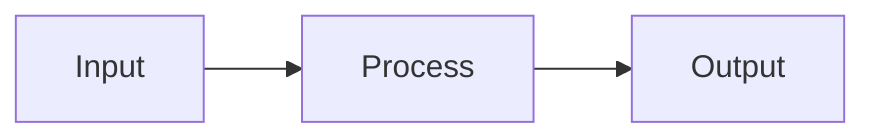

# Documentation Site Writing Instructions

These rules apply automatically when editing any documentation page in `docs/src/`.

The documentation site is powered by Zensical (MkDocs-compatible), publicly published as open source project documentation. All content targets developers who build, deploy, or contribute to IDP-Core.

## Page Structure

Every documentation page must include YAML front matter and follow this layout:

```markdown
---
title: Page Title
description: Brief description for SEO and social sharing
---

Introduction paragraph explaining the topic in 1-3 sentences.

## Section 1

Content...

## Section 2

Content...

---

## Next Steps

- **[Related Page](relative-link.md)** - Brief description
```

## Writing Style

- Use **active voice** and **present tense**.
- Address the reader as **"you."**
- Be concise—avoid redundancy and filler.
- Use precise, unambiguous technical language suitable for an open source audience.
- Prose is linted with Vale using the **Google** style guide and IDP-Core vocabulary (see `/.vale.ini`).

| Do                              | Don't                          |
| ------------------------------- | ------------------------------ |
| "Create a template by…"         | "A template can be created…"   |
| "Run the following command:"    | "The command should be run:"   |
| "You configure the database…"   | "The user configures…"         |

## Headings

- `#`—Page title (one per page, must match front matter `title`).
- `##`—Major sections.
- `###`—Subsections.
- `####`—Use sparingly for fine details.
- Heading levels must increment by one (no skipping from `##` to `####`).

## Formatting Elements

### Code Blocks

Use fenced code blocks with a language identifier. Add the `title` attribute for file names:

````markdown
```yaml title="application.yml"
spring:
  profiles:
    active: local
```
````

### Admonitions

Use native Markdown syntax (not Zensical-specific):

```markdown
> [!NOTE]
> Informational content.

> [!WARNING]
> Important caution.

> [!DANGER]
> Critical danger.
```

### Tabs

```markdown
=== "Java"
    ```java
    System.out.println("Hello");
    ```

=== "Python"
    ```python
    print("Hello")
    ```
```

### Tables

Standard Markdown tables with header separator:

```markdown
| Column 1 | Column 2 |
| -------- | -------- |
| Value 1  | Value 2  |
```

### Diagrams

Use Mermaid for diagrams. Supported types: `flowchart`, `sequenceDiagram`, `erDiagram`, `gantt`, `classDiagram`.

````markdown

````

## Links

- **Internal**: `[Link text](../section/page.md)` or `[Link text](../section/page.md#anchor)`
- **External**: `[Link text](https://example.com)`

## Images

- Store in `docs/assets/images/`.
- Prefer SVG, then PNG, then JPEG.
- Always include meaningful alt text: ``.
