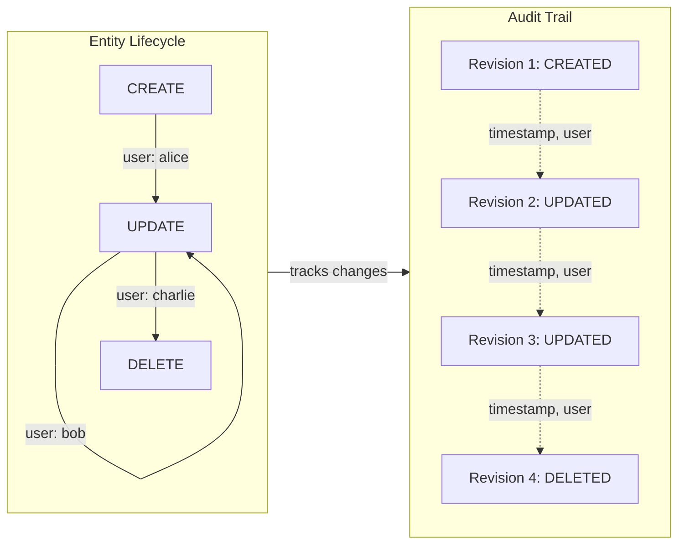

IDP-Core provides comprehensive audit tracking for all changes, enabling compliance, debugging, and historical analysis.
The audit mechanism uses Hibernate to maintain a complete revision history of every modification.

## Overview

Audit history captures every change to entity, entity template, properties throughout its lifecycle, including
creation, updates, and deletion. This information is essential for:

- **Compliance and Regulatory Requirements** - Maintain immutable audit trails for regulatory compliance
- **Change Tracking and Audit mechanism** - Know who changed what and when
- **Debugging and Root Cause Analysis** - Trace issues back to their origins
- **Historical Reconstruction** - Restore object state at any point in time

Example audit flow for entity lifecycle:



---

## How Audit Works

### Automatic Tracking

When you create, update, or delete any object, IDP-Core automatically records:

- **Revision Number** - Sequential identifier for each change
- **Timestamp** - When the change occurred
- **Revision Type** - The operation performed (CREATED, UPDATED, or DELETED)
- **Modified By** - The user who made the change
- **Entity Snapshot** - The object state at that moment

The audit system is transparent—no special configuration is needed. Every operation is tracked automatically using
Hibernate.

### Storage

Audit data is stored separately from current entity data in dedicated audit tables:

- `entity_aud` - Audit history of entity changes
- `envers_transaction_log` - Revision metadata including user information
- `revinfo` - Additional revision information

This separation ensures:

- **No impact on queries** - Current data queries perform as normal
- **Immutable audit trail** - Historical data cannot be modified
- **Flexible retention** - Audit data can be managed independently

---

## Retrieving Audit History

### API Endpoint

Retrieve the complete audit history for an entity:

```text
GET /api/v1/audit/entities/{templateIdentifier}/{entityIdentifier}
```

### Path Parameters

| Parameter            | Type   | Description                           |
|----------------------|--------|---------------------------------------|
| `templateIdentifier` | String | The template identifier of the entity |
| `entityIdentifier`   | String | The unique identifier of the entity   |

### Response

The response is an array of audit entries, ordered by revision number (newest first):

```json
[
  {
    "revision_number": 3,
    "revision_date": "2026-06-10T14:35:22.500Z",
    "revision_type": "DELETED",
    "modified_by": "alice@example.com",
    "snapshot": {
      "id": "550e8400-e29b-41d4-a716-446655440000",
      "template_identifier": "web-service",
      "identifier": "my-service",
      "name": "My Web Service"
    }
  },
  {
    "revision_number": 2,
    "revision_date": "2026-06-10T14:30:15.300Z",
    "revision_type": "UPDATED",
    "modified_by": "bob@example.com",
    "snapshot": {
      "id": "550e8400-e29b-41d4-a716-446655440000",
      "template_identifier": "web-service",
      "identifier": "my-service",
      "name": "My Web Service Updated"
    }
  },
  {
    "revision_number": 1,
    "revision_date": "2026-06-10T14:20:00.000Z",
    "revision_type": "CREATED",
    "modified_by": "charlie@example.com",
    "snapshot": {
      "id": "550e8400-e29b-41d4-a716-446655440000",
      "template_identifier": "web-service",
      "identifier": "my-service",
      "name": "My Web Service"
    }
  }
]
```

### Response Fields

| Field                          | Type    | Description                                             |
|--------------------------------|---------|---------------------------------------------------------|
| `revision_number`              | Number  | Unique sequential identifier of the revision            |
| `revision_date`                | Instant | ISO 8601 timestamp when the revision was created        |
| `revision_type`                | String  | Type of operation: CREATED, UPDATED, or DELETED         |
| `modified_by`                  | String  | User identifier or email who performed the modification |
| `snapshot`                     | Object  | Entity state at the time of this revision               |
| `snapshot.id`                  | UUID    | Unique identifier of the entity                         |
| `snapshot.template_identifier` | String  | Template identifier                                     |
| `snapshot.identifier`          | String  | Entity identifier (business key)                        |
| `snapshot.name`                | String  | Entity name                                             |

### Response Codes

| Code  | Description                             |
|-------|-----------------------------------------|
| `200` | Audit history retrieved successfully    |
| `400` | Invalid template or entity identifier   |
| `401` | Missing or invalid authentication token |
| `403` | Insufficient permissions                |
| `404` | Template or entity not found            |
| `500` | Unexpected server error                 |

### Example Requests

=== "Retrieve Entity Audit History"

```bash
curl -X GET http://localhost:8084/api/v1/audit/entities/web-service/my-service \
  -H "Authorization: Bearer <token>"
```

=== "Using cURL with filters"

```bash
# Get audit history for a specific entity
curl -s http://localhost:8084/api/v1/audit/entities/web-service/my-service | jq '.'
```

---

## Audit History Features

### Complete Lifecycle Tracking

The audit system tracks all stages of an entity's lifecycle:

#### Entity Creation

When you create an entity, a CREATED revision is recorded:

```json
{
  "revision_type": "CREATED",
  "modified_by": "user@example.com",
  "revision_date": "2026-06-10T14:20:00.000Z",
  "snapshot": {
    "identifier": "my-service",
    "name": "My Web Service"
  }
}
```

#### Entity Updates

Each update to an entity generates an UPDATED revision:

```json
{
  "revision_type": "UPDATED",
  "modified_by": "another-user@example.com",
  "revision_date": "2026-06-10T14:30:15.300Z",
  "snapshot": {
    "identifier": "my-service",
    "name": "My Web Service Updated"
  }
}
```

#### Entity Deletion

When an entity is deleted, a DELETED revision is recorded:

```json
{
  "revision_type": "DELETED",
  "modified_by": "admin@example.com",
  "revision_date": "2026-06-10T14:35:22.500Z",
  "snapshot": {
    "identifier": "my-service",
    "name": "My Web Service Updated"
  }
}
```

Information: Even after deletion, the audit history remains accessible. This allows you to retrieve the complete lifecycle of any
entity, including deleted ones.

### User Attribution

Every change in the audit trail is associated with the user who performed it. The `modified_by` field contains:

- **Standard Users** - The authenticated user's identifier or email
- **System Operations** - The value "system" for internal operations

This enables accountability and helps trace who made specific changes.

### Timestamp Precision

Each revision includes an ISO 8601 timestamp (`revision_date`) with millisecond precision, making it possible to:

- Correlate changes with other system events
- Establish exact chronological order of modifications
- Support regulatory compliance requirements

### Entity Snapshot

Each revision includes a snapshot of the entity's state at that moment, containing:

- `id` - The unique database identifier
- `template_identifier` - Which template the entity instantiates
- `identifier` - The business identifier (user-facing key)
- `name` - The entity name

> [!WARNING]
> The snapshot contains only core entity metadata. For complete property and relation state at a revision, you may need
> to reconstruct from the historical data stored in audit tables.

---

## Modification Flags

Hibernate Envers includes optional field-level change tracking through **modification flags**. When enabled on an entity with `@Audited(withModifiedFlag=true)`, Envers generates a `_mod` column for each audited field in the audit table.

### How Modification Flags Work

For each field in an audited entity, Envers creates a corresponding `_mod` column (for example, `name_mod`, `identifier_mod`). During an UPDATE operation, these flags are set to `true` only for fields that actually changed.

**Database Schema Example:**

```sql
CREATE TABLE entity_aud (
    id UUID NOT NULL,
    rev BIGINT NOT NULL,
    revtype SMALLINT,
    name VARCHAR(255),
    name_mod BOOLEAN,          -- Tracks if 'name' field was modified
    identifier VARCHAR(255),
    identifier_mod BOOLEAN,    -- Tracks if 'identifier' field was modified
    PRIMARY KEY (id, rev)
);
```

### Flag Values in Audit Responses

The audit API only includes modification flags that are `true`. Missing flags should be interpreted as `false` (field was not modified in that revision).

**Response Example - UPDATE Operation:**

When updating only the `name` field:

```json
{
  "revision_number": 2,
  "revision_type": "UPDATED",
  "modified_by": "alice@example.com",
  "snapshot": {
    "id": "550e8400-e29b-41d4-a716-446655440000",
    "template_identifier": "web-service",
    "identifier": "my-service",
    "name": "Updated Service Name",
    "modification_flags": {
      "name_mod": true
      // identifier_mod is NOT included (meaning it was false/unchanged)
    }
  }
}
```

**Response Example - Creation Operation:**

During creation, all fields are considered modified:

```json
{
  "revision_number": 1,
  "revision_type": "CREATED",
  "modified_by": "bob@example.com",
  "snapshot": {
    "id": "550e8400-e29b-41d4-a716-446655440000",
    "name": "Service Name",
    "modification_flags": {
      "name_mod": true,
      "identifier_mod": true
    }
  }
}
```

### Collections Flag

Envers also tracks modifications to collection fields (relationships) through the `collections_flag`. This flag indicates whether any collection in the entity was modified (added/removed items) in this revision.

**Example with Relations:**

```json
{
  "revision_number": 3,
  "revision_type": "UPDATED",
  "modified_by": "charlie@example.com",
  "snapshot": {
    "id": "550e8400-e29b-41d4-a716-446655440000",
    "name": "Service Name",
    "modification_flags": {
      "relations_mod": true,  // Collections (relations) were modified
      // Individual relation items are tracked in relation_aud table
    }
  }
}
```

### Using Modification Flags

Modification flags enable you to:

- **Track precise field changes** - Know exactly which fields changed in an update
- **Implement smart versioning** - Only serialize fields that actually changed
- **Audit compliance** - Prove which fields were modified for regulatory purposes
- **Change notifications** - Alert only when specific fields change

---

The audit system preserves audit history even after entity deletion.

### Retrieving History for Deleted Entities

You can retrieve the complete audit history for a deleted entity by calling the audit endpoint with its original
identifiers:

```bash
curl -X GET http://localhost:8084/api/v1/audit/entities/web-service/deleted-entity
```

The audit will include the DELETED revision and all previous CREATED and UPDATED revisions.

### Why This Matters

Maintaining audit trails for deleted entities is crucial for:

- **Compliance** - Regulatory requirements often mandate keeping deletion records
- **Debugging** - Understanding what data existed and when
- **Recovery** - Reconstructing entities if needed for investigation or recovery

---

## Technical Implementation

### Hibernate

The audit mechanism uses **Hibernate Envers**, an open source tool that provides:

- Automatic change tracking via JPA events
- Revision metadata management
- Efficient historical data storage
- Transaction-level consistency

### Custom Revision Entity

IDP-Core uses a custom revision entity (`CustomRevisionEntity`) that tracks:

- **Revision Number** - Sequential identifier
- **Timestamp** - Change timestamp
- **Authentication ID** - User information from the Spring Security context

The custom revision listener automatically populates the `auth_id` field from the currently authenticated user.

### Audit Tables

Each audited entity generates an audit table with the suffix `_aud`. For example:

- Entity table: `entity`
- Audit table: `entity_aud`

Audit tables store historical versions of every column with additional hibernate columns:

- `REV` - Revision number
- `REVTYPE` - Revision type (0=CREATED, 1=UPDATED, 2=DELETED)
- `{field}_MOD` - Modification flags (optional, when `@Audited(withModifiedFlag=true)`)

### Modification Flag Retrieval

The audit system automatically retrieves modification flags from audit tables during history queries:

- **Dynamic Column Detection** - The adapter queries audit tables to find all columns ending with `_mod`
- **Selective Inclusion** - Only flags with `true` values are included in API responses (false values are omitted)
- **Graceful Degradation** - If modification flag retrieval fails, the audit history is still returned without the granular field-level tracking
- **Logging** - Failures to retrieve modification flags are logged as warnings, allowing operators to monitor optional feature availability

### Collection Auditing: Set vs List

Hibernate Envers handles collections differently depending on whether you use `java.util.Set` or `java.util.List`. This impacts your audit table structure and schema design.

#### Set Collections (Recommended)

Use `Set` when **element order is not significant** and you want the cleanest audit table structure.

**Behavior:**

- Envers treats collection members as part of the composite primary key
- No additional ordinal/index column is introduced
- Composite primary key: `(entity_id, rev, element_id)`
- Simpler schema, better performance
- Ideal for many-to-many relationships and unordered collections

**JPA Definition:**

```java
@ElementCollection(fetch = FetchType.EAGER)
@CollectionTable(name = "relation_targets", joinColumns = @JoinColumn(name = "relation_id"))
@Audited(withModifiedFlag = true)
private Set<TargetEntity> targetEntities;
```

**Audit Table Schema:**

```sql
CREATE TABLE relation_targets_aud (
    relation_id UUID NOT NULL,
    target_id UUID NOT NULL,
    rev BIGINT NOT NULL,
    revtype SMALLINT,
    -- additional audited columns here
    PRIMARY KEY (relation_id, target_id, rev),
    FOREIGN KEY (rev) REFERENCES envers_transaction_log (rev) ON DELETE CASCADE
);
```

#### List Collections (Order Must Be Tracked)

Use `List` **only when element order must be preserved** and tracked in the audit trail.

**Behavior:**

- Envers automatically introduces an order-tracking column (e.g., `SETORDINAL`, or your custom `@OrderColumn` name)
- Order column becomes part of the composite primary key
- Composite primary key: `(entity_id, rev, order_column)`
- More complex schema, higher storage overhead
- Use `@OrderColumn` to explicitly define the order column name

**JPA Definition:**

```java
@ElementCollection(fetch = FetchType.EAGER)
@CollectionTable(name = "ordered_targets", joinColumns = @JoinColumn(name = "relation_id"))
@OrderColumn(name = "item_index")  // Explicitly track order
@Audited(withModifiedFlag = true)
private List<TargetEntity> targetEntities;
```

**Audit Table Schema (Note the order column in composite PK):**

```sql
CREATE TABLE ordered_targets_aud (
    relation_id UUID NOT NULL,
    item_index INT NOT NULL,
    rev BIGINT NOT NULL,
    revtype SMALLINT,
    target_id UUID,
    -- additional audited columns here
    PRIMARY KEY (relation_id, item_index, rev),
    FOREIGN KEY (rev) REFERENCES envers_transaction_log (rev) ON DELETE CASCADE
);
```

#### Decision Matrix

| Business Requirement          | Collection Type | Why                     | Schema Impact                           |
|-------------------------------|-----------------|-------------------------|-----------------------------------------|
| Members are unordered         | `Set`           | Natural fit             | Simpler PK: (entity_id, rev, member_id) |
| Many-to-many relationship     | `Set`           | Standard pattern        | Cleaner schema                          |
| Order not significant         | `Set`           | Reduces overhead        | Better query performance                |
| Must track insertion order    | `List`          | Business requirement    | Order column in PK                      |
| Ranked/prioritized items      | `List`          | Order is critical       | Complex PK: (entity_id, rev, order)     |
| Sequence matters historically | `List`          | Audit trail needs order | More storage required                   |

#### Common Issues and Solutions

> [!WARNING]
> **Changing collection types after data exists:** Migrating from `List` to `Set` or vice versa requires:
>
> - Altering the audit table structure
> - Modifying the composite primary key
> - Updating all related Flyway migrations
> - **Avoid this if possible** - choose the collection type early in development
>
> [!NOTE]
> **Audit Table Primary Key Mismatch:** If your Flyway script doesn't match Envers expectations for the collection type:
>
> - **Set** but missing element ID in PK → Envers will fail or create duplicate rows
> - **List** but missing order column in PK → Envers will fail to track ordering
> - Always verify migration scripts align with collection type

#### Best Practices

- **Default to `Set`** unless you have a specific business requirement to track order
- **Use `@OrderColumn` explicitly** when defining `List` collections to make ordering intent clear
- **Align database schema** with your collection type choice before data accumulates
- **Test audit retrieval** for collections to ensure proper historical reconstruction
- **Document the rationale** for using `List` collections so future maintainers understand why ordering is critical
- **Use defensive copy patterns** for mutable collection getters/setters (see Infrastructure instructions)

#### Example: When Set is Right

```java
@Entity
@Audited(withModifiedFlag = true)
public class RelationJpaEntity {
    @Id
    private UUID id;

    // No order needed - targets are just members of this relation
    @ElementCollection(fetch = FetchType.EAGER)
    @CollectionTable(name = "relation_targets", schema = "idp_core",
                     joinColumns = @JoinColumn(name = "relation_id"))
    private Set<RelationTargetJpaEntity> targetEntities;  // ✅ Set - simple and efficient
}
```

#### Example: When List is Right

```java
@Entity
@Audited(withModifiedFlag = true)
public class PriorityListEntity {
    @Id
    private UUID id;

    // Order is critical - items are prioritized
    @ElementCollection(fetch = FetchType.EAGER)
    @CollectionTable(name = "priority_items", joinColumns = @JoinColumn(name = "list_id"))
    @OrderColumn(name = "priority_order")
    private List<PriorityItemEntity> items;  // ✅ List - order must be tracked
}
```

### Performance Considerations

The audit system is designed for efficiency:

- **Minimal Query Impact** - Current entity queries are not affected by audit tracking
- **Optimized Storage** - Audit tables use efficient columnar storage
- **Index Support** - Audit queries include proper indexes for performance
- **Optional Cleanup** - Old audit data can be archived or purged based on retention policies

---

## Use Cases

### Compliance Auditing

Track all changes to entities for compliance with regulations like GDPR, SOC 2, or industry standards:

```bash
# Retrieve full history for audit purposes
curl -X GET \
  http://localhost:8084/api/v1/audit/entities/service-catalog/critical-service
```

### Debugging Changes

Identify when a specific entity changed and who made the modification:

```bash
# Get audit history to understand the sequence of changes
curl -X GET \
  http://localhost:8084/api/v1/audit/entities/web-service/production-api | jq '.[] | {revision_type, modified_by, revision_date}'
```

Output:

```json
{
  "revision_type": "UPDATED",
  "modified_by": "alice@example.com",
  "revision_date": "2026-06-10T14:35:22.500Z"
}
{
  "revision_type": "CREATED",
  "modified_by": "bob@example.com",
  "revision_date": "2026-06-10T14:20:00.000Z"
}
```

### Change Notification

Use audit endpoints in workflows to:

- Notify team members of entity changes
- Trigger automation based on specific revision types
- Generate change reports

### Historical Analysis

Analyze how entities evolved over time:

```bash
# Get the complete evolution of an entity
curl -s http://localhost:8084/api/v1/audit/entities/web-service/my-service | \
  jq 'reverse | .[] | {rev: .revision_number, type: .revision_type, date: .revision_date, user: .modified_by}'
```

---

## Next Steps

- **[Entities](entities.md)** - Entity structure and lifecycle
- **[Properties](properties.md)** - Property types and validation
- **[Relations](relations.md)** - Entity relationships
