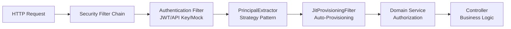

IDP-Core implements a flexible, modular authentication system based on Spring Security's filter chain architecture. This
document explains how the system works, how to configure it for different Identity Providers, and how to extend it with
custom authentication methods.

## Architecture Overview

The authentication system consists of four main components working together:



- **Security Filter Chain**: Routes requests through configured authentication mechanisms in order
- **Authentication Filters**: Extract credentials (JWT tokens, API keys, etc.) and create `Authentication` objects
- **Principal Extractor**: Converts authentication tokens into domain `PrincipalInfo` objects
- **JIT Provisioning Filter**: Automatically creates principals in the database on first authentication
- **Domain Services**: Enforce business rules and authorization checks

## Filter Chain Architecture

IDP-Core uses a **multi-chain architecture** where each authentication mechanism has its own dedicated
`SecurityFilterChain` with a specific `@Order`. This allows:

- **Independent configuration** of each mechanism without interference
- **Environment-specific activation** using `@ConditionalOnProperty`
- **Clear precedence rules** via ordering (lower numbers evaluate first)
- **Flexible extensibility** for adding new mechanisms

### Filter Chain Ordering

Chains are evaluated in strict order of `@Order` value:

| Order | Chain                                   | Purpose                                                                 |
|-------|-----------------------------------------|-------------------------------------------------------------------------|
| 1     | `PublicFilterChainConfig`               | Permits public paths without authentication (actuator, swagger, health) |
| 2     | `JwtFilterChainConfig`                  | OAuth2 resource server with JWT validation                              |
| 3     | `ApiKeyFilterChainConfig`               | Simple API key authentication for webhooks and service-to-service       |
| 4+    | Future / Other authentication mechanism | Your custom authentication mechanisms                                   |
| last  | `MockFilterChainConfig`                 | Local development only - generates mock JWT tokens                      |

When a request arrives, Spring Security evaluates chains in order. The first chain whose `securityMatcher` matches the
request path handles that request. If no `securityMatcher` is specified, the chain protects all remaining unmatched
paths.

### Public Filter Chain (Order 1)

```java

@Configuration
@Order(1)
public class PublicFilterChainConfig {
    @Bean
    public SecurityFilterChain publicFilterChain(HttpSecurity http) throws Exception {
        http.securityMatcher("/", "/actuator/**", "/swagger-ui/**", "/v3/api-docs/**")
                .authorizeHttpRequests(auth -> auth.anyRequest().permitAll())
                .csrf(csrf -> csrf.disable());
        return http.build();
    }
}
```

The public chain explicitly permits these paths without any authentication. All other paths fall through to subsequent
chains.

### JWT Filter Chain (Order 2)

The JWT chain provides OAuth2 resource server authentication:

- Expects JWT tokens in the `Authorization: Bearer <token>` header
- Validates token signature using the configured JWKS endpoint
- Extracts claims and creates `JwtAuthenticationToken`
- Invokes claim mapping to standardize different IdP claim names
- Applies service account detection to classify M2M vs. human users

## JWT Claim Mappings

Different Identity Providers (IdPs) use different claim names in their JWT tokens for the same semantic meaning. The
claim mapping system allows you to configure these differences without code changes.

### Optional Claim Mapping Configuration

Configure claim mappings in `application.yml` under `app.security.authentication.user-claim-mappings`:
Notice that only this two information is mandatory when JWT authentication is enabled :

- spring.security.oauth2.resourceserver.jwt.jwk-set-uri — required for signature validation.
- A valid JWT signature and standard sub claim — sub is effectively required for JIT provisioning because it is the final identifier fallback.

```yaml
app:
  security:
    authentication:
      user-claim-mappings:
        sub: "sub"                      # Unique user identifier - Mandatory
        preferred_username: "preferred_username"  # Human-readable username
        name: "name"                    # Display name
        email: "email"                  # Email address
        groups: "groups"                # Group memberships
        client_id: "client_id"          # OAuth2 client identifier
        azp: "azp"                      # Authorized party (alternative client ID)
        grant_type: "grant_type"        # OAuth2 grant type
        gty: "gty"                      # Grant type variant
        service_name: "service_name"    # Custom M2M service identifier
```

### Common IdP Configurations

=== "Auth0"

```yaml
app:
  security:
    authentication:
      user-claim-mappings:
        sub: "sub"
        preferred_username: "preferred_username"
        name: "name"
        email: "email"
        groups: "groups"
        client_id: "client_id"
        azp: "azp"
        grant_type: "grant_type"
        gty: "gty"
        service_name: "service_name"
```

=== "Keycloak"

```yaml

app:
  security:
    authentication:
      user-claim-mappings:
        sub: "sub"
        preferred_username: "preferred_username"
        name: "name"
        email: "email"
        groups: "groups"
        client_id: "clientId"       # Note: camelCase in Keycloak
        azp: "azp"
        grant_type: "grant_type"
        gty: "gty"
        service_name: "service_name"
```

=== "Azure AD"

```yaml
app:
  security:
    authentication:
      user-claim-mappings:
        sub: "oid"                  # Object ID in Azure
        preferred_username: "unique_name"
        name: "name"
        email: "email"
        groups: "groups"
        client_id: "appid"
        azp: "appid"
        grant_type: "grant_type"
        gty: "gty"
        service_name: "custom_service_name"
```

When a JWT is received, the `PrincipalExtractor` uses these mappings to extract the actual claim values from the token,
ensuring that regardless of IdP differences, your application always receives standardized `PrincipalInfo` objects.

## Service Account Detection

Service accounts are **machine-to-machine (M2M) credentials** used for service-to-service authentication (for example,
API clients, automation tools). Identifying them correctly is important for:

- Applying different authorization rules for services vs. humans
- Audit logging and security monitoring
- Rate limiting and quota management

IDP-Core supports two detection modes:

### Strict Mode (Recommended)

In strict mode, a single **definitive claim** unambiguously identifies M2M tokens:

```yaml
app:
  security:
    authentication:
      service-account-detection:
        enabled: true
        mode: "strict"
        definitive-claim-name: "token_type"
        definitive-claim-value: "m2m"
```

The system checks if the token contains `token_type=m2m`. If it does, the principal is classified as a
`SERVICE_ACCOUNT`; otherwise, it's a `HUMAN_USER`.

**Benefits:**

- Prevents false positives (human users misidentified as services)
- More secure - reduces risk of access control bypass
- Clear, deterministic behavior

**Requirements:**

- Your IdP or API gateway must inject the definitive claim
- May require custom configuration at the IdP level

### Legacy Mode (Backwards Compatibility)

In legacy mode, the system checks multiple optional claims with OR logic:

```yaml
app:
  security:
    authentication:
      service-account-detection:
        enabled: true
        mode: "legacy"
        legacy-fallback-claims:
          - "grant_type"
          - "service_name"
          - "client_id"
```

In legacy mode, IDP-Core classifies a token as a `SERVICE_ACCOUNT` when **any** of
the following conditions is true:

- The claim mapped to `grant_type` or `gty` has the value
  `client_credentials`.
- The claim mapped to `service_name` is present.
- The claim mapped to `client_id` or `azp` has the same value as `sub`.

If none of these conditions is met, the token is classified as a `HUMAN_USER`.

**Benefits:**

- Works immediately without IdP reconfiguration
- Maintains backwards compatibility with existing deployments

**Drawbacks:**

- Prone to false positives (for example, human user with `client_id` present)
- Less secure - may misclassify humans as services
- Will be deprecated in future versions

> [!WARNING]
> Migrate from legacy to strict mode is really encouraged for the systems meeting the prerequisites. Legacy mode is only recommended for existing systems
that cannot immediately reconfigure their Identity Provider configuration.

## Principal Extraction

Once a JWT is validated and claims are mapped, the `PrincipalExtractor` converts the token into a domain `PrincipalInfo`
object.

### Extraction Strategy Pattern

The extraction system uses the **Strategy pattern** to support multiple token types:

```java
public PrincipalInfo extractPrincipalInfo(Authentication authentication) {
    if (authentication instanceof JwtAuthenticationToken jwtToken) {
        return extractFromJwt(jwtToken);
    }

    // Fallback for other authentication types
    return createFallbackPrincipal(authentication);
}
```

Each strategy:

1. Reads the configured claim mappings from `AuthenticationProperties`
2. Extracts values from the token using mapped claim names
3. Classifies the principal as `HUMAN_USER` or `SERVICE_ACCOUNT` using service account detection
4. Returns a unified `PrincipalInfo` domain object

### PrincipalInfo Domain Model

```java
public record PrincipalInfo(
        String identifier,                  // Unique ID (for example, email, username)
        PrincipalKind kind,                 // HUMAN or SERVICE_ACCOUNT
        String name,                        // Display name
        Map<String, String> attributes,     // Additional attributes
        List<String> groups                 // Group memberships
) {
}
```

## Just-In-Time (JIT) Provisioning

After successful authentication, the `JitProvisioningFilter` automatically creates a principal record in the database if
it doesn't exist. This enables:

- **Self-service access**: Users don't need manual provisioning before first login
- **Automatic sync**: User data stays in sync with the IdP
- **Reduced overhead**: No need to pre-populate users before they access the system

### How JIT Provisioning Works

1. Request passes through an authentication filter successfully
2. `JitProvisioningFilter` extracts the `PrincipalInfo` from Spring Security Context
3. Checks if the principal exists in the database (by identifier)
4. If not found, creates a new principal record with the extracted information
5. Continues to the controller

### Excluding Paths

Not all authenticated requests should trigger provisioning (for example, public paths, health checks). Configure
excluded paths in `application.yml`:

```yaml
app:
  security:
    authentication:
      jit-provisioning-excluded-paths:
        - "/"
        - "/actuator/**"
        - "/swagger-ui/**"
        - "/swagger-ui.html"
        - "/v3/api-docs/**"
```

> [!IMPORTANT]
> Keep the JIT excluded paths in sync with the `PublicFilterChainConfig` permission mechanism. If you add a public path
to one, add it to both.

## API Key Authentication

For webhook receivers and service-to-service calls that don't use OAuth2, IDP-Core supports simple API key
authentication.

### Enabling API Key Authentication

```yaml
app:
  security:
    authentication:
      api-key:
        enabled: true
```

API keys are provided via the `X-API-Key` header:

```bash
curl -H "X-API-Key: your-secret-key" https://api.example.com/api/v1/webhooks
```

The `ApiKeyFilterChainConfig` validates the key and creates an authenticated principal without requiring JIT
provisioning (API keys are pre-configured, not JIT-provisioned).

## Mock Authentication (Local Development)

For local development and testing, enable mock authentication to generate tokens without an IdP:

```yaml
app:
  security:
    authentication:
      mock:
        enabled: true
```

The `MockFilterChainConfig` generates a mock JWT token with configurable claims via request parameters:

```bash
curl -H "Authorization: Bearer mock?sub=test-user&email=test@example.com" \
  http://localhost:8080/api/v1/entities
```

> [!WARNING]
> Mock authentication must never be enabled in production. It bypasses all JWT validation and should only be used in
`local` or `test` Spring profiles.

---

## Adding a Custom Authentication Method

This section explains how to add a new authentication mechanism to IDP-Core while respecting the existing architecture.

### Why Custom Authentication?

You might need custom authentication for:

- Cloud provider authentication (AWS IAM, Google Cloud)
- Enterprise SSO protocols (SAML, OpenID Connect with custom flows)
- Mutual TLS (mTLS) for service-to-service authentication
- Legacy authentication systems that must coexist with OAuth2
- Custom corporate authentication mechanisms

### Step 1: Define Configuration Properties

Add your mechanism toggle to `application.yml` under `app.security.authentication`:

```yaml
app:
  security:
    authentication:
      custom-auth:
        enabled: false
        # Custom mechanism-specific properties
        some-setting: "value"
```

Update `AuthenticationProperties.java` to include your configuration:

```java
public record AuthenticationProperties(
        // ... existing fields ...

        /// Your custom authentication mechanism configuration
        CustomAuthConfig customAuth
) {
}

public record CustomAuthConfig(
        boolean enabled,
        String someSetting
) {
}
```

### Step 2: Create the Filter Chain Configuration

Create a new configuration class in `infrastructure/adapters/api/configuration/security/chains/`:

```java
package com.decathlon.idp_core.infrastructure.adapters.api.configuration.security.chains;

import org.springframework.boot.autoconfigure.condition.ConditionalOnProperty;
import org.springframework.context.annotation.Bean;
import org.springframework.context.annotation.Configuration;
import org.springframework.core.annotation.Order;
import org.springframework.security.config.annotation.web.builders.HttpSecurity;
import org.springframework.security.web.SecurityFilterChain;
import org.springframework.security.web.authentication.preauth.AbstractPreAuthenticatedProcessingFilter;

import static org.springframework.security.config.Customizer.withDefaults;

import com.decathlon.idp_core.infrastructure.adapters.api.auth.JitProvisioningFilter;

/**
 * Security filter chain for custom authentication mechanism.
 *
 * This chain handles authentication for all requests matching the specified paths.
 * Custom authentication credentials are extracted from request headers/body and
 * validated before creating an Authentication object in the security context.
 *
 * The JitProvisioningFilter is appended to ensure authenticated principals are
 * automatically provisioned in the database (if not already present).
 *
 * @see CustomAuthenticationFilter
 * @see JitProvisioningFilter
 */
@Configuration
@ConditionalOnProperty(prefix = "app.security.authentication.custom-auth", name = "enabled", havingValue = "true")
public class CustomAuthFilterChainConfig {

    private final JitProvisioningFilter jitProvisioningFilter;
    private final CustomAuthenticationFilter customAuthFilter;

    public CustomAuthFilterChainConfig(
            JitProvisioningFilter jitProvisioningFilter,
            CustomAuthenticationFilter customAuthFilter) {
        this.jitProvisioningFilter = jitProvisioningFilter;
        this.customAuthFilter = customAuthFilter;
    }

    /**
     * Security filter chain for custom authentication.
     *
     * Order: 4 (after JWT at 2, API Key at 3, and Mock at the last position)
     *
     * Specifies:
     * 1. Which paths this chain protects (via securityMatcher)
     * 2. Authorization rules (authenticated or specific roles)
     * 3. Custom authentication filter to extract credentials
     * 4. JIT provisioning filter for automatic principal creation
     */
    @Bean
    @Order(4)
    public SecurityFilterChain customAuthSecurityFilterChain(HttpSecurity http) throws Exception {
        http
                // Optional: Specify which paths this chain handles
                // Omit to protect all remaining paths not handled by other chains
                .securityMatcher("/api/v1/custom/**")

                // Require authentication for all matched paths
                .authorizeHttpRequests(auth -> auth.anyRequest().authenticated())

                // Enable CORS with default settings
                .cors(withDefaults())

                // Disable CSRF (stateless API, tokens provide their own protection)
                .csrf(csrf -> csrf.disable());

        // Add your custom authentication filter
        // Place it before AbstractPreAuthenticatedProcessingFilter
        http.addFilterBefore(customAuthFilter, AbstractPreAuthenticatedProcessingFilter.class);

        // Add JIT provisioning filter to create principals in database
        http.addFilterAfter(jitProvisioningFilter, AbstractPreAuthenticatedProcessingFilter.class);

        return http.build();
    }
}
```

### Step 3: Create the Custom Authentication Filter

Create your filter in `infrastructure/adapters/api/auth/`:

```java
package com.decathlon.idp_core.infrastructure.adapters.api.auth;

import java.io.IOException;

import jakarta.servlet.FilterChain;
import jakarta.servlet.ServletException;
import jakarta.servlet.http.HttpServletRequest;
import jakarta.servlet.http.HttpServletResponse;

import lombok.extern.slf4j.Slf4j;
import org.springframework.security.core.context.SecurityContextHolder;
import org.springframework.stereotype.Component;
import org.springframework.web.filter.OncePerRequestFilter;

/**
 * Extracts custom authentication credentials from the request and creates
 * an Authentication object in the Spring Security context.
 *
 * This filter is invoked before the principal extractor and JIT provisioning.
 * It must:
 * 1. Extract credentials from request (header, cookie, body, etc.)
 * 2. Validate credentials against your custom mechanism
 * 3. Create an Authentication object representing the validated identity
 * 4. Store it in SecurityContextHolder for downstream filters
 *
 * If credentials are missing or invalid, leave the SecurityContext empty
 * and let the request proceed to the next filter (may be rejected at the
 * authorization step or fallback to another authentication method).
 */
@Component
@Slf4j
public class CustomAuthenticationFilter extends OncePerRequestFilter {

    @Override
    protected void doFilterInternal(
            HttpServletRequest request,
            HttpServletResponse response,
            FilterChain filterChain) throws ServletException, IOException {

        try {
            // 1. Extract credentials from request
            String credentials = extractCredentials(request);

            if (credentials != null) {
                // 2. Validate credentials (your custom logic)
                CustomAuthenticationToken token = validateAndCreateToken(credentials);

                // 3. Store authentication in Spring Security context
                SecurityContextHolder.getContext().setAuthentication(token);

                log.debug("Custom authentication successful");
            }
        } catch (Exception e) {
            log.debug("Custom authentication failed: {}", e.getMessage());
            // Leave SecurityContext empty; authorization filter will reject if needed
        }

        // Continue filter chain
        filterChain.doFilter(request, response);
    }

    private String extractCredentials(HttpServletRequest request) {
        // Extract from X-Custom-Auth header (example)
        return request.getHeader("X-Custom-Auth");
    }

    private CustomAuthenticationToken validateAndCreateToken(String credentials) {
        // Validate credentials and extract principal info
        // Return authenticated token with principal details
        return new CustomAuthenticationToken(credentials, true);
    }
}
```

### Step 4: Create a Custom Authentication Token Class

Create your token class representing the authenticated principal:

```java
package com.decathlon.idp_core.infrastructure.adapters.api.auth;

import java.util.Collection;
import java.util.List;

import org.springframework.security.core.Authentication;
import org.springframework.security.core.GrantedAuthority;
import org.springframework.security.core.authority.SimpleGrantedAuthority;

import com.decathlon.idp_core.infrastructure.adapters.api.principal.PrincipalExtractor;

/**
 * Authentication token for custom authentication mechanism.
 *
 * This class represents an authenticated principal from your custom mechanism.
 * Spring Security uses this to track the currently authenticated user.
 *
 * The PrincipalExtractor will recognize this token type and extract the principal
 * information into a domain PrincipalInfo object.
 *
 * @see PrincipalExtractor
 */
public class CustomAuthenticationToken extends AbstractAuthenticationToken {

    private final String credentials;
    private final String principal; // identifier/username

    public CustomAuthenticationToken(String credentials, boolean authenticated) {
        // Pass authorities to the superclass
        super(List.of(new SimpleGrantedAuthority("ROLE_USER")));
        this.credentials = credentials;
        this.principal = extractPrincipal(credentials);
        // Let AbstractAuthenticationToken handle the authenticated state securely
        super.setAuthenticated(authenticated);
    }

    private String extractPrincipal(String credentials) {
        return credentials.split(":")[1];
    }

    @Override
    public Object getCredentials() {
        return credentials;
    }

    @Override
    public Object getPrincipal() {
        return principal;
    }
}
```

### Step 5: Update the Principal Extractor

The `PrincipalExtractor` must recognize your custom authentication token and convert it to a `PrincipalInfo` domain
object.

You should create a new Spring `@Component` that implements `PrincipalExtractionStrategy`. Spring will automatically
inject it into `PrincipalExtractor`.

```java
package com.decathlon.idp_core.infrastructure.adapters.api.principal;

import org.springframework.security.core.Authentication;
import org.springframework.stereotype.Component;

import com.decathlon.idp_core.domain.model.principal.PrincipalInfo;
import com.decathlon.idp_core.domain.model.principal.PrincipalKind;
import com.decathlon.idp_core.infrastructure.adapters.api.auth.CustomAuthenticationToken;

@Component
public class CustomAuthenticationExtractionStrategy implements PrincipalExtractionStrategy {

    @Override
    public boolean supports(Authentication authentication) {
        return authentication instanceof CustomAuthenticationToken;
    }

    @Override
    public PrincipalInfo extract(Authentication authentication) {
        CustomAuthenticationToken token = (CustomAuthenticationToken) authentication;
        String principal = token.getName();

        return new PrincipalInfo(
                principal,               // identifier
                PrincipalKind.HUMAN,     // kind (or SERVICE_ACCOUNT)
                principal,               // name
                Map.of(),                // attributes
                List.of()                // roles/groups
        );
    }
}
```

### Step 6: Verification Checklist

After implementing your custom authentication method:

- [ ] Configuration toggle in `application.yml` under `app.security.authentication.custom-auth.enabled`
- [ ] `AuthenticationProperties.java` updated with your configuration record
- [ ] Filter chain configuration class created with `@Order(5)` or next available
- [ ] Filter chain uses `@ConditionalOnProperty` to load only when enabled
- [ ] Custom authentication filter extracts and validates credentials
- [ ] Custom authentication filter stores `Authentication` in security context
- [ ] Custom authentication token class implements Spring `Authentication`
- [ ] `PrincipalExtractor` recognizes your token type
- [ ] `PrincipalExtractor` extracts required fields: `identifier`, `sub`, `name`, `email`, `groups`, `type`
- [ ] `JitProvisioningFilter` is appended to the chain
- [ ] No overlapping `securityMatcher` paths with existing chains
- [ ] Request paths are not in the JIT provisioning excluded paths list (unless they should be public)
- [ ] Tests verify authentication flow end-to-end
- [ ] Documentation in `application.yml` explains the new mechanism

### Step 7: Testing Your Implementation

Create an integration test to verify the end-to-end flow:

```java

@SpringBootTest(webEnvironment = SpringBootTest.WebEnvironment.RANDOM_PORT)
class CustomAuthenticationIntegrationTest {

    @Autowired
    private TestRestTemplate restTemplate;

    @Test
    void testCustomAuthenticationSuccess() {
        // Create a request with your custom credentials
        HttpHeaders headers = new HttpHeaders();
        headers.set("X-Custom-Auth", "your:test:credentials");

        HttpEntity<String> request = new HttpEntity<>(headers);

        // Execute request
        ResponseEntity<String> response = restTemplate.exchange(
                "/api/v1/entities",
                HttpMethod.GET,
                request,
                String.class
        );

        // Verify successful authentication
        assertThat(response.getStatusCode()).isEqualTo(HttpStatus.OK);
    }

    @Test
    void testCustomAuthenticationFailure() {
        // Test with missing/invalid credentials
        ResponseEntity<String> response = restTemplate.getForEntity(
                "/api/v1/entities",
                String.class
        );

        // Should fail (401 or 403 depending on your config)
        assertThat(response.getStatusCode()).isIn(
                HttpStatus.UNAUTHORIZED,
                HttpStatus.FORBIDDEN
        );
    }
}
```

---
