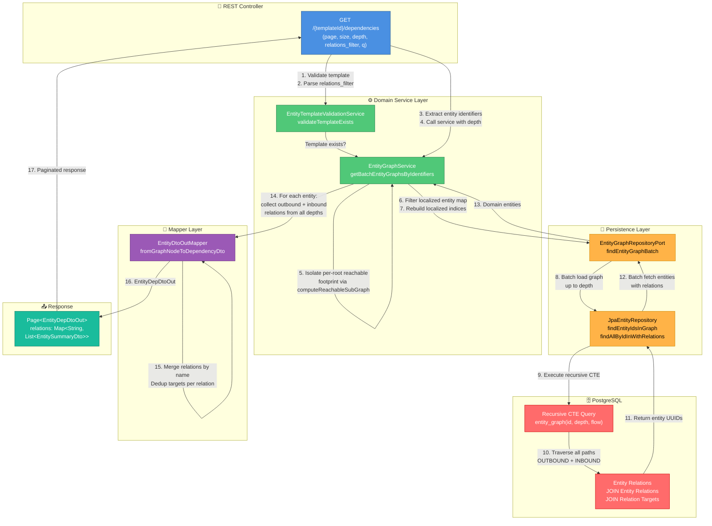

```mermaid
graph TB
    subgraph Controller["🎯 REST Controller"]
        A["GET /{templateId}/dependencies<br/>(page, size, depth, relations_filter, q)"]
    end

    subgraph Service["⚙️ Domain Service Layer"]
        B["EntityGraphService<br/>getBatchEntityGraphsByIdentifiers"]
        C["EntityTemplateValidationService<br/>validateTemplateExists"]
    end

    subgraph Repository["💾 Persistence Layer"]
        D["EntityGraphRepositoryPort<br/>findEntityGraphBatch"]
        E["JpaEntityRepository<br/>findEntityIdsInGraph<br/>findAllByIdInWithRelations"]
    end

    subgraph Database["🗄️ PostgreSQL"]
        F["Recursive CTE Query<br/>entity_graph(id, depth, flow)"]
        G["Entity Relations<br/>JOIN Entity Relations<br/>JOIN Relation Targets"]
    end

    subgraph Mapper["🔄 Mapper Layer"]
        H["EntityDtoOutMapper<br/>fromGraphNodeToDependencyDto"]
    end

    subgraph Response["📤 Response"]
        I["Page&lt;EntityDepDtoOut&gt;<br/>relations: Map&lt;String,<br/>List&lt;EntitySummaryDto&gt;&gt;"]
    end

    A -->|1. Validate template<br/>2. Parse relations_filter| C
    C -->|Template exists?| B
    
    A -->|3. Extract entity identifiers<br/>4. Call service with depth| B
    
    B -->|5. Isolate per-root reachable<br/>footprint via computeReachableSubGraph| B
    
    B -->|6. Filter localized entity map<br/>7. Rebuild localized indices| D
    
    D -->|8. Batch load graph<br/>up to depth| E
    
    E -->|9. Execute recursive CTE| F
    
    F -->|10. Traverse all paths<br/>OUTBOUND + INBOUND| G
    
    G -->|11. Return entity UUIDs| E
    
    E -->|12. Batch fetch entities<br/>with relations| D
    
    D -->|13. Domain entities| B
    
    B -->|14. For each entity:<br/>collect outbound + inbound<br/>relations from all depths| H
    
    H -->|15. Merge relations by name<br/>Dedup targets per relation| H
    
    H -->|16. EntityDepDtoOut| I
    
    I -->|17. Paginated response| A

    style A fill:#4A90E2,stroke:#2E5C8A,color:#fff
    style B fill:#50C878,stroke:#2E7D4E,color:#fff
    style C fill:#50C878,stroke:#2E7D4E,color:#fff
    style D fill:#FFB347,stroke:#CC8800,color:#000
    style E fill:#FFB347,stroke:#CC8800,color:#000
    style F fill:#FF6B6B,stroke:#CC0000,color:#fff
    style G fill:#FF6B6B,stroke:#CC0000,color:#fff
    style H fill:#9B59B6,stroke:#6C3483,color:#fff
    style I fill:#1ABC9C,stroke:#117A65,color:#fff
```
