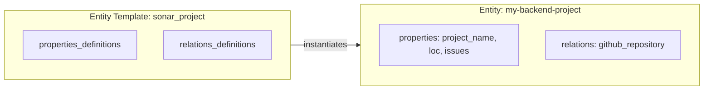

Entities are **instances** of Entity Templates containing actual data. If an Entity Template is the blueprint, an Entity is the house built from that blueprint.

## Overview

An Entity contains:

- **Identity** - Unique identifier and title
- **Template Reference** - Which template it instantiates
- **Properties** - Actual values for the template's property definitions
- **Relations** - Links to other entities
- **Audit Fields** - Creation/modification timestamps and actors



---

## Structure

### Complete Example

Here's an entity instantiated from the `sonar_project` template:

```json
{
  "identifier": "decathlon_my-backend-project",
  "title": "My Backend Project",
  "template": "sonar_project",
  "properties": {
    "project_name": "My Backend Project",
    "last_analysis_date": "2025-11-28T12:20:38+0000",
    "issues_number": 137,
    "loc": 20000
  },
  "relations": {
    "github_repository": "my-backend-repo"
  },
  "created_at": "2024-10-25T09:44:02.742Z",
  "created_by": "1EOn3KYVK6L8Bh6Sm0dZ1AdG1AtAZmWt",
  "updated_at": "2025-11-29T09:44:03.448Z",
  "updated_by": "1EOn3KYVK6L8Bh6Sm0dZ1AdG1AtAZmWt"
}
```

---

## Core Fields

| Field        | Type     | Description                                  |
| ------------ | -------- | -------------------------------------------- |
| `identifier` | String   | Unique identifier for this entity            |
| `title`      | String   | Human-readable name                          |
| `template`   | String   | The Entity Template this entity instantiates |
| `properties` | Object   | Key-value pairs of property data             |
| `relations`  | Object   | Links to other entities                      |
| `created_at` | DateTime | When the entity was created                  |
| `created_by` | String   | Who created the entity                       |
| `updated_at` | DateTime | Last modification time                       |
| `updated_by` | String   | Who last modified the entity                 |

---

## Properties

Properties contain the actual data values. The structure follows the template's property definitions:

```json
{
  "properties": {
    "project_name": "My Backend Project",  // STRING
    "issues_number": 137,                  // NUMBER
    "loc": 20000,                          // NUMBER
    "last_analysis_date": "2025-11-28..."  // STRING (date-time)
  }
}
```

### Validation

System validates values against the template's property rules:

- Required properties must be present
- Types must match: STRING, NUMBER, or BOOLEAN
- Enforcement rules apply: min or max length, format, enum values

---

## Relations

Relations link entities together, forming a graph. It references the entity identifiers of related entities.

### One-to-One Relations (`to_many: false`)

For consistency, even single relations are represented as arrays:

```json
{
  "relations": {
    "owned_by": ["platform-team"]
  }
}
```

### One-to-Many Relations (`to_many: true`)

When multiple related entities are allowed, you can list several identifiers in the relation array:

```json
{
  "relations": {
    "components": ["frontend", "backend", "database"]
  }
}
```

---

## Audit Fields

Every entity tracks who created/modified it and when:

```json
{
  "created_at": "2024-10-25T09:44:02.742Z",
  "created_by": "auth0|65c1d23377c9bea7d7adc415",
  "updated_at": "2025-11-29T09:44:03.448Z",
  "updated_by": "webhook_integration_sonar"
}
```

The `created_by` and `updated_by` fields contain:

- User IDs for manual operations
- Integration IDs for automated data ingestion

---

## Dynamic Schema

Because templates are configured at runtime, the entity structure is **dynamic**:

> [!WARNING]
> The second-level JSON paths (`properties`, `relations`) are **not guaranteed by the API contract**. Their structure depends on the template configuration.
>
> This means:
>
> - Properties change when templates change
> - Clients should handle unknown properties gracefully

## Next Steps

- **[Properties](properties.md)** - Property types and validation rules
- **[Relations](relations.md)** - How entities connect
- **[Calculated Properties](calculated-properties.md)** - Automatic computations
