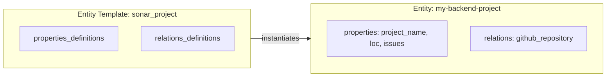

Entities are **instances** of Entity Templates containing actual data. If an Entity Template is the blueprint, an Entity is the house built from that blueprint.

## Overview

An Entity contains:

- **Identity** - Unique identifier and name
- **Template Reference** - Which template it instantiates
- **Properties** - Actual values for the template's property definitions
- **Relations** - Links to other entities



---

## Structure

### Complete Example

Here's an entity instantiated from the `web-service` template:

```json
{
  "identifier": "my-web-service",
  "name": "my-web-service",
  "template_identifier": "web-service",
  "properties": {
    "port": "8080",
    "environment": "dev"
  },
  "relations": {
    "depends-on": [
      {
        "identifier": "web-api-1",
        "name": "Web API 1"
      }
    ]
  },
  "relations_as_target": {}
}
```

---

## Core Fields

| Field                  | Type   | Description                                  |
| ---------------------- | ------ | -------------------------------------------- |
| `identifier`           | String | Unique identifier within the template scope  |
| `name`                 | String | Human-readable name                          |
| `template_identifier`  | String | The Entity Template this entity instantiates |
| `properties`           | Object | Key-value pairs of property data             |
| `relations`            | Object | Links to other entities (grouped by name)    |
| `relations_as_target`  | Object | Reverse relations from other entities        |

---

## Creating an Entity

You create an entity by sending a `POST` request to the entities endpoint, specifying the template identifier in the URL path.

### Endpoint

```text
POST /api/v1/entities/{templateIdentifier}
```

### Request Body

```json
{
  "name": "my-web-service",
  "identifier": "my-web-service",
  "properties": {
    "port": "8080",
    "environment": "dev"
  },
  "relations": [
    {
      "name": "depends-on",
      "target_entity_identifiers": ["web-api-1", "web-api-2"]
    }
  ]
}
```

### Validation

IDP-Core validates entities at two levels: **syntactic validation** at the API boundary and **semantic validation** against the template definition.

#### Syntactic Validation (API Layer)

The API enforces basic structural rules on the request body before any business logic runs:

| Field                                | Rule          | Error Message                               |
| ------------------------------------ | ------------- | ------------------------------------------- |
| `name`                               | Required, not blank | Entity name is mandatory              |
| `identifier`                         | Required, not blank | Entity identifier is mandatory        |
| `relations[].name`                   | Required, not blank | Relation name is mandatory            |
| `relations[].target_entity_identifiers` | Required, not null | Relation target identifiers required |

If any rule fails, the API returns `400 Bad Request` with a description of the violation.

#### Semantic Validation (Domain Layer)

After syntactic checks pass, the domain service validates the entity against its template definition:

- **Template existence** - The template identifier must match an existing template. Returns `404 Not Found` if the template does not exist.
- **Property value types** - Values must conform to the property definition type (STRING, NUMBER, BOOLEAN).
- **Property rules** - Values must satisfy the template's property rules (min/max length, format, regex, enum).
- **Required properties** - All properties marked as required in the template must be present.
- **Duplicate check** - An entity with the same identifier must not already exist for the template. Returns `409 Conflict` if it does.

### Response Codes

| Code  | Description                                                    |
| ----- | -------------------------------------------------------------- |
| `201` | Entity created successfully                                    |
| `400` | Invalid request body or validation failure                     |
| `401` | Missing or invalid authentication token                        |
| `403` | Insufficient permissions                                       |
| `404` | Template not found for the given identifier                    |
| `409` | An entity with this identifier already exists for the template |
| `500` | Unexpected server error                                        |

### Minimal Example

You can create an entity with only the required fields:

```json
{
  "name": "microservice-minimal",
  "identifier": "microservice-minimal"
}
```

Properties and relations are optional in the request body. The domain layer validates that all *required* properties (as defined in the template) are present.

---

## Properties

Properties contain the actual data values. The structure follows the template's property definitions:

```json
{
  "properties": {
    "project_name": "My Backend Project",
    "issues_number": 137,
    "loc": 20000,
    "last_analysis_date": "2025-11-28..."
  }
}
```

### Validation

The system validates values against the template's property rules:

- Required properties must be present
- Types must match: STRING, NUMBER, or BOOLEAN
- Enforcement rules apply: min or max length, format, enum values

---

## Relations

Relations link entities together, forming a graph. Each relation references the entity identifiers of related entities.

### Creating Relations

When creating an entity, you specify relations as an array of objects, each with a `name` and a list of `target_entity_identifiers`:

```json
{
  "relations": [
    {
      "name": "depends-on",
      "target_entity_identifiers": ["web-api-1", "web-api-2"]
    },
    {
      "name": "owned-by",
      "target_entity_identifiers": ["platform-team"]
    }
  ]
}
```

### Relations in Responses

In API responses, relations are grouped by name and include summary information about each target entity:

```json
{
  "relations": {
    "depends-on": [
      { "identifier": "web-api-1", "name": "Web API 1" },
      { "identifier": "web-api-2", "name": "Web API 2" }
    ]
  },
  "relations_as_target": {
    "depends-on": [
      { "identifier": "frontend-app", "name": "Frontend App" }
    ]
  }
}
```

The `relations_as_target` field shows reverse relationships—other entities that reference this entity.

### One-to-One Relations (`to_many: false`)

For consistency, even single relations are represented as arrays:

```json
{
  "relations": [
    {
      "name": "owned_by",
      "target_entity_identifiers": ["platform-team"]
    }
  ]
}
```

### One-to-Many Relations (`to_many: true`)

When multiple related entities are allowed, list several identifiers:

```json
{
  "relations": [
    {
      "name": "components",
      "target_entity_identifiers": ["frontend", "backend", "database"]
    }
  ]
}
```

---

## Retrieving Entities

### List Entities by Template

Retrieve a paginated list of entities for a given template:

```text
GET /api/v1/entities/{templateIdentifier}?page=0&size=20&sort=identifier,asc
```

### Get Entity by Identifier

Retrieve a specific entity using its template and entity identifiers:

```text
GET /api/v1/entities/{templateIdentifier}/identifier/{entityIdentifier}
```

---

## Dynamic Schema

Because templates are configured at runtime, the entity structure is **dynamic**:

> [!WARNING]
> The second-level JSON paths (`properties`, `relations`) are **not guaranteed by the API contract**. Their structure depends on the template configuration.
>
> This means:
>
> - Properties change when templates change
> - Clients should handle unknown properties gracefully

## Next Steps

- **[Properties](properties.md)** - Property types and validation rules
- **[Relations](relations.md)** - How entities connect
- **[API Reference](../api/index.md)** - Interactive Swagger UI documentation
