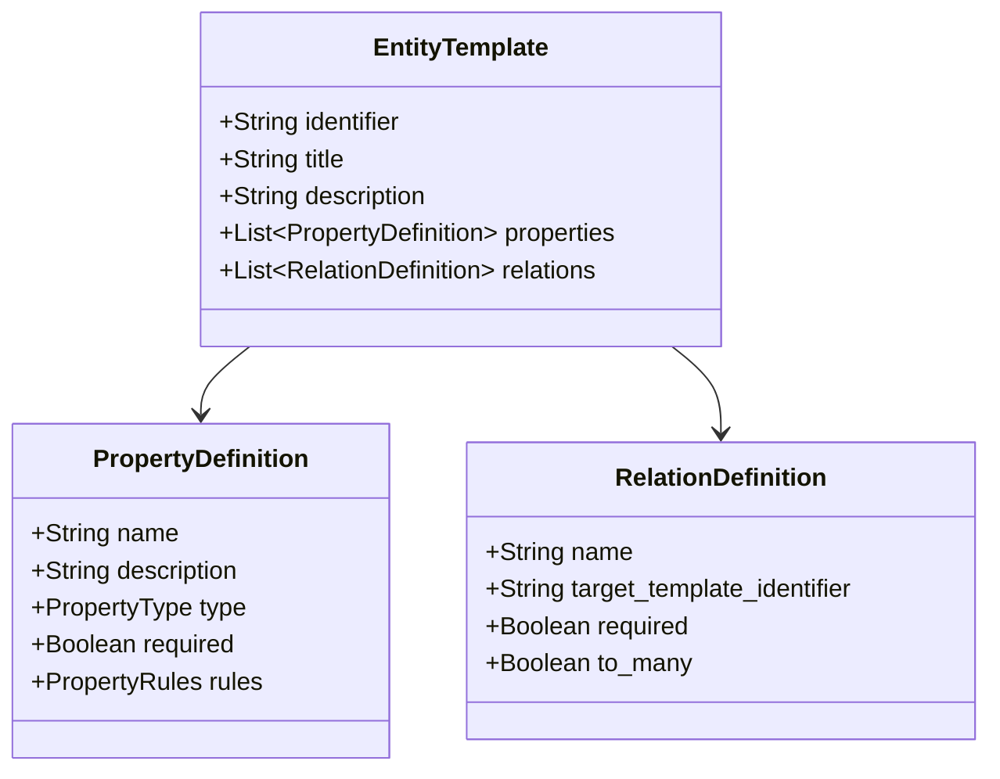

Entity Templates are the **blueprints** that define the structure of entities in IDP-Core. Think of them as runtime-configurable database schemas that describe what data your platform can store.

## Overview

An Entity Template defines:

- **Identity** - Unique identifier and human-readable name used to reference the template throughout the system.
- **Properties** - Data fields with types and validation rules
- **Relations** - Connections to other entity templates



---

## Structure

### Complete Example

Here's a complete Entity Template for a Sonar project:

```json
{
  "identifier": "sonar_project",
  "title": "Sonar Project",
  "description": "Data coming from Sonar about main indicators of software quality",
  "properties_definitions": [
    {
      "name": "project_name",
      "description": "Name of the project in Sonar",
      "type": "STRING",
      "required": true,
      "rules": {
        "max_length": 200,
        "min_length": 1
      }
    },
    {
      "name": "last_analysis_date",
      "description": "Last date of analysis of the project in Sonar",
      "type": "STRING",
      "required": true,
      "rules": {
        "regex": "^\\d{4}-\\d{2}-\\d{2}T\\d{2}:\\d{2}:\\d{2}Z$"
      }
    },
    {
      "name": "issues_number",
      "description": "Number of open issues in Sonar",
      "type": "NUMBER",
      "required": false,
      "rules": {
        "max_value": 2000,
        "min_value": 0
      }
    },
    {
      "name": "loc",
      "description": "Number of lines of code",
      "type": "NUMBER",
      "required": false,
      "rules": {
        "min_value": 0
      }
    }
  ],
  "relations_definitions": [
    {
      "name": "depends_on",
      "target_template_identifier": "github_repository",
      "required": true,
      "to_many": false
    }
  ]
}
```

---

## Core Identity Fields

### Identifier Best Practices

- Use `snake_case` for identifiers
- Keep them short but descriptive
- Make them unique across your entire data model
- Don't change identifiers after entities are created

```text
✅ Good: service, github_repository, sonar_project
❌ Bad: Service, GitHub Repository, my-service-template
```

---

## Properties

Properties define the data model—the fields that entities will contain.

See **[Properties](properties.md)** for detailed documentation.

```json
{
  "properties_definitions": [
    {
      "name": "project_name",
      "description": "Name of the project",
      "type": "STRING",
      "required": true,
      "rules": {
        "min_length": 1,
        "max_length": 200
      }
    }
  ]
}
```

---

## Relations

Relations define how entity templates connect to each other, forming a graph structure.

See **[Relations](relations.md)** for detailed documentation.

```json
{
  "relations_definitions": [
    {
      "name": "owned_by",
      "target_template_identifier": "team",
      "required": true,
      "to_many": false
    },
    {
      "name": "components",
      "target_template_identifier": "component",
      "required": false,
      "to_many": true
    }
  ]
}
```

---

## Best Practices

### 1. Start Simple

Begin with basic templates and add complexity as needed:

```json
// Start with this
{
  "identifier": "service",
  "properties_definitions": [
    {"name": "name", "type": "STRING", "required": true}
  ]
}

// Evolve to this over time
{
  "identifier": "service",
  "properties_definitions": [...],
  "relations_definitions": [...]
}
```

### 2. Use Consistent Naming

- **Templates**: Use snake_case nouns like `github_repository`, `sonar_project`
- **Properties**: Use snake_case like `project_name`, `last_analysis_date`
- **Relations**: Use verb phrases like `owned_by`, `depends_on`, `contains`

### 3. Document Everything

Always include descriptions for templates and properties to help you and your team understand what each element represents. This makes maintenance and updates easier.

```json
{
  "identifier": "sonar_project",
  "description": "Represents a project analyzed by SonarQube/SonarCloud",
  "properties_definitions": [
    {
      "name": "coverage",
      "description": "Test coverage percentage (0-100)",
      "type": "NUMBER"
    }
  ]
}
```

### 4. Plan Relations Carefully

Think about your data model before creating templates. Don't over complicate relations: you can start with simple properties and add relations later as needed.

---

## Next Steps

- **[Properties](properties.md)** - Define data fields with validation
- **[Relations](relations.md)** - Connect templates together
