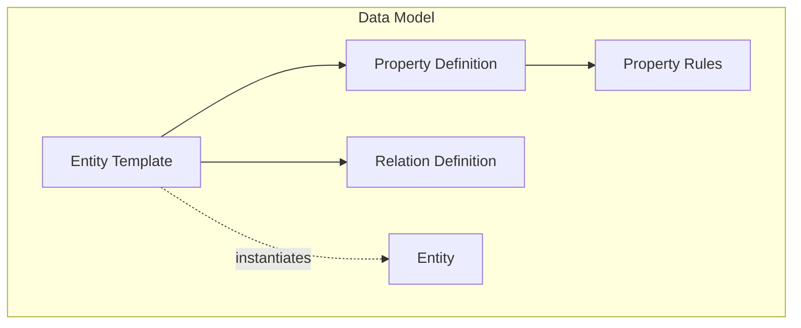
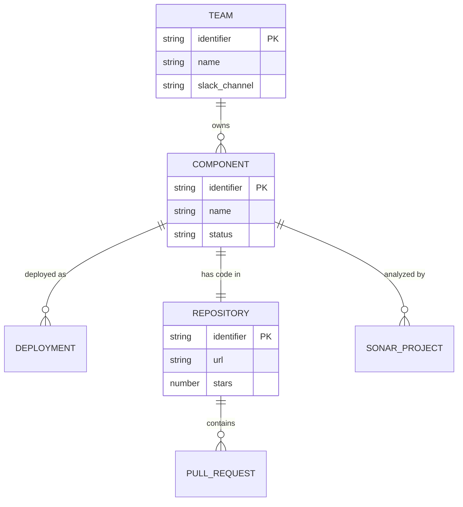

IDP-Core sits at the center of a flexible, runtime-configurable data model. This section explains the fundamental concepts you need to understand.

## Overview

- 📄 **[Entity Templates](entity-templates.md)**

    ---

    Blueprints that define the structure of your entities—like database schemas defined at runtime.

- 🗄️ **[Entities](entities.md)**

    ---

    Instances of templates with actual data—your software catalog items.

- 📋 **[Properties](properties.md)**

    ---

    Data fields with types, validation rules, and constraints.

- 🔗 **[Relations](relations.md)**

    ---

    Connections between entities forming a knowledge graph.

---

## The IDP-Core Data Model

Unlike traditional Configuration Management Databases with rigid, predefined schemas, IDP-Core provides a **flexible meta-modeling engine**. You define your own data models—called **Entity Templates**—that mirror your organization's specific needs.

### Key Principles

1. **Runtime Configurable** - Create and modify data models without code changes or deployments
2. **Schema-less Flexibility** - No predefined schemas; adapt to your organization's needs
3. **Graph-Based Relations** - Connect entities to form a knowledge graph of your tech landscape

### Example: Software Catalog

Here's how you might model a basic software catalog:

---

## Quick Reference

| Concept             | What It Is                                          | Example                                                   |
| ------------------- | --------------------------------------------------- | --------------------------------------------------------- |
| **Entity Template** | Blueprint/schema                                    | `service`, `team`, `repository`                           |
| **Entity**          | Instance based on a template that contains the data | `payment-service`, `platform-team`, `idp-core-repository` |
| **Property**        | Data field                                          | `name`, `status`, `url`                                   |
| **Property Rules**  | Validation                                          | `format: EMAIL`, `min_value: 0`                           |
| **Relation**        | Link to another entity                              | `owned_by`, `depends_on`                                  |

---

## How It All Fits Together

1. **Define Templates** - Create Entity Templates that describe your domain objects
2. **Add Properties** - Specify what data each entity type contains
3. **Configure Relations** - Link templates to form a graph structure
4. **Create Entities** - Instantiate templates with actual data

---

## Next Steps

Dive deeper into each concept:

- **[Entity Templates](entity-templates.md)** - Learn how to design your data model
- **[Properties](properties.md)** - Understand property types and validation
- **[Relations](relations.md)** - Connect your entities into a graph
