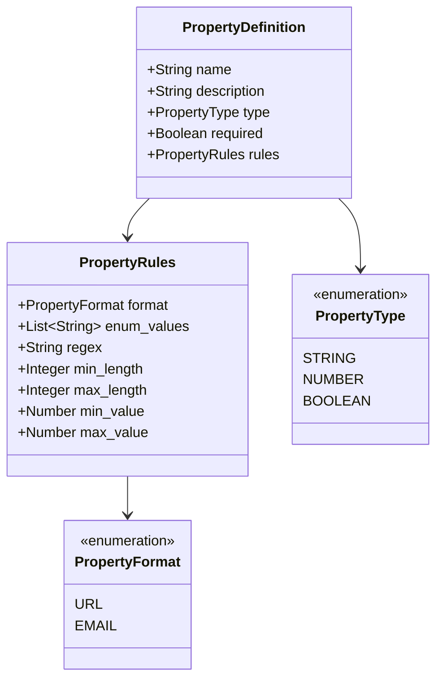

Properties define the **data fields** that entities must contain. Each property needs a type, optional validation rules, and can be required or optional.

## Overview

A Property Definition specifies:

- **Name** - Internal identifier for the property
- **Type** - Data type (STRING, NUMBER, BOOLEAN)
- **Required** - Whether the property must have a value
- **Rules** - Validation constraints such as format, length, range, or enum values



---

## Property Definition Structure

```json
{
  "name": "email",
  "description": "Contact email address",
  "type": "STRING",
  "required": true,
  "rules": {
    "pattern": "EMAIL"
  }
}
```

| Field         | Type        | Required | Description                                   |
| ------------- | ----------- | -------- | --------------------------------------------- |
| `name`        | String      | Yes      | Internal property name                        |
| `description` | String      | No       | Human-readable description                    |
| `type`        | Enumeration | Yes      | Data type: STRING, NUMBER, or BOOLEAN         |
| `required`    | Boolean     | No       | Whether value is mandatory (default: `false`) |
| `rules`       | Object      | No       | Validation rules                              |

---

## Property Types

### STRING

Text values. Use for names, descriptions, URLs, dates, and any text data.

```json
{
  "name": "description",
  "type": "STRING",
  "required": false,
  "rules": {
    "min_length": 10,
    "max_length": 1000,
    "pattern": "^[A-Za-z0-9 ,.?!'-]+$"
  }
}
```

### NUMBER

Numeric values. Use for counts, metrics, scores, and measurements.

```json
{
  "name": "coverage",
  "type": "NUMBER",
  "required": false,
  "rules": {
    "min_value": 0,
    "max_value": 100
  }
}
```

### BOOLEAN

True/false values. Use for flags and binary states.

```json
{
  "name": "is_public",
  "type": "BOOLEAN",
  "required": false
}
```

---

## Property Rules

Rules provide validation constraints for property values.

### Format Rules

Validate STRING properties against common formats:

=== "EMAIL"

    ```json
    {
      "name": "contact_email",
      "type": "STRING",
      "rules": {
        "format": "EMAIL"
      }
    }
    ```

    Validates: `user@example.com`

=== "URL"

    ```json
    {
      "name": "repository_url",
      "type": "STRING",
      "rules": {
        "format": "URL"
      }
    }
    ```

    Validates: `https://github.com/org/repo`

### Length Rules

Constrain STRING length:

```json
{
  "name": "name",
  "type": "STRING",
  "rules": {
    "min_length": 2,
    "max_length": 100
  }
}
```

### Value Range Rules

Constrain NUMBER values:

```json
{
  "name": "stars",
  "type": "NUMBER",
  "rules": {
    "min_value": 0,
    "max_value": 1000000
  }
}
```

### Enumeration Rules

Restrict STRING to predefined values:

```json
{
  "name": "status",
  "type": "STRING",
  "rules": {
    "enum_values": ["development", "staging", "production", "deprecated"]
  }
}
```

### Regex Rules

Custom pattern validation:

```json
{
  "name": "version",
  "type": "STRING",
  "rules": {
    "regex": "^v?\\d+\\.\\d+\\.\\d+$"
  }
}
```

Validates: `v1.2.3`, `1.0.0`

---

## Complete Rules Reference

| Rule | Applies To | Description | Example |
| ------ | ------------ | ------------- | --------- |
| `format` | STRING | Predefined format validation | `"format": "EMAIL"` |
| `enum_values` | STRING | Allowed values list | `"enum_values": ["a", "b"]` |
| `regex` | STRING | Custom regex pattern | `"regex": "^[A-Z]+$"` |
| `min_length` | STRING | Minimum character length | `"min_length": 1` |
| `max_length` | STRING | Maximum character length | `"max_length": 255` |
| `min_value` | NUMBER | Minimum numeric value | `"min_value": 0` |
| `max_value` | NUMBER | Maximum numeric value | `"max_value": 100` |

---

## Examples

### Service Properties

```json
{
  "properties_definitions": [
    {
      "name": "name",
      "description": "Service name",
      "type": "STRING",
      "required": true,
      "rules": {
        "min_length": 2,
        "max_length": 100
      }
    },
    {
      "name": "description",
      "description": "Service description",
      "type": "STRING",
      "required": false,
      "rules": {
        "max_length": 1000
      }
    },
    {
      "name": "status",
      "description": "Lifecycle status",
      "type": "STRING",
      "required": true,
      "rules": {
        "enum_values": ["development", "staging", "production", "deprecated"]
      }
    },
    {
      "name": "port",
      "description": "Default port number",
      "type": "NUMBER",
      "required": false,
      "rules": {
        "min_value": 1,
        "max_value": 65535
      }
    },
    {
      "name": "is_critical",
      "description": "Whether this is a critical service",
      "type": "BOOLEAN",
      "required": false
    }
  ]
}
```

### Repository Properties

```json
{
  "properties_definitions": [
    {
      "name": "url",
      "description": "Repository URL",
      "type": "STRING",
      "required": true,
      "rules": {
        "format": "URL"
      }
    },
    {
      "name": "stars",
      "description": "GitHub stars count",
      "type": "NUMBER",
      "required": false,
      "rules": {
        "min_value": 0
      }
    },
    {
      "name": "language",
      "description": "Primary programming language",
      "type": "STRING",
      "required": false,
      "rules": {
        "enum_values": ["Java", "Python", "TypeScript", "Go", "Rust", "Other"]
      }
    },
    {
      "name": "is_public",
      "description": "Public visibility",
      "type": "BOOLEAN",
      "required": false
    }
  ]
}
```

---

## Best Practices

### 1. Always Add Descriptions

```json
{
  "name": "coverage",
  "description": "Test coverage percentage (0-100)",  // ✅ Clear
  "type": "NUMBER"
}
```

### 2. Use Appropriate Types

```json
// ❌ Bad - using STRING for numeric data
{"name": "stars", "type": "STRING"}

// ✅ Good - use NUMBER for numeric data
{"name": "stars", "type": "NUMBER"}
```

### 3. Add Validation Rules

```json
// ❌ Bad - no validation
{"name": "email", "type": "STRING"}

// ✅ Good - validates email format
{"name": "email", "type": "STRING", "rules": {"format": "EMAIL"}}
```

### 4. Use Enumerations for Fixed Values

```json
// ❌ Bad - free text for status
{"name": "status", "type": "STRING"}

// ✅ Good - constrained to valid values
{"name": "status", "type": "STRING", "rules": {"enum_values": ["active", "inactive"]}}
```

### 5. Be Careful with Required

Only mark properties as required if they truly are:

```json
// Required for identity
{"name": "name", "type": "STRING", "required": true}

// Optional metadata
{"name": "description", "type": "STRING", "required": false}
```

---

## Next Steps

- **[Relations](relations.md)** - Connect entities together
- **[Calculated Properties](calculated-properties.md)** - Compute derived values
