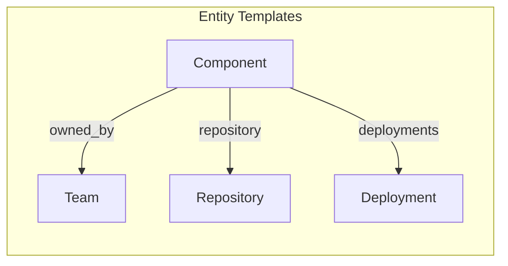
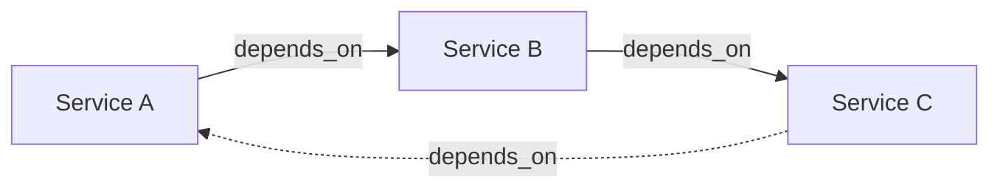

Relations define **connections between entities**, forming a graph structure that represents your technical landscape. They allow you to model ownership, dependencies, and associations between different entity types.

## Overview

A Relation Definition specifies:

- **Name** - Semantic name for the relationship. It should used on frontend side to display the relation meaningfully.
- **Target** - Which entity template it connects to
- **Cardinality** - One-to-one or one-to-many
- **Required** - Whether the relation must be established at entity creation and update time



---

## Relation Definition Structure

```json
{
  "name": "owned_by",
  "target_template_identifier": "team",
  "required": true,
  "to_many": false
}
```

| Field                        | Type    | Required | Description                                | Default |
|------------------------------|---------|----------|--------------------------------------------|---------|
| `name`                       | String  | Yes      | Semantic name for the relationship         | `N/A`   |
| `target_template_identifier` | String  | Yes      | Entity template identifier to link to      | `N/A`   |
| `required`                   | Boolean | No       | Whether the relation must exist            | `false` |
| `to_many`                    | Boolean | No       | `false` = one-to-one, `true` = one-to-many | `false` |

---

## Cardinality

### One-to-One (`to_many: false`)

Each entity can link to **exactly one** target entity.

```json
{
  "name": "owned_by",
  "target_template_identifier": "team",
  "required": true,
  "to_many": false
}
```

**Entity data:**

```json
{
  "relations": {
    "owned_by": ["platform-team"]
  }
}
```

**Use cases:**

- A software owned by a single team
- A Sonar project linked to one repository
- A deployment associated with one environment

### One-to-Many (`to_many: true`)

Each entity can link to **multiple** target entities.

```json
{
  "name": "components",
  "target_template_identifier": "component",
  "required": false,
  "to_many": true
}
```

**Entity data:**

```json
{
  "relations": {
    "components": ["frontend", "backend", "database", "cache"]
  }
}
```

**Use cases:**

- A product made up of multiple components
- A repository with many pull requests
- A team that includes several members

---

## Example: Complete Data Model

Here's a complete example with multiple templates and relations:

### Team Template

```json
{
  "identifier": "team",
  "properties_definitions": [
    {"name": "name", "type": "STRING", "required": true},
    {"name": "slack_channel", "type": "STRING", "required": false}
  ]
}
```

### Repository Template

```json
{
  "identifier": "github_repository",
  "properties_definitions": [
    {"name": "url", "type": "STRING", "required": true},
    {"name": "stars", "type": "NUMBER", "required": false}
  ]
}
```

### Component Template

```json
{
  "identifier": "component",
  "properties_definitions": [
    {"name": "name", "type": "STRING", "required": true},
    {"name": "status", "type": "STRING", "required": false}
  ],
  "relations_definitions": [
    {
      "name": "owned_by",
      "target_template_identifier": "team",
      "required": true,
      "to_many": false
    },
    {
      "name": "repository",
      "target_template_identifier": "github_repository",
      "required": false,
      "to_many": false
    },
    {
      "name": "depends_on",
      "target_template_identifier": "component",
      "required": false,
      "to_many": true
    }
  ]
}
```

---

## Best Practices

### 1. Use Semantic Names

```json
// ✅ Good - clear meaning
{"name": "owned_by", "target_template_identifier": "team"}
{"name": "depends_on", "target_template_identifier": "service"}

// ❌ Bad - unclear
{"name": "team_link", "target_template_identifier": "team"}
{"name": "service_ref", "target_template_identifier": "service"}
```

### 2. Choose Cardinality Carefully

Think about the real-world relationship:

- A service has **one** owning team → `to_many: false`
- A product has **many** components → `to_many: true`

### 3. Use Required Appropriately

Only mark relations as required if the entity is meaningless without them. It will introduce a strong validation constraints when creating or updating entities.

```json
// Service must have an owner
{"name": "owned_by", "required": true}

// Service may or may not have documentation
{"name": "documentation", "required": false}
```

### 4. Avoid Circular Dependencies

Be careful with relations that could create cycles:



---

## Next Steps
