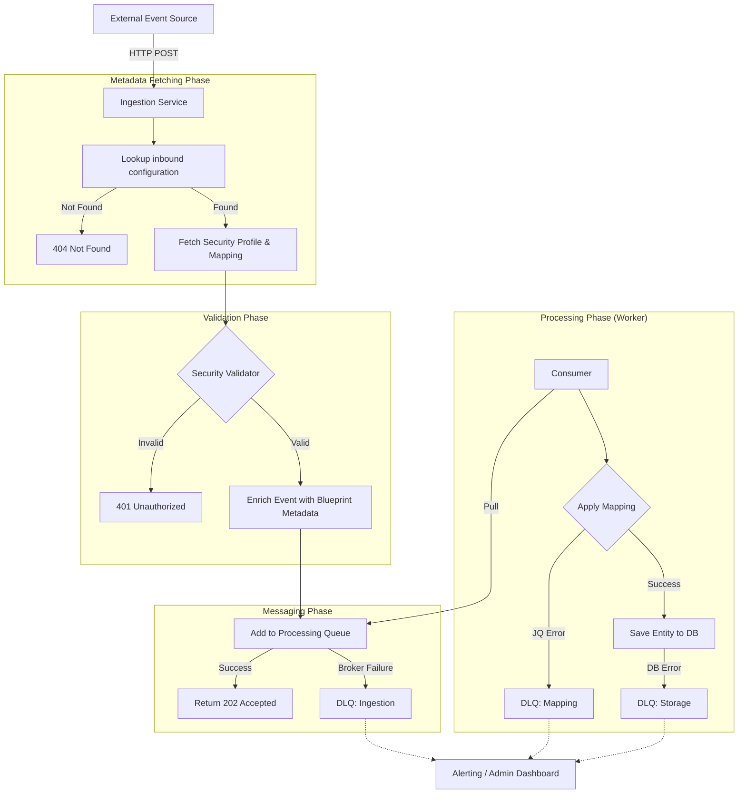

# 0003 - Data Ingestion Framework

* Status: Accepted
* Deciders:
  * maintainers team: Andrés BRAND, Matthieu WALTERSPIELER, Eve BERNHARD, Ferial OUKOUKES, Renny VANDOMBER
  * contributors team: `N/A`
* Consulted: Étienne JACQUOT
* Informed: `N/A`
* Date: 2026-04-22

## Context and Problem Statement

One of the main features of the IDP is the ability to import data from external sources for creating or modifying entities. We call these components "connectors." The external sources can be an Inbound Webhook, a Message System subscription, or a scheduled API puller. The event treatment must be stateless.

* For the Inbound Webhook connector, we expect to create a generic HTTP route with a configuration ID as a URL parameter.
* For the Message connector, we need to subscribe to multiple topics to begin receiving incoming events.
* For the API puller connector, we need to be able to call an API using the target URL.

For all connectors, we will have to manage the security layer. The mapping capability is configured at runtime (all the mapping definition is in the database).

### Proposed architecture and Problem Statement

We have defined a high-level architecture to implement the flow from event reception to entity persistence in our database:

We have to create at least the following elements:

* Security validator
* Mapper (using technologies such as JQ, JSLT, or other)
* Message broker client
* Queue management system
* Web client with retry configuration
* DLQ logic

## Decision Drivers

* Maintainability
* Time to market
* Developer Experience
* Reliability
* Complexity of implementation
* Flexibility
* Scalability

## Considered Options

1. Implement the flow creating custom Spring Boot code.
2. Use the Apache Camel framework for implementing the route configurations and data handling.

## Decision Outcome

Chosen option: 2, **"Use the Apache Camel framework for implementing the route configurations and data handling."** because it mainly can help us to speed the time to market the product.

### Positive Consequences

* Accelerated Time-to-Market: Reduced time to implement the initial ingestion logic and establish a shorter feedback loop for system performance and data quality.
* Declarative Power: Allows the team to focus on business logic (the "what") rather than infrastructure plumbing (the "how").

### Negative Consequences

* Steep Learning Curve: Requires an initial time investment for the team to master Camel DSL, its internal exchange model, and Enterprise Integration Patterns (EIP).
* "Black Box" Abstraction: The high level of framework abstraction can make the system feel like a "black box," potentially complicating deep debugging.

## Pros and Cons of the Options

### 1. Implement the flow creating custom Spring Boot code

Here is how we could implement each block using only Spring Boot code:

| Feature            | Description                                                                                    |
|--------------------|------------------------------------------------------------------------------------------------|
| Template Fetching  | Easy: Standard `@Service` lookup.                                                              |
| Security validator | Manual: Requires creating the component for each security strategy.                            |
| Messaging client   | Heavy: Requires importing the client library and writing a `@Service` for each type of client. |
| Mapping         | Manual: Requires importing a mapping library and writing a `@Service`.                             |
| Web client         | Manual: Requires creating a new connector with exception management.                           |
| Queueing           | Manual: Requires creating a new `@Service` and templates for pushing and pulling.              |
| DLQ Logic          | Manual: Requires custom `@ExceptionHandler` logic.                                             |

* Good because we have total control. We have 100% transparency over the execution. Standard Spring Services are easier to write and unit test.
* Good because of developer familiarity. The team already knows Spring Boot. We won't need specialized Camel knowledge to maintain the code.
* Good because for extremely high-throughput systems, removing the framework abstraction can reduce CPU cycles per message.
* Bad because of high boilerplate. We have to manually write the "plumbing." We'll spend time writing Pub/Sub clients, producers, retry logic, and HTTP clients instead of focusing on the business value of idp-core : the conception of templates, relationships and entities.
* Good because contributor onboarding on the open source repository is facilitated. Spring Boot is one of the most popular Java frameworks in the engineering community. Apache Camel is maybe less known and requires a learning curve.
* Good because we limit our framework dependencies.
* Bad because of less flexibility by default. Integrating a new type of source or migrate an existing one will require more development time, which adds boilerplate code and maintenance overhead.
* Bad because of manual DLQ management. We must manually catch exceptions, wrap the failed message, and send it to a DLQ topic.
* Bad because of more conception time. We will focus more on the infrastructure side of the architecture and not the functional one.

### 2. Use the Apache Camel framework for implementing the route configurations and data handling

| Feature            | Description                                                                                       |
|--------------------|---------------------------------------------------------------------------------------------------|
| Template Fetching  | Easy: Use `pollEnrich` or a simple Bean lookup.                                                   |
| Security validator | Manual: Requires creating the component for each security strategy.                               |
| Messaging client   | Native: Built-in `kafka:topicName` or `google-pubsub:{{project.name}}:{{subscription.name}}`.     |
| Mapping         | Native: Built-in `transform().jq(...)` (as well for JSLT).                                         |
| Queueing           | Seamless: Just use `.to("seda:queue")` or `.to("kafka:...")`.                                     |
| DLQ Logic          | Superior: `deadLetterChannel` handles retries and routing automatically.                          |

* Good because of built-in Enterprise Integration Patterns (EIP): Patterns like Dead Letter Channel, Wire Tap, and Message Translator are native. We don't write the logic, we just configure it.
* Good because of its large component library: Camel has 300+ components. Switching from a Webhook to a Kafka source is just changing a URI (for example, `platform-http:/hook` to `kafka:my-topic`).
* Good because of flexibility. We can leverage the Camel components to easily add functionalities to IDP-Core. For example, using Pub/Sub instead of the database for queuing.
* Good because Camel has a native JQ and JSLT expression language. We can apply the template mapping in one line of DSL.
* Good because of error handling. Managing different Dead Letter Queues for "Mapping Errors" vs. "Database Errors" is handled via simple `onException` blocks.
* Good because of less conception time. We will focus more on the route logic.
* Good because of documentation. Camel is a well-documented framework with a recently added LLM accessibility for assistance and coding agents.
* Good because of observability. Camel has OpenTelemetry with integrated metrics and traces for the routes.
* Bad because for a simple "pass-through" service, Camel adds a layer of abstraction that might slightly increase memory usage in the Cloud Run container.
* Bad because of complex debugging. Camel error logs can be less clear than a native Spring Boot solution.
* Bad because it may be overkill for our use case.
* Bad because if we cannot implement a generic route, the high volume of individual routes will significantly delay the container startup.
* Bad because there is no typing contract between treatments at build. It will not break during the build if the route n+1 expects another object type.

## More Information

* [Apache Camel for Spring Boot documentation](https://camel.apache.org/camel-spring-boot/latest/)
* [Apache Documentation for LLM](https://camel.apache.org/blog/2025/11/camel-website-llmstxt)
* [Apache Documentation for Open Telemetry integration](https://camel.apache.org/components/latest/others/opentelemetry.html)
