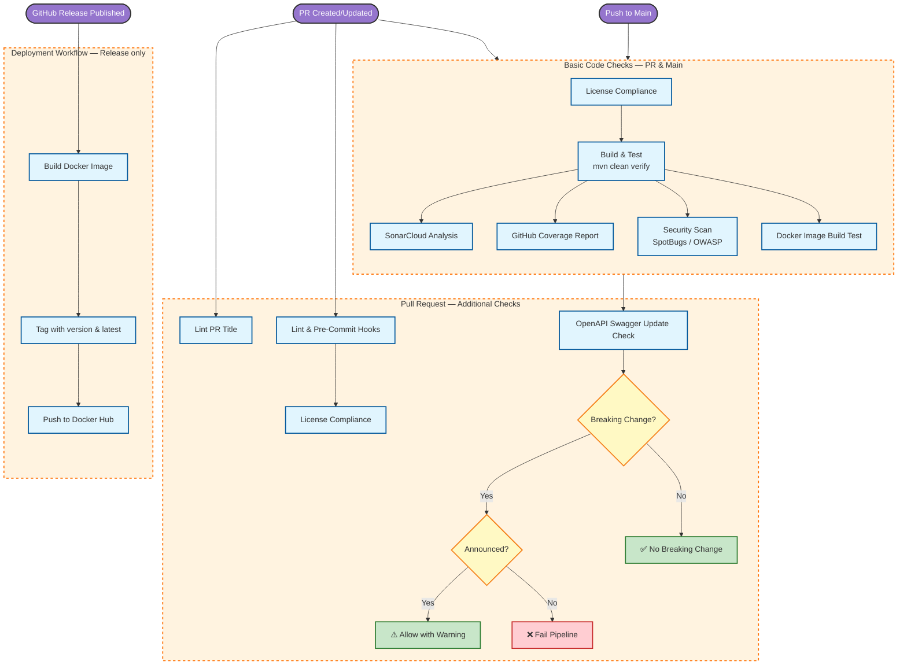

## 📈 Visual Workflow

## Key Checks

The `Basic Code Checks` workflow runs on every **pull request** targeting `main` and on every **push to `main`**. Some jobs are PR-only.

| Job | Pull Request | Push to `main` |
| --- | :---: | :---: |
| Lint & Pre-Commit Hooks | ✅ | — |
| License Compliance | ✅ | ✅ |
| Build, Test & SonarCloud Analysis | ✅ | ✅ |
| GitHub Coverage Report | ✅ | ✅ |
| Security Scan (SpotBugs / OWASP) | ✅ | ✅ |
| OpenAPI Breaking Change Check | ✅ | — |
| Docker Image Build Test | ✅ | ✅ |

1. **Conventional Commits**: PR titles must follow `feat:`, `fix:`, etc. We also control the scope, for example `feat(domain): ...`.
2. **Breaking Changes**: We use `oasdiff` to check for API breaking changes.
    * **Announce** breaking changes in the commit message, for example `feat(domain)!: remove endpoint`.
    * Unannounced breaking changes **fail the pipeline**.
3. **Tests**: Unit tests and integration tests using Testcontainers must pass. Coverage should be at least 80%.
4. **Coverage reporting**: SonarCloud and GitHub quality both receive coverage data on every push to `main` and on every PR.

## Release Process

1. Create a stable GitHub release with a semantic version tag, for example `v1.4.0`.
2. The `Build and Push to Docker Hub` workflow starts on the `release` event (type `released`).
3. The pipeline runs `mvn clean verify`, then builds and pushes Docker images:
    * `decathlon/internal-developer-platform:<release-tag>`
    * `decathlon/internal-developer-platform:latest`
4. Pull the versioned image when you need reproducible deployments and use `latest` for quick evaluation.

## Next Steps

* **[Contributing Overview](../contributing/index.md)** - Learn how to contribute to IDP-Core.
* **[Development Setup](development-setup.md)** - Set up your local environment for development and testing.
