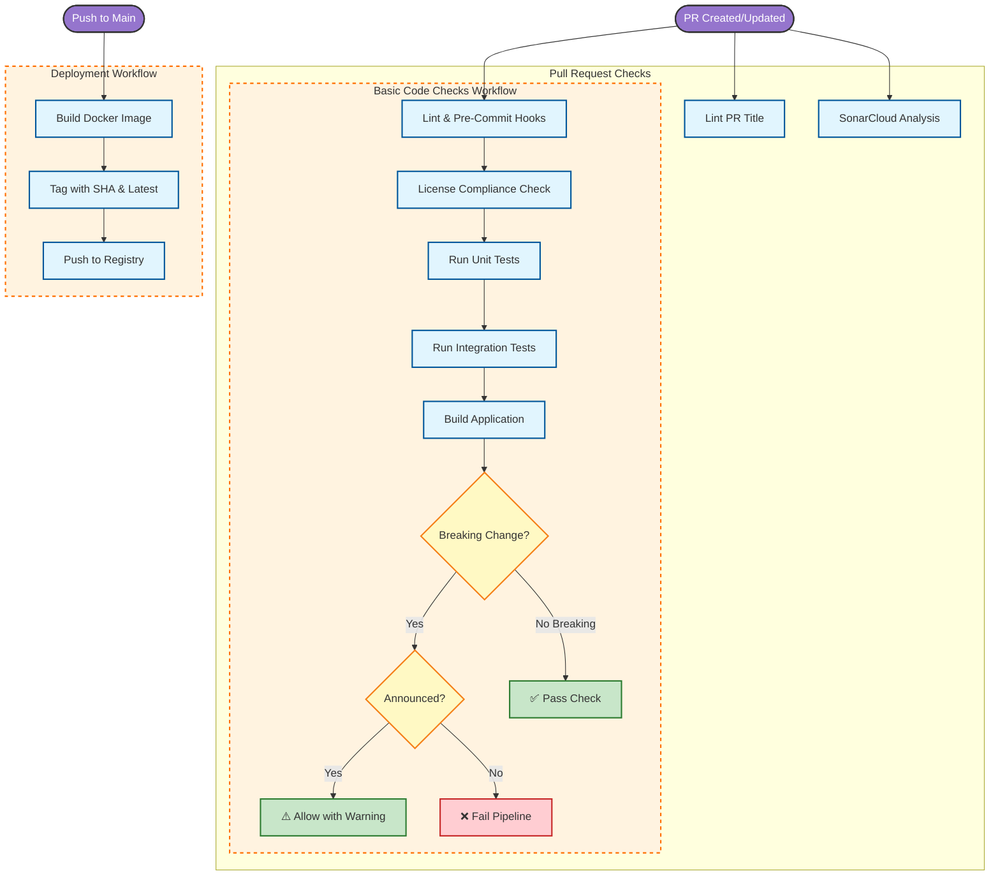

## 📈 Visual Workflow

## Key Checks

1. **Conventional Commits**: PR titles must follow `feat:`, `fix:`, etc. We also control the scope, for example `feat(domain): ...`.
2. **Breaking Changes**: We use `oasdiff` to check for API breaking changes.
    * **Announce** breaking changes in the commit message, for example `feat(domain)!: remove endpoint`.
    * Unannounced breaking changes **fail the pipeline**.
3. **Tests**: Unit tests and Integration tests using Testcontainers must pass. Coverage should be at least 80%.

## Release Process

1. Create a stable GitHub release with a semantic version tag, for example `v1.4.0`.
2. The `Build and Push to Docker Hub` workflow starts on the `released` event.
3. The pipeline runs `mvn clean verify`, then builds and pushes Docker images:
    * `decathlon/internal-developer-platform:<release-tag>`
    * `decathlon/internal-developer-platform:latest`
4. Pull the versioned image when you need reproducible deployments and use `latest` for quick evaluation.
