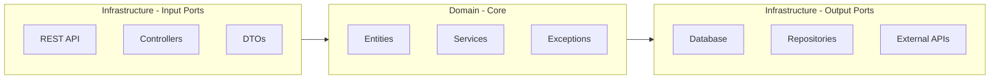

IDP Core is a Spring Boot app built following the principles of the **Hexagonal Architecture**.

## Key Technologies

- **Spring Boot 4**
- **Spring Security**
- **Spring Data JPA** & **PostgreSQL**
- **Docker** & **Testcontainers library**
- **Flyway**

## Sections

- 🏢 [**Domain & Infrastructure**](domain-infrastructure.md)

    Separation of concerns and folder structure.

- ⚠️ [**Exception Handling**](exception-handling.md)

    Global strategy and error response formats.

- ✅ [**Validations**](domain-model-validations.md)

    DTO vs Entity validation rules.

- 🎨 [**Code Conventions**](code-conventions.md)

    Coding standards and style guide.

- ⭐ [**Best Practices**](best-practices.md)

    Checklist for architecture, DB, and security.

## Architecture Principles

We strictly separate the **Domain** (Business Logic) from the **Infrastructure** (Technical concerns).

### Hexagonal Architecture

### Core Rules

1. **Dependency Rule**: Infrastructure depends on Domain. Domain depends on **nothing**.
2. **Testing**: Domain is unit-tested. Infrastructure is integration-tested in addition.
