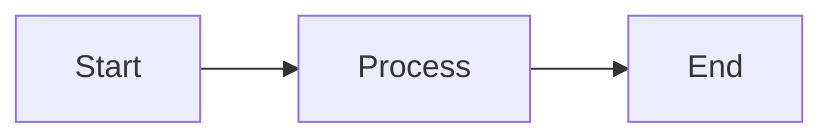
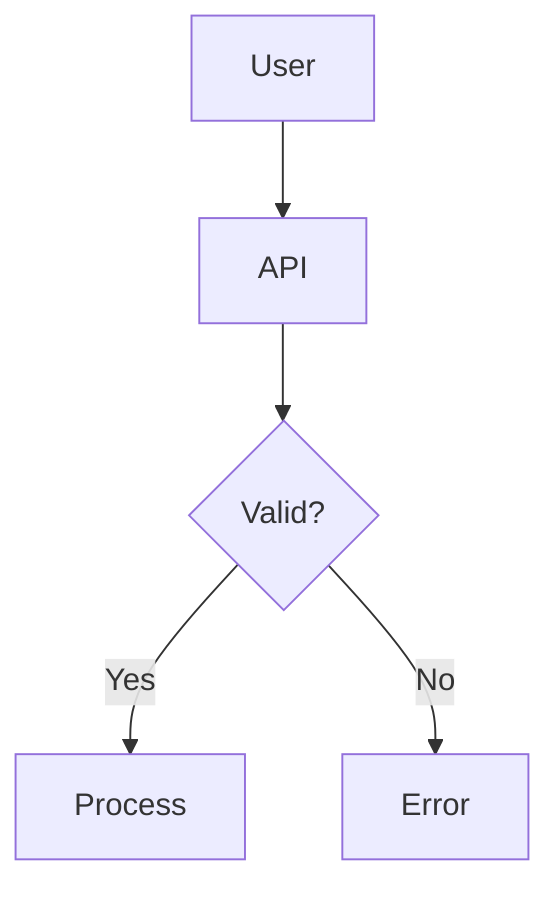
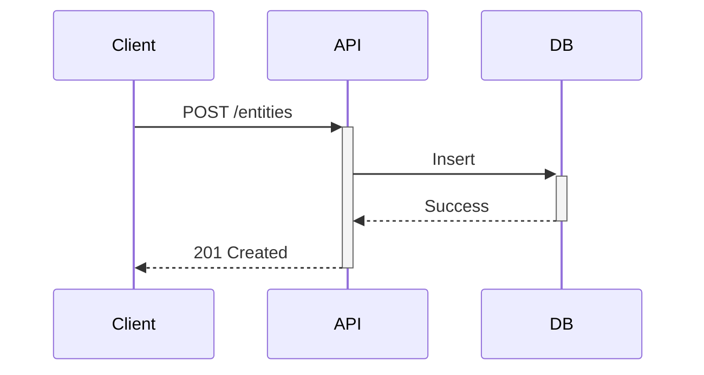

Good documentation is essential for IDP-Core's success. This guide explains how to contribute to the docs.

## Documentation Stack

| Tool     | Purpose                                    |
| -------- | ------------------------------------------ |
| Zensical | Documentation generator, MkDocs-compatible |
| Markdown | Content format                             |
| Mermaid  | Diagrams                                   |

---

## Local Setup

### Prerequisites

- Python 3.14+
- uv package manager

### Install Dependencies

```bash
cd docs

# Install dependencies
uv sync

# Or with pip
pip install -e .

source .venv/bin/activate
```

### Run Locally

```bash
# Start dev server
uv run zensical serve

# Or simply
zensical serve
```

Open <http://localhost:8000>

### Build Static Site

```bash
zensical build
```

Output in `site/` directory.

---

## Directory Structure

```bash
doc-site/
├── docs/
│   ├── index.md                 # Homepage
│   ├── getting-started/         # Getting started guides
│   │   ├── index.md
│   │   ├── installation.md
│   │   ├── quickstart.md
│   │   └── configuration.md
│   ├── concepts/                # Core concepts
│   ├── features/                # Feature documentation
│   ├── api/                     # API reference
│   ├── deployment/              # Deployment guides
│   └── contributing/            # Contributor guides
├── zensical.toml               # Site configuration
└── pyproject.toml              # Python dependencies
```

---

## Writing Guidelines

### Page Structure

```markdown
---
title: Page Title
description: Brief description for SEO
---

Introduction paragraph explaining the topic.

## Section 1

Content...

## Section 2

Content...

---

## Next Steps

- **[Related Page](related.md)** - Brief description
```

### Headings

- `#` - Page title, one per page
- `##` - Major sections
- `###` - Subsections for detailed topics
- `####` - Use rarely for fine details

### Writing Style

Writing style and prose is linted using Vale with the "Google" style guide and integrate specific vocabulary for IDP-Core.

| Do                      | Don't             |
| ----------------------- | ----------------- |
| Use active voice        | Use passive voice |
| Be concise              | Be verbose        |
| Use present tense       | Use future tense  |
| Address reader as "you" | Use "the user"    |

**Examples:**

```markdown
✅ "Create an entity template by calling the API."
❌ "An entity template can be created by the user by calling the API."

✅ "Run the following command:"
❌ "The following command should be run:"
```

---

## Formatting

### Code Blocks

````markdown
```bash
mvn spring-boot:run
```

```java
public class Example {
    // Code here
}
```

```yaml title="application.yml"
spring:
  profiles:
    active: local
```
````

### Tables

```markdown
| Column 1 | Column 2 | Column 3 |
|----------|----------|----------|
| Value 1  | Value 2  | Value 3  |
```

### Admonitions

We use native Markdown admonitions instead of Zensical-specific syntax.

```markdown
> [!NOTE]
> This is a note.

> [!WARNING]
> This is a warning.

> [!DANGER]
> This is dangerous.
```

### Tabs

```markdown
=== "Java"
    ```java
    System.out.println("Hello");
    ```

=== "Python"
    ```python
    print("Hello")
    ```
```

---

## Diagrams

### Mermaid

````markdown

````

### Diagram Types

| Type              | Use Case         |
| ----------------- | ---------------- |
| `flowchart`       | Process flows    |
| `sequenceDiagram` | Interactions     |
| `erDiagram`       | Data models      |
| `gantt`           | Timelines        |
| `classDiagram`    | Class structures |

### Examples

#### Flowchart

````markdown

````

#### Sequence Diagram

````markdown

````

---

## Navigation

### Adding Pages

1. Create the markdown file in appropriate directory
2. Add to `nav` in `zensical.toml`:

```toml
[[nav]]
title = "Section"
items = [
    { title = "Page Title", path = "section/page.md" }
]
```

### Internal Links

```markdown
[Link text](../concepts/entities.md)
[Link to section](../concepts/entities.md#section-name)
```

### External Links

```markdown
[External link](https://example.com)
```

---

## Images

### Adding Images

Place images in `docs/assets/images/`:

```markdown

```

### Image Guidelines

- For diagram images, use excalidraw.svg or draw.io.svg format for VS Code extension compatibility
- Use SVG format as soon as possible, PNG as a fallback, then JPEG
- Optimize file size
- Add meaningful alt text

---

## API Documentation

### Swagger Integration

The API reference uses embedded Swagger UI with the swagger.yaml file in docs/src/static/, automatically generated by SpringBoot at build time.

### Updating Swagger

1. Do your changes in the codebase
2. Run the app locally: `mvn spring-boot:run -Dspring-boot.run.profiles=local`
3. Access Swagger UI at `http://localhost:8080/swagger-ui.html`
4. Export the updated `swagger.yaml` from the UI
5. Replace the file in `docs/src/static/swagger.yaml`

---

## Review Checklist

Before submitting documentation changes:

- [ ] Spell-checked content
- [ ] Links work correctly
- [ ] Code examples pass testing in their environment
- [ ] Diagrams render properly
- [ ] Page builds without errors
- [ ] Follows style guidelines
- [ ] Navigation updated if needed

---

## Common Issues

### Build Errors

```bash
# Check for errors
zensical build --strict

# Common fixes:
# - Fix broken links
# - Add missing files to nav
# - Check YAML front matter
```

### Broken Links

```bash
# Find broken links
zensical build --strict 2>&1 | grep "not found"
```

### Missing Images

Ensure images are in `docs/static/images/` and paths are correct.

---

## Next Steps

- **[Code Conventions](code-conventions.md)** - Code documentation standards
- **[Pull Requests](pull-requests.md)** - Submit your changes
