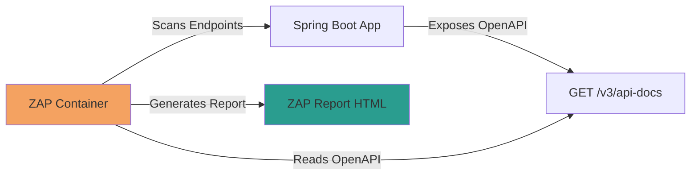
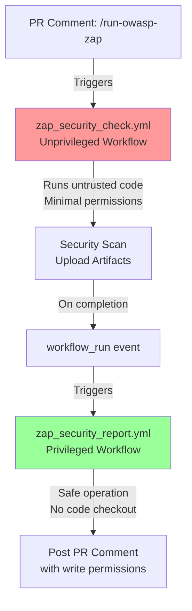

Use this guide to run OWASP ZAP scans against IDP-Core locally or in GitHub Actions and to interpret the results.

## Overview

OWASP ZAP (Zed Attack Proxy) is a free, open-source security scanning tool that performs **Dynamic Application Security
Testing (DAST)**. This guide explains how to run ZAP security scans locally or via GitHub Actions to identify
vulnerabilities in your API.

## What is OWASP ZAP?

**OWASP ZAP** is a penetration testing tool that:

- **Scans your API** by automatically discovering and testing endpoints
- **Identifies vulnerabilities** like injection flaws, broken authentication, XSS, CSRF, and more
- **Generates reports** with severity levels (High, Medium, Low, Informational)
- **Integrates with CI/CD** to prevent vulnerable code from reaching production

## Utility and Benefits

| Benefit                           | Explanation                                                               |
|-----------------------------------|---------------------------------------------------------------------------|
| **Early Vulnerability Detection** | Catch security issues before they reach production                        |
| **API Contract-Based Testing**    | Uses OpenAPI/Swagger specs for comprehensive coverage                     |
| **Compliance & Standards**        | Aligns with OWASP Top 10 security recommendations                         |
| **CI/CD Integration**             | Run on demand via GitHub Actions (manual dispatch or PR comment trigger). |
| **No Code Changes Required**      | Black-box testing; works with any API implementation                      |
| **Community-Maintained**          | Benefits from continuous updates and threat intelligence                  |

## How It Works



### Workflow

1. **Application Startup**: Your Spring Boot API starts on a dynamic port
2. **OpenAPI Discovery**: ZAP reads your API contract from `/v3/api-docs` (via Springdoc-OpenAPI)
3. **Dynamic Scanning**: ZAP automatically discovers all endpoints and executes security tests
4. **Results**: Vulnerabilities are reported with severity levels and remediation guidance
5. **CI Feedback**: Report is uploaded as artifact or posted as PR comment

## Running ZAP Locally

### Prerequisites

- Docker installed and running
- Maven 3.8.0 or higher
- Java 25
- API running locally or accessible over network

### Step 1 (Optional): Start Your Application

```bash
mvn spring-boot:run
# Application starts on a port (For example, 8080)
```

### Step 2: Run Security Tests

Run only security tests (tagged with `@Tag("security")`):

```bash
 mvn test -Dtest.groups=security -Dtest.excludedGroups= -B
```

This executes the `ZapSecurityIntegrationTest` class, which:

- Starts Spring Boot on a random port
- Spins up the official ZAP Docker container
- Reads your OpenAPI spec
- Performs a dynamic security scan
- Prints results to the console

### Step 3: Review Scan Output

Console output includes:

```text
--- OWASP ZAP Standard Output ---
[... ZAP scan logs ...]
OWASP ZAP Execution finished with Exit Code: 0
```

**Exit codes:**

- `0`: Success (no vulnerabilities found)
- `1`: At least one WARN (non-blocking issues found)
- `2`: At least one FAIL (blocking issues found)

### Step 4: Access Detailed Reports (Optional)

Reports are located in:

```text
target/zap-reports/
```

Look for HTML reports containing:

- Vulnerability summary
- Affected endpoints
- Attack details and evidence
- Remediation recommendations

## Running ZAP via PR Comment

### Trigger on Demand

Comment on a pull request with:

```bash
/run-owasp-zap
```

### What Happens

1. **Workflow Triggers**: GitHub Actions detects the comment
2. **Checkout PR Branch**: Code from your branch is checked out
3. **Build & Start App**: Spring Boot application is built and starts
4. **Run ZAP Scan**: Security tests execute automatically
5. **Artifact Upload**: ZAP report is uploaded for 1 day
6. **PR Comment**: Link to the HTML report is posted on the PR

### Example PR Comment Output

```markdown
### 🛡️ OWASP ZAP Scan Findings

- **High Risk:** 0
- **Medium Risk:** 1
- **Low Risk:** 3

📥 Download the complete HTML report from the [Workflow Run Artifacts](https://github.com/...).
```

### Accessing Artifacts

1. Go to the GitHub Actions workflow run
2. Scroll to **Artifacts** section
3. Download `zap-scan-report.zip`
4. Extract and open the HTML report in your browser

## GitHub Actions Workflow Architecture

IDP-Core uses a **two-workflow security pattern** for OWASP ZAP scanning to protect against privilege escalation
attacks. This architecture ensures that untrusted code from pull requests cannot access elevated permissions.

### Workflow Separation



### `zap_security_check.yml`-Unprivileged Workflow

**Purpose:** Execute security scans on untrusted code from pull requests

**Permissions:** Minimal

- `contents: read`- Read access to repository
- `actions: write`- Required to upload workflow artifacts

**Triggered by:**

- Manual workflow dispatch (trusted)
- PR comments starting with `/run-owasp-zap` (from authorized users only)

**What it does:**

1. Checks out PR branch code
2. Builds and starts the application
3. Runs OWASP ZAP security tests
4. Generates both HTML (for detailed review) and JSON (for automated parsing) reports
5. Uploads artifacts (1-day retention)
6. Triggers `zap_security_report.yml` to post a formatted PR comment

**Security benefit:** Untrusted code cannot access elevated permissions to modify repository or secrets.

### `zap_security_report.yml` Privileged Workflow

**Purpose:** Post scan results to pull requests safely

**Permissions:** Elevated (but safe)

- `contents: read`
- `pull-requests: write`- Required to post comments on PRs

**Triggered by:**

- Completion of `zap_security_check.yml` only
- Runs on the main branch (not on forked code)

**What it does:**

1. Downloads ZAP report artifacts from the completed workflow
2. Parses the JSON report to extract High/Medium/Low vulnerability counts
3. Posts a formatted PR comment with the findings summary
4. Links to detailed HTML reports for deeper investigation

**Security benefit:** Elevated permissions are only used for safe operations (posting comments) and do NOT execute any
untrusted code.

### Why Two Workflows?

This pattern prevents a common GitHub Actions vulnerability:

| Attack Vector            | Single Workflow ❌                      | Two Workflows ✅                     |
|--------------------------|-----------------------------------------|--------------------------------------|
| **Malicious PR code**    | Runs with `pull-requests: write`        | Runs with `contents: read` only      |
| **Privilege escalation** | Code could modify repository or secrets | Impossible-no elevated permissions   |
| **Comment injection**    | Untrusted code posts comments           | Trusted workflow posts safe comments |

**Reference:** [GitHub Actions Security Hardening Guide](https://docs.github.com/en/actions/security-guides/security-hardening-for-github-actions#understanding-the-risk-of-script-injection)

## Understanding ZAP Reports

### Severity Levels

| Severity   | CVSS     | Impact                   | Action                                    |
|------------|----------|--------------------------|-------------------------------------------|
| **High**   | 7.0–10.0 | Critical vulnerabilities | Must fix before merge                     |
| **Medium** | 4.0–6.9  | Significant issues       | Should fix OK to merge with justification |
| **Low**    | 0.1–3.9  | Minor issues             | Consider for future work                  |

### Common Findings

**SQL Injection** → Use parameterized queries (JPA repositories do this)

**Cross-Site Scripting (XSS)** → Ensure response content types are correct (For example, `application/json`)

**Missing CORS Headers** → Configure Spring Security CORS properly

**Broken Authentication** → Verify JWT validation is enabled in your `SecurityConfiguration`

## Fixing Vulnerabilities

### Example: SQL Injection

**❌ Vulnerable:**

```java
repository.findByIdNative("SELECT * FROM users WHERE id = "+id);
```

**✅ Fixed (use parameterized queries):**

```java
repository.findById(id);  // Spring Data JPA uses PreparedStatement
```

### Example: Missing Security Headers

**❌ Vulnerable:**

```java

@GetMapping("/public-data")
public ResponseEntity<Data> getData() {
    return ResponseEntity.ok(data);
}
```

**✅ Fixed (add security headers):**

```java

@GetMapping("/public-data")
public ResponseEntity<Data> getData() {
    return ResponseEntity.ok()
            .header("Content-Security-Policy", "default-src 'self'")
            .body(data);
}
```

## Troubleshooting

### "Docker is not running"

Start Docker:

```bash
sudo systemctl start docker
# or use Docker Desktop GUI
```

### "ZAP container failed to start"

Check Docker image availability:

```bash
docker pull zaproxy/zap-stable:2.17.0
```

### "OpenAPI endpoint not found"

Verify dependency in `pom.xml`:

```xml

<dependency>
    <groupId>org.springdoc</groupId>
    <artifactId>springdoc-openapi-starter-webmvc-ui</artifactId>
    <version>2.x.x</version>
</dependency>
```

Verify endpoint is accessible:

```bash
curl http://localhost:8080/v3/api-docs
```

### "ZAP timeout or hanging"

Increase test timeout in `ZapSecurityIntegrationTest.java`:

```java

@Timeout(300)  // 5 minutes
@Test
public void runZapApiScan() { ...}
```

## Best Practices

- **Run Locally Before PR**: Execute `mvn test -Dtest=ZapSecurityIntegrationTest` locally to catch issues early
- **Review Reports Carefully**: Not all findings are actionable; prioritize high/medium severity
- **Keep Dependencies Updated**: Regularly update ZAP container and security libraries
- **Integrate with CI/CD**: Make ZAP scans a required check before merge
- **Document Exclusions**: If ignoring a finding, document why in a comment or ADR

## Related Resources

- **[OWASP ZAP Documentation](https://www.zaproxy.org/docs/desktop/start/features/autoscan/)**
- **[OWASP Top 10](https://owasp.org/www-project-top-ten/)**
- **[CI/CD Workflows](ci-workflow.md)**

---

## Next Steps

- **[Testing Strategy](testing.md)** - Review when to run unit, integration, and security tests.
- **[CI/CD Workflows](ci-workflow.md)** - Learn how workflows run in GitHub Actions.
