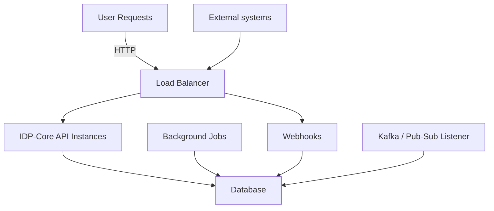

This section covers deploying the Internal Developer Platform to various environments, from local development to production Kubernetes clusters.

## Deployment Options

| Option                      | Best For                 | Complexity |
| --------------------------- | ------------------------ | ---------- |
| [Docker Compose](docker.md) | Development, small teams | Low        |
| [Kubernetes](kubernetes.md) | Production, scale        | Medium     |
| [Cloud Managed](cloud.md)   | Minimal ops overhead     | Low        |

## Deployment philosophy

IDP-Core is designed to serve cloud-native deployment patterns, allowing you to choose the best environment for your needs. Furthermore, IDP-Core separates concerns into several profiles, giving you the ability to adapt the deployment to your use case (development, testing, production, etc.), habits, or organization scale:

- Single instance deployment for small teams or development environments
- Scaled deployments with multiple replicas, load balancing, and high availability for larger organizations
- Separating services per functional area (API, worker, scheduler, etc.) to optimize resource usage, security, and horizontal scaling.

---

## Sections

- 🐳 **[Docker](docker.md)**

    Deploy with Docker and Docker Compose

- ☸️ **[Kubernetes](kubernetes.md)**

    Production deployment on Kubernetes

- 🔧 **[Configuration](configuration.md)**

    Complete configuration reference

- 📈 **[Observability](observability.md)**

    Monitoring, logging, and tracing

