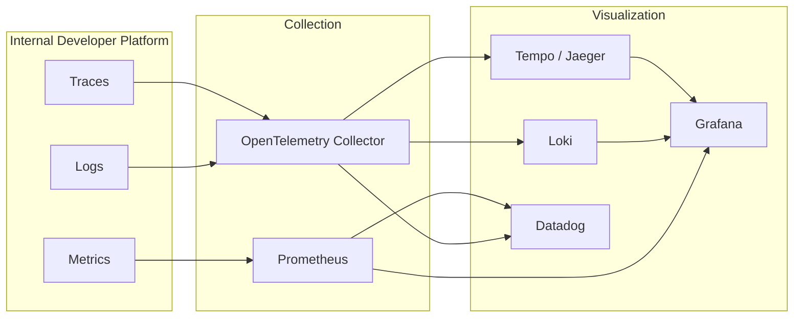

The Internal Developer Platform provides comprehensive observability through metrics, logs, and distributed tracing using OpenTelemetry.

## Overview



---

## Metrics

### Prometheus Endpoint

The Internal Developer Platform exposes metrics at `/actuator/prometheus`:

```bash
curl http://localhost:8080/actuator/prometheus
```

### Key Metrics

#### Application Metrics

| Metric | Description |
| -------- | ------------- |
| `idp_entities_total` | Total entities by template |
| `idp_entity_operations_total` | CRUD operations count |
| `idp_webhook_invocations_total` | Webhook calls |
| `idp_action_executions_total` | Self-service action runs |

#### HTTP Metrics

| Metric | Description |
| -------- | ------------- |
| `http_server_requests_seconds` | Request latency |
| `http_server_requests_active` | Active requests |

#### JVM Metrics

| Metric | Description |
| -------- | ------------- |
| `jvm_memory_used_bytes` | Memory usage |
| `jvm_gc_pause_seconds` | GC pause time |
| `jvm_threads_live` | Thread count |

#### Database Metrics

| Metric | Description |
| -------- | ------------- |
| `hikaricp_connections_active` | Active DB connections |
| `hikaricp_connections_pending` | Waiting connections |

### Metrics Configuration

```yaml
management:
  endpoints:
    web:
      exposure:
        include: health,info,metrics,prometheus
  metrics:
    export:
      prometheus:
        enabled: true
    distribution:
      percentiles-histogram:
        http.server.requests: true
      percentiles:
        http.server.requests: 0.5,0.95,0.99
    tags:
      application: idp-core
      environment: ${ENVIRONMENT:dev}
```

### Prometheus scrape configuration

```yaml title="prometheus.yml"
scrape_configs:
  - job_name: 'idp-core'
    metrics_path: '/actuator/prometheus'
    static_configs:
      - targets: ['idp-core:8080']
    scrape_interval: 15s
```

### Kubernetes ServiceMonitor

```yaml title="servicemonitor.yaml"
apiVersion: monitoring.coreos.com/v1
kind: ServiceMonitor
metadata:
  name: idp-core
  namespace: idp
spec:
  selector:
    matchLabels:
      app: idp-core
  endpoints:
    - port: http
      path: /actuator/prometheus
      interval: 30s
```

---

## Logging

### Log Format

#### Development (Human-readable)

```text
2024-01-15 10:30:45.123 INFO  [http-nio-8080-exec-1] c.d.i.a.EntityController - Creating entity: payment-service
```

#### Production (JSON)

```json
{
  "timestamp": "2024-01-15T10:30:45.123Z",
  "level": "INFO",
  "logger": "c.d.i.a.EntityController",
  "message": "Creating entity: payment-service",
  "thread": "http-nio-8080-exec-1",
  "traceId": "abc123def456",
  "spanId": "789xyz"
}
```

### Logging Configuration

```yaml
logging:
  level:
    root: INFO
    com.decathlon.idp_core: INFO
    org.springframework.web: WARN
    org.hibernate: WARN

  pattern:
    # JSON for production
    console: '{"timestamp":"%d{ISO8601}","level":"%level","logger":"%logger{36}","message":"%msg","thread":"%thread","traceId":"%X{traceId}","spanId":"%X{spanId}"}%n'
```

### Loki Integration

Send logs to Loki via the OpenTelemetry Collector:

```yaml title="otel-collector-config.yaml"
receivers:
  otlp:
    protocols:
      grpc:
        endpoint: 0.0.0.0:4317

exporters:
  loki:
    endpoint: http://loki:3100/loki/api/v1/push
    labels:
      attributes:
        service.name: "service_name"
        deployment.environment: "environment"

service:
  pipelines:
    logs:
      receivers: [otlp]
      exporters: [loki]
```

### Log Levels

| Level   | Usage                      |
| ------- | -------------------------- |
| `ERROR` | Errors requiring attention |
| `WARN`  | Potential issues           |
| `INFO`  | Key business events        |
| `DEBUG` | Development debugging      |
| `TRACE` | Detailed tracing           |

---

## Distributed Tracing

### OpenTelemetry Setup

```yaml
management:
  tracing:
    enabled: true
    sampling:
      probability: 1.0  # Sample all requests (use 0.1 for 10% in prod)

otel:
  exporter:
    otlp:
      endpoint: http://otel-collector:4317
  service:
    name: idp-core
  resource:
    attributes:
      deployment.environment: production
      service.version: "1.0.0"
```

### Trace Context

IDP-Core propagates trace context through:

- HTTP headers (W3C Trace Context)
- Kafka message headers
- Webhook requests

### Key Spans

| Span                        | Description          |
| --------------------------- | -------------------- |
| `HTTP GET /api/v1/entities` | Incoming API request |
| `EntityRepository.findById` | Database query       |
| `WebhookService.invoke`     | Outgoing webhook     |
| `KafkaProducer.send`        | Kafka message        |

### Jaeger/Tempo Integration

```yaml title="otel-collector-config.yaml"
receivers:
  otlp:
    protocols:
      grpc:
        endpoint: 0.0.0.0:4317

exporters:
  otlp/tempo:
    endpoint: http://tempo:4317
    tls:
      insecure: true

service:
  pipelines:
    traces:
      receivers: [otlp]
      exporters: [otlp/tempo]
```

---

## Health Checks

### Endpoints

| Endpoint                     | Purpose         |
| ---------------------------- | --------------- |
| `/actuator/health`           | Overall health  |
| `/actuator/health/liveness`  | Liveness probe  |
| `/actuator/health/readiness` | Readiness probe |

### Health Configuration

```yaml
management:
  endpoint:
    health:
      show-details: when_authorized
      show-components: always
      probes:
        enabled: true
  health:
    db:
      enabled: true
    diskspace:
      enabled: true
      threshold: 100MB
```

### Response Example

```json
{
  "status": "UP",
  "components": {
    "db": {
      "status": "UP",
      "details": {
        "database": "PostgreSQL",
        "validationQuery": "isValid()"
      }
    },
    "diskSpace": {
      "status": "UP",
      "details": {
        "total": 107374182400,
        "free": 85899345920,
        "threshold": 104857600
      }
    },
    "ping": {
      "status": "UP"
    }
  }
}
```

---

## Next Steps

- **[Configuration](configuration.md)** - Observability settings
- **[Kubernetes](kubernetes.md)** - Production monitoring
- **[Docker](docker.md)** - Local observability setup
