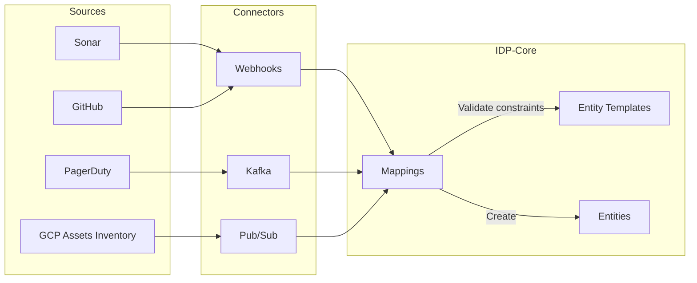

> [!IMPORTANT]
> This document describes a feature that is not yet developed. The content is subject to change and may not reflect the final implementation.

The Internal Developer Platform provides flexible data integration, allowing you to connect to any source and map incoming data to your entities at runtime without code changes. That's powerful for rapid adaptation.

## Overview

Data integration in the Internal Developer Platform follows a three-step pattern:

1. **Configure a connector** - Set up a Webhook, Kafka consumer, or Pub/Sub subscription
2. **Define mappings** - Use JSLT expressions to transform incoming data
3. **Ingest data** - Data flows automatically, creating and updating entities



---

## Webhooks

Webhooks allow external systems to push data to IDP-Core via HTTP POST requests.

### Methods

| Method | Endpoint | Purpose |
| ------ | -------- | ------- |
| `POST` | `/webhooks/{configurationId}` | Receive an inbound event for the connector identified in the URL |
| `POST` | `/api/v1/inbound-webhooks` | Create a webhook connector configuration |
| `GET` | `/api/v1/inbound-webhooks` | List webhook connector configurations |
| `GET` | `/api/v1/inbound-webhooks/{identifier}` | Read one webhook connector configuration |
| `PUT` | `/api/v1/inbound-webhooks/{identifier}` | Update one webhook connector configuration |
| `DELETE` | `/api/v1/inbound-webhooks/{identifier}` | Delete one webhook connector configuration |

 These HTTP routes map to the `InboundWebhookManagementController` methods for connector management.

### Webhook Configuration

```json
{
  "identifier": "sonar_webhook",
  "title": "Sonar webhook",
  "description": "Webhook to receive Sonar project data",
  "enabled": true,
  "mappings": [
    {
      "template": "sonar_project",
      "filter": ".visibility == \"private\"",
      "entity": {
        "identifier": ".key | tostring | gsub(\"\\\\s\";\"_\")",
        "title": ".name",
        "properties": {
          "project_name": ".name | tostring",
          "last_analysis_date": ".lastAnalysisDate",
          "issues_number": ".measures[] | select(.metric == \"new_violations\") | .period.value",
          "loc": ".measures[] | select(.metric == \"ncloc\") | .value"
        },
        "relations": {
          "github_repository": ".components[0].name"
        }
      }
    }
  ],
  "security": {
    "type": "HMAC_SHA256",
    "config": {
      "header_name": "X-Sonar-Webhook-HMAC-SHA256",
      "secret_alias": "SONAR_WEBHOOK_SECRET",
      "prefix": "sha256="
    }
  }
}
```

### Configuration Fields

| Field         | Description                                                     |
|---------------|-----------------------------------------------------------------|
| `identifier`  | Unique key for this webhook                                     |
| `title`       | Human-readable name                                             |
| `description` | Purpose of the webhook                                          |
| `enabled`     | Toggle ingestion on/off                                         |
| `mappings`    | Array of mapping rules                                          |
| `security`    | Authentication configuration using a `type` + `config` contract |

### Mapping Structure

| Field               | Description                                   |
|---------------------|-----------------------------------------------|
| `template`          | Target Entity Template identifier             |
| `filter`            | JSLT expression to filter incoming payloads   |
| `entity.identifier` | JSLT expression to generate entity identifier |
| `entity.title`      | JSLT expression for entity title              |
| `entity.properties` | Map of property names to JSLT expressions     |
| `entity.relations`  | Map of relation names to JSLT expressions     |

---

## Kafka / Pub-Sub

For streaming data, configure Kafka or Pub/Sub consumers.

### Kafka Configuration

```json
{
  "identifier": "users_kafka",
  "title": "Users provisioning",
  "description": "Kafka topic ingestion for users",
  "enabled": true,
  "mappings": [
    {
      "template": "users",
      "topic": "identity_provider_users",
      "header_filter": ".event == \"create\"",
      "entity": {
        "identifier": ".user_id",
        "title": "(.firstname + \" \" + .lastname)",
        "properties": {
          "firstname": ".firstname",
          "lastname": ".lastname"
        },
        "relations": {
          "team": ".support_groups[]?.id"
        }
      }
    }
  ]
}
```

### Spring Configuration

Configure the Kafka consumer in your Spring profile:

```yaml
spring:
  kafka:
    bootstrap-servers: localhost:9092
    consumer:
      group-id: idp-consumer-group
      auto-offset-reset: earliest
      key-deserializer: org.apache.kafka.common.serialization.StringDeserializer
      value-deserializer: org.apache.kafka.common.serialization.StringDeserializer
      properties:
        idp.kafka.mapping: users_kafka
```

---

## JSLT Mapping Reference

The Internal Developer Platform uses [JSLT](https://github.com/schibsted/jslt) for data transformation. It accesses the entire JSON payload sent to the webhook or consumed from Kafka/Pub-Sub. Refer to the JSLT documentation for detailed usage.

---

## Example: GitHub Webhook

Configure a webhook to receive GitHub repository events:

```json
{
  "identifier": "github_repos",
  "title": "GitHub Repositories",
  "enabled": true,
  "mappings": [
    {
      "template": "github_repository",
      "filter": ".action == \"created\" or .action == \"edited\"",
      "entity": {
        "identifier": ".repository.full_name | gsub(\"/\"; \"_\")",
        "title": ".repository.name",
        "properties": {
          "name": ".repository.name",
          "url": ".repository.html_url",
          "stars": ".repository.stargazers_count",
          "language": ".repository.language // \"Unknown\"",
          "is_public": ".repository.private | not"
        },
        "relations": {
          "owner": ".repository.owner.login"
        }
      }
    }
  ],
  "security": {
    "type": "HMAC_SHA256",
    "config": {
      "header_name": "X-Hub-Signature-256",
      "secret_alias": "GITHUB_WEBHOOK_SECRET",
      "prefix": "sha256="
    }
  }
}
```

---

## Security

### Webhook Authentication

Webhooks support signature-based authentication:

```json
{
  "security": {
    "type": "STATIC_TOKEN",
    "config": {
      "header_name": "X-Webhook-Signature",
      "secret_alias": "WEBHOOK_SHARED_TOKEN"
    }
  }
}
```

The Internal Developer Platform validates the header value against the configured secret before processing.

### Best Practices

1. **Always enable authentication** for production webhooks
2. **Use HTTPS** endpoints in production
3. **Rotate secrets** periodically
4. **Monitor webhook logs** for failed authentications

---

## Audit & Troubleshooting

The Internal Developer Platform logs all ingestion operations for troubleshooting:

```bash
GET /api/v1/audit_logs?entity_template=sonar_project&limit=10
```

Response:

```json
[
  {
    "id": "c5963029-60f5-4bc2-b097-0212608ffd88",
    "action": "CREATE",
    "resource_type": "entity",
    "trigger": {
      "at": "2025-11-02T06:03:25.333Z",
      "by": {"integration_id": "5ef89f76-34c5-40bf-9daf-e831db34ebad"},
      "origin": "WEBHOOK"
    },
    "context": {
      "entity_template": "sonar_project",
      "entity": "care_back"
    },
    "status": "SUCCESS"
  },
  {
    "id": "d0483b48-7e77-4c95-b7d1-2e40e4fb1cfa",
    "action": "CREATE",
    "resource_type": "entity",
    "trigger": {
      "at": "2025-11-02T06:03:25.333Z",
      "by": {"integration_id": "5ef89f76-34c5-40bf-9daf-e831db34ebad"},
      "origin": "WEBHOOK"
    },
    "context": {
      "entity_template": "sonar_project",
      "entity": "invalid_entity"
    },
    "message": "Relation 'github_repo' does not exist",
    "status": "FAILURE"
  }
]
```

---

## Next Steps

- **[Scorecards](scorecards.md)** - Track metrics from ingested data
