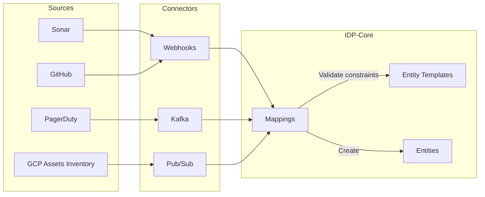
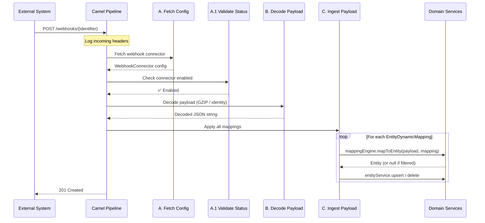

> [!IMPORTANT]
> This document describes a feature that is not yet developed. The content is subject to change and may not reflect the final implementation.

The Internal Developer Platform provides flexible data integration to connect to any source and map incoming data to your entities at runtime without code changes. That's powerful for rapid adaptation.

## Overview

Data integration in the Internal Developer Platform follows a three-step pattern:

1. **Configure a connector** - Set up a Webhook, Kafka consumer, or Pub/Sub subscription
2. **Define mappings** - Use JSLT expressions to transform incoming data
3. **Ingest data** - Data flows automatically, creating and updating entities


```mermaid
flowchart LR
    subgraph "Sources"
        S1[Sonar]
        S2[GitHub]
        S3[PagerDuty]
        S4[GCP Assets Inventory]
    end

    subgraph "Connectors"
        WH[Webhooks]
        KF[Kafka]
        PS[Pub/Sub]
    end

    subgraph "IDP-Core"
        MP[Mappings]
        ET[Entity Templates]
        E[Entities]
    end

    S1 --> WH
    S2 --> WH
    S3 --> KF
    S4 --> PS
    WH --> MP
    KF --> MP
    PS --> MP
    MP --Validate constraints--> ET
    MP --Create--> E
```

---

## Webhooks

Webhooks allow external systems to push data to IDP-Core via HTTP POST requests.
You configure a webhook connector and attach one or more **Entity Dynamic Mappings**
to it. Each mapping defines how the incoming JSON payload is transformed into an entity.

### API Reference

| Method   | Endpoint                                       | Purpose                                      |
| -------- | ---------------------------------------------- | -------------------------------------------- |
| `POST`   | `/webhooks/{identifier}`                       | Receive an inbound event for the connector   |
| `POST`   | `/api/v1/inbound_webhooks`                     | Create a webhook connector configuration     |
| `GET`    | `/api/v1/inbound_webhooks`                     | List webhook connector configurations        |
| `GET`    | `/api/v1/inbound_webhooks/{identifier}`        | Read one webhook connector configuration     |
| `PUT`    | `/api/v1/inbound_webhooks/{identifier}`        | Update one webhook connector configuration   |
| `DELETE` | `/api/v1/inbound_webhooks/{identifier}`        | Delete one webhook connector configuration   |
| `POST`   | `/api/v1/entity_dynamic_mappings`              | Create an entity dynamic mapping             |
| `GET`    | `/api/v1/entity_dynamic_mappings`              | List entity dynamic mappings (paginated)     |
| `GET`    | `/api/v1/entity_dynamic_mappings/{identifier}` | Read one entity dynamic mapping              |
| `PUT`    | `/api/v1/entity_dynamic_mappings/{identifier}` | Update one entity dynamic mapping            |
| `DELETE` | `/api/v1/entity_dynamic_mappings/{identifier}` | Delete one entity dynamic mapping            |
| `POST`   | `/api/v1/entity_dynamic_mappings/dry-run`      | Test a mapping with sample payload           |

### Step 1 — Create an Entity Dynamic Mapping

An **Entity Dynamic Mapping** defines how a raw JSON payload is transformed into an
entity. It includes a JSLT filter, a JSLT template, and the action to apply.

```json title="POST /api/v1/entity_dynamic_mappings"
{
  "identifier": "sonar_project_mapping",
  "name": "Sonar Project Mapping",
  "description": "Maps Sonar webhook payloads to sonar_project entities",
  "entity_template_identifier": "sonar_project",
  "filter": ".visibility == \"private\"",
  "action": "UPDATE_ENTITY",
  "entity": {
    "identifier": ".key | tostring | gsub(\"\\\\s\";\"_\")",
    "name": ".name",
    "properties": {
      "project_name": ".name | tostring",
      "last_analysis_date": ".lastAnalysisDate",
      "issues_number": ".measures[] | select(.metric == \"new_violations\") | .period.value",
      "loc": ".measures[] | select(.metric == \"ncloc\") | .value"
    },
    "relations": [
      {
        "name": "github_repository",
        "target_entity_identifiers": [".components[0].name"]
      }
    ]
  }
}
```

#### Entity Dynamic Mapping Fields

| Field                        | Required | Description                                                                      |
| ---------------------------- | -------- | -------------------------------------------------------------------------------- |
| `identifier`                 | ✅       | Unique key for this mapping                                                      |
| `name`                       | ✅       | Human-readable name                                                              |
| `description`                |          | Purpose of the mapping                                                           |
| `entity_template_identifier` | ✅       | Target Entity Template identifier                                                |
| `filter`                     | ✅       | JSLT expression — payload is skipped if it returns false                         |
| `action`                     | ✅       | One of `UPDATE_ENTITY`, `UPDATE_PROPERTIES`, `UPDATE_RELATIONS`, `DELETE_ENTITY` |
| `entity`                     | ✅       | Entity mapping configuration (see below)                                         |

#### Entity Mapping Configuration

| Field        | Required | Description                                              |
| ------------ | -------- | -------------------------------------------------------- |
| `identifier` | ✅       | JSLT expression to generate the entity identifier        |
| `name`       | ✅       | JSLT expression for the entity name                      |
| `properties` |          | Map of property names to JSLT expressions                |
| `relations`  |          | Array of relation definitions (see below)                |

#### Relation Definition

| Field                       | Required | Description                                              |
| --------------------------- | -------- | -------------------------------------------------------- |
| `name`                      | ✅       | Relation name from the Entity Template                   |
| `target_entity_identifiers` | ✅       | Array of JSLT expressions to extract target identifiers  |

#### Mapping Actions

| Action              | Behaviour                                                          |
| ------------------  | ------------------------------------------------------------------ |
| `UPDATE_ENTITY`     | Creates the entity if absent, otherwise patches all fields         |
| `UPDATE_PROPERTIES` | Creates the entity if absent, otherwise patches properties only    |
| `UPDATE_RELATIONS`  | Creates the entity if absent, otherwise patches relations only     |
| `DELETE_ENTITY`     | Deletes the entity if it exists                                    |

#### JSLT Expressions

Entity Dynamic Mappings use **JSLT (JSON Streaming Language)** to transform incoming
JSON payloads. JSLT is a powerful DSL for JSON manipulation designed for filtering,
selecting, and transforming JSON data without code.

##### Core Concepts

- **Payload Context**: All JSLT expressions work on the entire JSON payload sent to the webhook
- **Lazy Evaluation**: JSLT uses lazy evaluation, so expressions only compute what is needed
- **Null Safety**: Operations gracefully handle missing fields by returning `null` or `empty`
- **Composition**: Expressions can be chained using the pipe operator (`|`) to build complex transformations

##### Common JSLT Operations

| Operation                | Example                                               | Description                                  |
| ------------------------ | ----------------------------------------------------- | -------------------------------------------- |
| **Field access**         | `.key`                                                | Access top-level or nested fields            |
| **Nested access**        | `.repository.owner.login`                             | Navigate deeply nested objects               |
| **Array indexing**       | `.components[0].name`                                 | Access array element by index                |
| **Array iteration**      | `.measures[]`                                         | Iterate over all array elements              |
| **Array slicing**        | `.items[1:3]`                                         | Extract a slice of an array                  |
| **Array filtering**      | `.measures[].metric`                                  | Extract specific field from all array items  |
| **Pipe operator**        | `.key \| tostring \| gsub("\\s"; "_")`                | Chain transformations left-to-right          |
| **Conditional**          | `if .visibility == "private" then .key else empty end`| Branch logic based on conditions             |
| **Default value**        | `.language // "Unknown"`                              | Provide fallback if value is null/missing    |
| **String concatenation** | `"Project: " + .name`                                 | Combine strings                              |
| **Filtering arrays**     | `.measures[] \| select(.metric == "ncloc")`           | Filter array elements by condition           |
| **Mapping arrays**       | `.tags[] \| {tag: ., priority: .}`                    | Transform each array element                 |

##### Built-in JSLT Functions

JSLT provides many built-in functions for string, array, and numeric operations:

###### String Functions

| Function         | Usage                            | Description                        |
| -------------    | ---------------------------------| -----------------------------------|
| `tostring`       | `.count \| tostring`             | Convert value to string            |
| `tonumber`       | `"42" \| tonumber`               | Convert value to number            |
| `gsub`           | `.name \| gsub("\\s"; "_")`      | Global string substitution (regex) |
| `split`          | `.tags \| split(",")`            | Split string into array            |
| `join`           | `.words[] \| join("-")`          | Join array into string             |
| `startswith`     | `.url \| startswith("http")`     | Check if string starts with prefix |
| `endswith`       | `.domain \| endswith(".com")`    | Check if string ends with suffix   |
| `length`         | `.name \| length`                | Get string or array length         |
| `ltrimstr`       | `.path \| ltrimstr("/api")`      | Remove prefix from string          |
| `rtrimstr`       | `.path \| rtrimstr("/")`         | Remove suffix from string          |
| `ascii_downcase` | `.status \| ascii_downcase`      | Convert string to lowercase        |
| `ascii_upcase`   | `.status \| ascii_upcase`        | Convert string to uppercase        |
| `test`           | `.email \| test("@.*\\.com")`    | Test if string matches regex       |

###### Array Functions

| Function    | Usage                                 | Description                     |
| ----------- | ----------------------------------    | ------------------------------- |
| `map`       | `.items[] \| map(.id)`                | Transform array elements        |
| `select`    | `.items[] \| select(.active == true)` | Filter array elements           |
| `sort`      | `.names[] \| sort`                    | Sort array elements             |
| `reverse`   | `.items[] \| reverse`                 | Reverse array order             |
| `group_by`  | `.items[] \| group_by(.category)`     | Group array by field            |
| `unique`    | `.tags[] \| unique`                   | Remove duplicate elements       |
| `flatten`   | `.nested[] \| flatten`                | Flatten nested arrays           |
| `min`       | `.scores[] \| min`                    | Find minimum value              |
| `max`       | `.scores[] \| max`                    | Find maximum value              |
| `add`       | `.numbers[] \| add`                   | Sum array elements              |

###### Type Functions

| Function | Usage                                             | Description                                                              |
| -------- | ------------------------------------------------- | ------------------------------------------------------------------------ |
| `type`   | `.value \| type`                                  | Get type of value (string, number, object, array, boolean, null)         |
| `has`    | `.repository \| has("url")`                       | Check if object has key                                                  |
| `in`     | `"active" \| in(.filters)`                        | Check if value is in object/array                                        |
| `empty`  | `if .status == "skip" then empty else . end`      | Return no results (filter out)                                           |

##### Custom JSLT Functions

IDP-Core can provide and expose custom JSLT functions for common webhook transformations:

| Function        | Usage                           | Description                                   | Example                                                   |
| --------------- | ------------------------------- | --------------------------------------------- | --------------------------------------------------------- |
| `base64-decode` | `base64-decode(.payload_data)`  | Decode Base64-encoded strings in the payload  | `base64-decode("SGVsbG8gV29ybGQ=")` → `"Hello World"`     |

##### JSLT Expression Examples

###### Basic Field Extraction

```jslt
# Extract simple field
.repository.name

# Extract with type conversion
.project_id | tostring

# Extract with fallback
.language // "Unknown"
```

###### Array Operations

```jslt
# Extract all metric values
.measures[] | .value

# Extract specific metric value
.measures[] | select(.metric == "ncloc") | .value

# Transform array elements
.components[] | {name: .name, version: (.version | tostring)}

# Count matching items
.measures[] | select(.metric == "new_violations") | length
```

###### String Manipulation

```jslt
# Normalize identifier (remove spaces, replace special chars)
.project_key | gsub("\\s"; "_") | gsub("/"; "_")

# Extract domain from URL
.repository_url | split("/")[2]

# Conditional string generation
if .is_private == true then "PRIVATE_" + .name else .name end
```

###### Complex Filtering and Transformation

```jslt
# Extract and transform multiple fields
{
  identifier: (.key | tostring | gsub("\\s"; "_")),
  name: .name,
  language: (.language // "Unknown"),
  metrics: {
    violations: (.measures[] | select(.metric == "new_violations") | .value),
    loc: (.measures[] | select(.metric == "ncloc") | .value)
  }
}

# Decode Base64 payload if present
if .payload_data then
  base64-decode(.payload_data) | fromjson
else
  .
end
```

**Filtering Payloads with `filter`**

The `filter` field determines whether a mapping applies to a payload:

```jslt
# Apply mapping only to private projects
.visibility == "private"

# Apply mapping only if webhook action is create/edit
(.action == "created" or .action == "edited")

# Apply mapping only if critical metrics exist
(.measures[] | select(.metric == "new_violations") | .value) > 0

# Complex: apply only if specific conditions are met
(.visibility == "private" and .status == "active" and (.language // "java") == "java")
```

> [!TIP]
> Use the **dry-run endpoint** (POST `/api/v1/entity_dynamic_mappings/dry-run`) to test
> your JSLT expressions before deploying them to production. This helps catch syntax
> errors and unexpected transformations early.
> [!NOTE]
> For comprehensive JSLT documentation, refer to the
> [official JSLT GitHub repository](https://github.com/schibsted/jslt). The platform
> supports JSLT version 0.1.x built-in functions and custom extensions.

### Step 2 — Create a Webhook Connector

A **Webhook Connector** receives the HTTP POST request and references one or more
entity dynamic mappings. Each mapping is applied independently to the same payload.

```json title="POST /api/v1/inbound_webhooks"
{
  "identifier": "sonar_webhook",
  "name": "Sonar Webhook",
  "description": "Webhook to receive Sonar project data",
  "enabled": true,
  "mapping_identifiers": [
    "sonar_project_mapping"
  ],
  "security": {
    "type": "HMAC_SHA256",
    "config": {
      "header_name": "X-Sonar-Webhook-HMAC-SHA256",
      "secret_alias": "SONAR_WEBHOOK_SECRET",
      "prefix": "sha256="
    }
  }
}
```

#### Webhook Connector Fields

| Field                 | Required | Description                                                       |
| --------------------- | -------- | ----------------------------------------------------------------- |
| `identifier`          | ✅       | Unique key for this webhook                                       |
| `name`                | ✅       | Human-readable name                                               |
| `description`         |          | Purpose of the webhook                                            |
| `enabled`             | ✅       | Toggle ingestion on/off without deleting the connector            |
| `mapping_identifiers` | ✅       | Array of entity dynamic mapping identifiers to apply              |
| `security`            |          | Authentication configuration using a `type` + `config` contract   |

### Testing Mappings with Dry-Run

Before deploying a mapping to production, test it with a sample payload using the
**dry-run endpoint**. This validates your JSLT expressions without persisting entities.

```bash title="POST /api/v1/entity_dynamic_mappings/dry-run"
{
  "mapping": {
    "identifier": "sonar_project_mapping",
    "name": "Sonar Project Mapping",
    "entity_template_identifier": "sonar_project",
    "filter": ".visibility == \"private\"",
    "action": "UPDATE_ENTITY",
    "entity": {
      "identifier": ".key | tostring",
      "name": ".name",
      "properties": {
        "project_name": ".name | tostring"
      },
      "relations": []
    }
  },
  "payload": "{\"key\": \"my_project\", \"name\": \"My Project\", \"visibility\": \"private\"}"
}
```

**Response:**

```json
{
  "results": [
    {
      "success": true,
      "mapping_template_identifier": "sonar_project",
      "entity": {
        "template_identifier": "sonar_project",
        "identifier": "my_project",
        "name": "My Project",
        "properties": {
          "project_name": "My Project"
        },
        "relations": []
      }
    }
  ]
}
```

If the mapping filter returns `false` or the JSLT expression has errors, you'll see:

```json
{
  "results": [
    {
      "success": false,
      "mapping_template_identifier": "sonar_project",
      "error": {
        "type": "FILTER_NOT_MATCHED",
        "message": "Payload did not match filter expression"
      }
    }
  ]
}
```

### Ingestion Pipeline

When a webhook event arrives at `POST /webhooks/{identifier}`, IDP-Core runs the
following Camel route pipeline:


```mermaid
sequenceDiagram
    participant Client as External System
    participant Route as Camel Pipeline
    participant Config as A. Fetch Config
    participant Validate as A.1 Validate Status
    participant Decode as B. Decode Payload
    participant Ingest as C. Ingest Payload
    participant Domain as Domain Services

    Client->>Route: POST /webhooks/{identifier}
    Note over Route: Log incoming headers
    Route->>Config: Fetch webhook connector
    Config-->>Route: WebhookConnector config
    Route->>Validate: Check connector enabled
    Validate-->>Route: ✅ Enabled
    Route->>Decode: Decode payload (GZIP / identity)
    Decode-->>Route: Decoded JSON string
    Route->>Ingest: Apply all mappings
    loop For each EntityDynamicMapping
        Ingest->>Domain: mappingEngine.mapToEntity(payload, mapping)
        Domain-->>Ingest: Entity (or null if filtered)
        Ingest->>Domain: entityService.upsert / delete
    end
    Route-->>Client: 201 Created
```

Each step in the pipeline is isolated in its own Camel sub-route:

| Step | Route ID | Responsibility |
| ---- | -------- | -------------- |
| **A** | `fetch-webhook-config` | Load `WebhookConnector` from the database by identifier |
| **A.1** | `validate-webhook-enabled` | Throw `WebhookDisabledException` if `enabled: false` |
| **B** | `decode-payload` | Decompress GZIP payloads; strips `Content-Encoding` header |
| **C** | `ingest-payload` | Apply each `EntityDynamicMapping` and persist entities |

> [!NOTE]
> If a mapping's `filter` expression returns `false`, the payload is silently
> skipped for that mapping. Other mappings on the same connector continue to run.

---

## Kafka / Pub-Sub

For streaming data, configure Kafka or Pub/Sub consumers.

### Kafka Configuration

```json
{
  "identifier": "users_kafka",
  "title": "Users provisioning",
  "description": "Kafka topic ingestion for users",
  "enabled": true,
  "mappings": [
    {
      "template": "users",
      "topic": "identity_provider_users",
      "header_filter": ".event == \"create\"",
      "entity": {
        "identifier": ".user_id",
        "title": "(.firstname + \" \" + .lastname)",
        "properties": {
          "firstname": ".firstname",
          "lastname": ".lastname"
        },
        "relations": {
          "team": ".support_groups[]?.id"
        }
      }
    }
  ]
}
```

### Spring Configuration

Configure the Kafka consumer in your Spring profile:

```yaml
spring:
  kafka:
    bootstrap-servers: localhost:9092
    consumer:
      group-id: idp-consumer-group
      auto-offset-reset: earliest
      key-deserializer: org.apache.kafka.common.serialization.StringDeserializer
      value-deserializer: org.apache.kafka.common.serialization.StringDeserializer
      properties:
        idp.kafka.mapping: users_kafka
```

---

## JSLT Mapping Reference

The Internal Developer Platform uses [JSLT](https://github.com/schibsted/jslt) for data transformation. It accesses the entire JSON payload sent to the webhook or consumed from Kafka/Pub-Sub. Refer to the JSLT documentation for detailed usage.

---

## Example: GitHub Webhook

Configure a webhook to receive GitHub repository events:

```json
{
  "identifier": "github_repos",
  "name": "GitHub Repositories",
  "description": "Webhook to receive GitHub repository data",
  "enabled": true,
  "mapping_identifiers": ["github_repos_mapping"],
  "security": {
    "type": "HMAC_SHA256",
    "config": {
      "header_name": "X-Hub-Signature-256",
      "secret_alias": "GITHUB_WEBHOOK_SECRET",
      "prefix": "sha256="
    }
  }
}
```

Create the mapping:

```json title="POST /api/v1/entity_dynamic_mappings"
{
  "identifier": "github_repos_mapping",
  "name": "GitHub Repository Mapping",
  "entity_template_identifier": "github_repository",
  "filter": ".action == \"created\" or .action == \"edited\"",
  "action": "UPDATE_ENTITY",
  "entity": {
    "identifier": ".repository.full_name | gsub(\"/\"; \"_\")",
    "name": ".repository.name",
    "properties": {
      "name": ".repository.name",
      "url": ".repository.html_url",
      "stars": ".repository.stargazers_count | tostring",
      "language": ".repository.language // \"Unknown\"",
      "is_public": ".repository.private | not | tostring"
    },
    "relations": [
      {
        "name": "owner",
        "target_entity_identifiers": [".repository.owner.login"]
      }
    ]
  }
}
```

---

## Security

### Webhook Authentication

Webhooks support signature-based authentication:

```json
{
  "security": {
    "type": "STATIC_TOKEN",
    "config": {
      "header_name": "X-Webhook-Signature",
      "secret_alias": "WEBHOOK_SHARED_TOKEN"
    }
  }
}
```

The Internal Developer Platform validates the header value against the configured secret before processing.

### Best Practices

1. **Always enable authentication** for production webhooks
2. **Use HTTPS** endpoints in production
3. **Rotate secrets** periodically
4. **Monitor webhook logs** for failed authentications

---

## Audit & Troubleshooting

The Internal Developer Platform logs all ingestion operations for troubleshooting:

```bash
GET /api/v1/audit_logs?entity_template=sonar_project&limit=10
```

Response:

```json
[
  {
    "id": "c5963029-60f5-4bc2-b097-0212608ffd88",
    "action": "CREATE",
    "resource_type": "entity",
    "trigger": {
      "at": "2025-11-02T06:03:25.333Z",
      "by": {"integration_id": "5ef89f76-34c5-40bf-9daf-e831db34ebad"},
      "origin": "WEBHOOK"
    },
    "context": {
      "entity_template": "sonar_project",
      "entity": "care_back"
    },
    "status": "SUCCESS"
  },
  {
    "id": "d0483b48-7e77-4c95-b7d1-2e40e4fb1cfa",
    "action": "CREATE",
    "resource_type": "entity",
    "trigger": {
      "at": "2025-11-02T06:03:25.333Z",
      "by": {"integration_id": "5ef89f76-34c5-40bf-9daf-e831db34ebad"},
      "origin": "WEBHOOK"
    },
    "context": {
      "entity_template": "sonar_project",
      "entity": "invalid_entity"
    },
    "message": "Relation 'github_repo' does not exist",
    "status": "FAILURE"
  }
]
```

---

## Next Steps

- **[Scorecards](scorecards.md)** - Track metrics from ingested data
