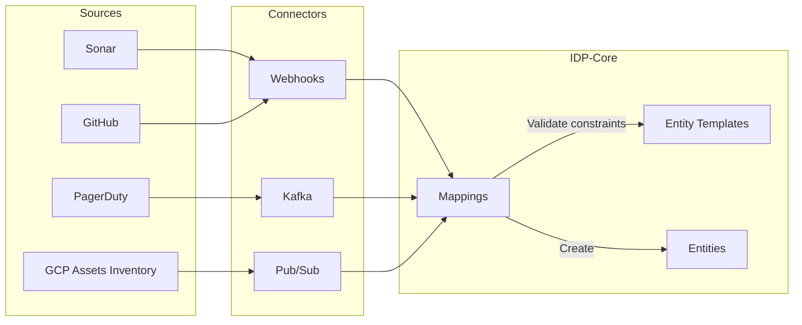
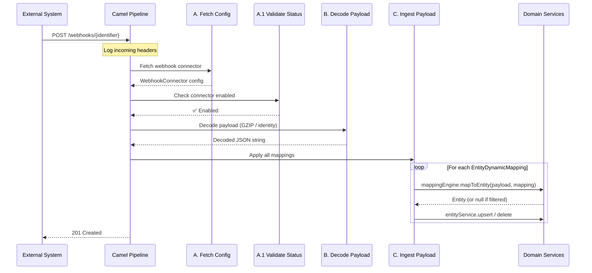

> [!IMPORTANT]
> This document describes a feature that is not yet developed. The content is subject to change and may not reflect the final implementation.

The Internal Developer Platform provides flexible data integration to connect to any source and map incoming data to your entities at runtime without code changes. That's powerful for rapid adaptation.

## Overview

Data integration in the Internal Developer Platform follows a three-step pattern:

1. **Configure a connector** - Set up a Webhook, Kafka consumer, or Pub/Sub subscription
2. **Define mappings** - Use JSLT expressions to transform incoming data
3. **Ingest data** - Data flows automatically, creating and updating entities


```mermaid
flowchart LR
    subgraph "Sources"
        S1[Sonar]
        S2[GitHub]
        S3[PagerDuty]
        S4[GCP Assets Inventory]
    end

    subgraph "Connectors"
        WH[Webhooks]
        KF[Kafka]
        PS[Pub/Sub]
    end

    subgraph "IDP-Core"
        MP[Mappings]
        ET[Entity Templates]
        E[Entities]
    end

    S1 --> WH
    S2 --> WH
    S3 --> KF
    S4 --> PS
    WH --> MP
    KF --> MP
    PS --> MP
    MP --Validate constraints--> ET
    MP --Create--> E
```

---

## Webhooks

Webhooks allow external systems to push data to IDP-Core via HTTP POST requests.
You configure a webhook connector and attach one or more **Entity Dynamic Mappings**
to it. Each mapping defines how the incoming JSON payload is transformed into an entity.

### Step 1: Create an Entity Dynamic Mapping

An **Entity Dynamic Mapping** defines how a raw JSON payload is transformed into an
entity. It includes a JSLT filter, a JSLT template, and the action to apply.

```json title="POST /api/v1/entity_dynamic_mappings"
{
  "identifier": "sonar_project_mapping",
  "name": "Sonar Project Mapping",
  "description": "Maps Sonar webhook payloads to sonar_project entities",
  "entity_template_identifier": "sonar_project",
  "filter": ".visibility == \"private\"",
  "action": "UPDATE_ENTITY",
  "entity": {
    "identifier": "replace(string(.key), \"\\\\s\", \"_\")",
    "name": ".name",
    "properties": {
      "project_name": "string(.name)",
      "last_analysis_date": ".lastAnalysisDate",
      "issues_number": "[for (.measures) .period.value if (.metric == \"new_violations\")] | .[0]",
      "loc": "[for (.measures) .value if (.metric == \"ncloc\")] | .[0]"
    },
    "relations": [
      {
        "name": "github_repository",
        "target_entity_identifiers": [
          ".components[0].name"
        ]
      }
    ]
  }
}
```

### Step 2: Create a Webhook Connector

A **Webhook Connector** receives the HTTP POST request and references one or more
entity dynamic mappings. Each mapping is applied independently to the same payload.

```json title="POST /api/v1/inbound_webhooks"
{
  "identifier": "sonar_webhook",
  "name": "Sonar Webhook",
  "description": "Webhook to receive Sonar project data",
  "enabled": true,
  "mapping_identifiers": [
    "sonar_project_mapping"
  ],
  "security": {
    "type": "HMAC_SHA256",
    "config": {
      "header_name": "X-Sonar-Webhook-HMAC-SHA256",
      "secret_alias": "SONAR_WEBHOOK_SECRET",
      "prefix": "sha256="
    }
  }
}
```

### Testing Mappings with Dry-Run

Before deploying a mapping to production, test it with a sample payload using the
**dry-run endpoint**. This validates your JSLT expressions without persisting entities.

```bash title="POST /api/v1/entity_dynamic_mappings/dry-run"
{
  "mapping": {
    "identifier": "sonar_project_mapping",
    "name": "Sonar Project Mapping",
    "entity_template_identifier": "sonar_project",
    "filter": ".visibility == \"private\"",
    "action": "UPDATE_ENTITY",
    "entity": {
      "identifier": ".key | tostring",
      "name": ".name",
      "properties": {
        "project_name": ".name | tostring"
      },
      "relations": []
    }
  },
  "payload": "{\"key\": \"my_project\", \"name\": \"My Project\", \"visibility\": \"private\"}"
}
```

**Response:**

```json
{
  "results": [
    {
      "success": true,
      "mapping_template_identifier": "sonar_project",
      "entity": {
        "template_identifier": "sonar_project",
        "identifier": "my_project",
        "name": "My Project",
        "properties": {
          "project_name": "My Project"
        },
        "relations": []
      }
    }
  ]
}
```

If the mapping filter returns `false` or the JSLT expression has errors, you'll see:

```json
{
  "results": [
    {
      "success": false,
      "mapping_template_identifier": "sonar_project",
      "error": {
        "type": "FILTER_NOT_MATCHED",
        "message": "Payload did not match filter expression"
      }
    }
  ]
}
```

### Ingestion Pipeline

When a webhook event arrives at `POST /webhooks/{identifier}`, IDP-Core runs the
following Camel route pipeline:


```mermaid
sequenceDiagram
    participant Client as External System
    participant Route as Camel Pipeline
    participant Config as A. Fetch Config
    participant Validate as A.1 Validate Status
    participant Decode as B. Decode Payload
    participant Ingest as C. Ingest Payload
    participant Domain as Domain Services

    Client->>Route: POST /webhooks/{identifier}
    Note over Route: Log incoming headers
    Route->>Config: Fetch webhook connector
    Config-->>Route: WebhookConnector config
    Route->>Validate: Check connector enabled
    Validate-->>Route: ✅ Enabled
    Route->>Decode: Decode payload (GZIP / identity)
    Decode-->>Route: Decoded JSON string
    Route->>Ingest: Apply all mappings
    loop For each EntityDynamicMapping
        Ingest->>Domain: mappingEngine.mapToEntity(payload, mapping)
        Domain-->>Ingest: Entity (or null if filtered)
        Ingest->>Domain: entityService.upsert / delete
    end
    Route-->>Client: 201 Created
```

Each step in the pipeline is isolated in its own Camel sub-route:

| Step | Route ID | Responsibility |
| ---- | -------- | -------------- |
| **A** | `fetch-webhook-config` | Load `WebhookConnector` from the database by identifier |
| **A.1** | `validate-webhook-enabled` | Throw `WebhookDisabledException` if `enabled: false` |
| **B** | `decode-payload` | Decompress GZIP payloads; strips `Content-Encoding` header |
| **C** | `ingest-payload` | Apply each `EntityDynamicMapping` and persist entities |

> [!TIP]
> If a `filter` expression returns `false`, the payload is silently
> skipped for that mapping. Other mappings on the same connector continue to run.

---

## Kafka / Pub-Sub

For streaming data, configure Kafka or Pub/Sub consumers.

### Kafka Configuration

```json
{
  "identifier": "users_kafka",
  "title": "Users provisioning",
  "description": "Kafka topic ingestion for users",
  "enabled": true,
  "mappings": [
    {
      "template": "users",
      "topic": "identity_provider_users",
      "header_filter": ".event == \"create\"",
      "entity": {
        "identifier": ".user_id",
        "title": "(.firstname + \" \" + .lastname)",
        "properties": {
          "firstname": ".firstname",
          "lastname": ".lastname"
        },
        "relations": {
          "team": ".support_groups[]?.id"
        }
      }
    }
  ]
}
```

### Spring Configuration

Configure the Kafka consumer in your Spring profile:

```yaml
spring:
  kafka:
    bootstrap-servers: localhost:9092
    consumer:
      group-id: idp-consumer-group
      auto-offset-reset: earliest
      key-deserializer: org.apache.kafka.common.serialization.StringDeserializer
      value-deserializer: org.apache.kafka.common.serialization.StringDeserializer
      properties:
        idp.kafka.mapping: users_kafka
```

## Example: GitHub Webhook

Configure a webhook to receive GitHub repository events:

```json
{
  "identifier": "github_repos",
  "name": "GitHub Repositories",
  "description": "Webhook to receive GitHub repository data",
  "enabled": true,
  "mapping_identifiers": ["github_repos_mapping"],
  "security": {
    "type": "HMAC_SHA256",
    "config": {
      "header_name": "X-Hub-Signature-256",
      "secret_alias": "GITHUB_WEBHOOK_SECRET",
      "prefix": "sha256="
    }
  }
}
```

Create the mapping:

```json title="POST /api/v1/entity_dynamic_mappings"
{
  "identifier": "github_repos_mapping",
  "name": "GitHub Repository Mapping",
  "entity_template_identifier": "github_repository",
  "filter": ".action == \"created\" or .action == \"edited\"",
  "action": "UPDATE_ENTITY",
  "entity": {
    "identifier": ".repository.full_name | gsub(\"/\"; \"_\")",
    "name": ".repository.name",
    "properties": {
      "name": ".repository.name",
      "url": ".repository.html_url",
      "stars": ".repository.stargazers_count | tostring",
      "language": ".repository.language // \"Unknown\"",
      "is_public": ".repository.private | not | tostring"
    },
    "relations": [
      {
        "name": "owner",
        "target_entity_identifiers": [".repository.owner.login"]
      }
    ]
  }
}
```

---

## Security

### Webhook Authentication

Webhooks support signature-based authentication:

```json
{
  "security": {
    "type": "STATIC_TOKEN",
    "config": {
      "header_name": "X-Webhook-Signature",
      "secret_alias": "WEBHOOK_SHARED_TOKEN"
    }
  }
}
```

The Internal Developer Platform validates the header value against the configured secret before processing.

### Best Practices

1. **Always enable authentication** for production webhooks
2. **Use HTTPS** endpoints in production
3. **Rotate secrets** periodically
4. **Monitor webhook logs** for failed authentications

---

## Audit & Troubleshooting

The Internal Developer Platform logs all ingestion operations for troubleshooting:

```bash
GET /api/v1/audit_logs?entity_template=sonar_project&limit=10
```

Response:

```json
[
  {
    "id": "c5963029-60f5-4bc2-b097-0212608ffd88",
    "action": "CREATE",
    "resource_type": "entity",
    "trigger": {
      "at": "2025-11-02T06:03:25.333Z",
      "by": {"integration_id": "5ef89f76-34c5-40bf-9daf-e831db34ebad"},
      "origin": "WEBHOOK"
    },
    "context": {
      "entity_template": "sonar_project",
      "entity": "care_back"
    },
    "status": "SUCCESS"
  },
  {
    "id": "d0483b48-7e77-4c95-b7d1-2e40e4fb1cfa",
    "action": "CREATE",
    "resource_type": "entity",
    "trigger": {
      "at": "2025-11-02T06:03:25.333Z",
      "by": {"integration_id": "5ef89f76-34c5-40bf-9daf-e831db34ebad"},
      "origin": "WEBHOOK"
    },
    "context": {
      "entity_template": "sonar_project",
      "entity": "invalid_entity"
    },
    "message": "Relation 'github_repo' does not exist",
    "status": "FAILURE"
  }
]
```

---

## Next Steps

- **[Scorecards](scorecards.md)** - Track metrics from ingested data
