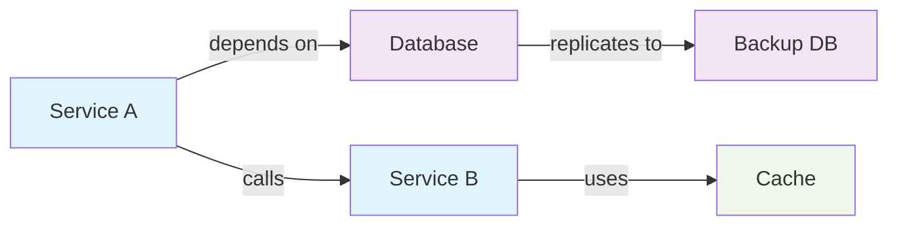

The Internal Developer Platform provides a powerful graph endpoint that returns entity relationships in a standardized format. You can easily visualize these relationships using frontend libraries like React Flow, D3.js, or similar graph visualization tools.

## Overview

The Entity Relationship Graph enables you to:

- **Visualize relationships** between entities and their dependencies
- **Explore entity networks** and understand how components interact
- **Track impact** of changes across related entities
- **Build interactive dashboards** with graph visualization libraries



## API Reference

### Get Entity Relationship Graph

Retrieve the complete relationship graph for a specific entity, including all connected entities and their relationships. You can control the depth of traversal, filtering by specific relation types, and include entity property data in the response.

```bash
GET /api/v1/entities/{templateIdentifier}/{entityIdentifier}/graph?depth={depth}&include_data={include_data}&traversal_mode={mode}&relations={relations}&properties={properties}
```

### Path Parameters

| Parameter            | Type   | Required | Description                                             |
| -------------------- | ------ | -------- | ------------------------------------------------------- |
| `templateIdentifier` | string | ✅       | The entity template identifier (for example, "service") |
| `entityIdentifier`   | string | ✅       | The unique entity identifier                            |

### Query Parameters

| Parameter        | Type    | Required | Default          | Description                                                                                                                                  |
| ---------------- | ------- | -------- | ---------------- | ---------------------------------------------------------------------------------------------------------------------------------------------|
| `depth`          | integer |          | `1`              | Maximum traversal depth for relationship resolution. Range: 1-6. Controls how many hops away from the entity to include in the graph.        |
| `include_data`   | boolean |          | `false`          | When true, each graph node includes a data object containing the entity's property values.                                                   |
| `traversal_mode` | string  |          | `DIRECT_LINEAGE` | Specifies how relationships are traversed: `DIRECT_LINEAGE`, `BIDIRECTIONAL`, or `OUTBOUND_ONLY`.                                            |
| `relations`      | string  |          | All              | Comma-separated list of relation names to include (for example, `depends_on,uses`). Omit to traverse all relations.                          |
| `properties`     | string  |          | All              | Comma-separated list of property names to include in node data (for example, `language,owner_team`). Requires `include_data=true`.           |

### Examples

```bash
# Get graph with default settings (depth=1, no data)
GET /api/v1/entities/service/auth-service/graph

# Get graph with specific depth
GET /api/v1/entities/service/auth-service/graph?depth=3

# Include entity property data in nodes
GET /api/v1/entities/service/auth-service/graph?include_data=true

# Filter by specific relation types
GET /api/v1/entities/service/auth-service/graph?relations=depends_on,uses

# Bidirectional traversal (both outbound and inbound)
GET /api/v1/entities/service/auth-service/graph?traversal_mode=BIDIRECTIONAL

# Include specific properties only
GET /api/v1/entities/service/auth-service/graph?include_data=true&properties=language,owner_team

# Complex example: deep graph with filtered relations and limited properties
GET /api/v1/entities/service/auth-service/graph?depth=4&traversal_mode=BIDIRECTIONAL&relations=depends_on,calls&include_data=true&properties=language,region
```

### Traversal Modes**

| Mode             | Behaviour                                                                                |
| ---------------- | ---------------------------------------------------------------------------------------- |
| `DIRECT_LINEAGE` | Forward traversal only. Shows what this entity depends on or uses.                       |
| `BIDIRECTIONAL`  | Both forward and backward traversal. Shows dependencies and dependents.                  |
| `OUTBOUND_ONLY`  | Outgoing relationships only. Shows what this entity connects to.                         |

### Response

```json
{
  "entity": {
    "identifier": "auth-service",
    "template_identifier": "service",
    "name": "Authentication Service",
    "properties": {
      "language": "java",
      "repository": "https://github.com/org/auth-service",
      "owner_team": "platform"
    }
  },
  "nodes": [
    {
      "id": "auth-service",
      "label": "Authentication Service",
      "template": "service",
      "data": {
        "identifier": "auth-service",
        "name": "Authentication Service",
        "type": "service",
        "properties": {
          "language": "java",
          "repository": "https://github.com/org/auth-service"
        }
      }
    },
    {
      "id": "user-db",
      "label": "User Database",
      "template": "database",
      "data": {
        "identifier": "user-db",
        "name": "User Database",
        "type": "database",
        "properties": {
          "engine": "postgresql",
          "region": "us-east-1"
        }
      }
    },
    {
      "id": "identity-provider",
      "label": "Identity Provider",
      "template": "external_service",
      "data": {
        "identifier": "identity-provider",
        "name": "Identity Provider",
        "type": "external_service"
      }
    }
  ],
  "edges": [
    {
      "id": "auth-service->user-db",
      "source": "auth-service",
      "target": "user-db",
      "label": "stores_data_in",
      "animated": false
    },
    {
      "id": "auth-service->identity-provider",
      "source": "auth-service",
      "target": "identity-provider",
      "label": "delegates_to",
      "animated": false
    }
  ]
}
```

### Response Fields

| Field    | Type   | Description                                       |
| -------- | ------ | ------------------------------------------------- |
| `entity` | object | The central entity being graphed                  |
| `nodes`  | array  | Array of nodes representing entities in the graph |
| `edges`  | array  | Array of edges representing relationships         |

### Node Structure

Each node in the graph represents an entity with the following structure:

| Field      | Type   | Description                                                     |
| ---------- | ------ | --------------------------------------------------------------- |
| `id`       | string | Unique identifier for the node (entity identifier)              |
| `label`    | string | Human-readable name for display                                 |
| `template` | string | Entity template type (for example, "service", "database")       |
| `data`     | object | Complete entity data including properties and metadata          |

### Edge Structure

Each edge in the graph represents a relationship between two entities:

| Field      | Type    | Description                                                     |
| ---------- | ------- | --------------------------------------------------------------- |
| `id`       | string  | Unique identifier for the edge                                  |
| `source`   | string  | Source node identifier                                          |
| `target`   | string  | Target node identifier                                          |
| `label`    | string  | Relationship name/type (for example, "depends_on", "calls")     |
| `animated` | boolean | Whether the edge should be animated in visualization            |

## Visualization with React Flow

[React Flow](https://reactflow.dev/) is a popular library for building interactive node-based user interfaces. The graph endpoint response format is perfectly suited for React Flow visualization.

### Basic Setup

```tsx
import React, { useEffect, useState } from 'react';
import ReactFlow, {
  Background,
  Controls,
  MiniMap
} from 'reactflow';
import 'reactflow/dist/style.css';

interface GraphResponse {
  entity: Entity;
  nodes: Node[];
  edges: Edge[];
}

export function EntityGraph({ templateId, entityId }: Props) {
  const [data, setData] = useState<GraphResponse | null>(null);
  const [loading, setLoading] = useState(true);

  useEffect(() => {
    const fetchGraph = async () => {
      // Include data to display entity properties in nodes
      const response = await fetch(
        `/api/v1/entities/${templateId}/${entityId}/graph?include_data=true&depth=3`
      );
      const graphData = await response.json();
      setData(graphData);
      setLoading(false);
    };

    fetchGraph();
  }, [templateId, entityId]);

  if (loading) return <div>Loading graph...</div>;
  if (!data) return <div>No graph data available</div>;

  return (
    <ReactFlow nodes={data.nodes} edges={data.edges}>
      <Background />
      <Controls />
      <MiniMap />
    </ReactFlow>
  );
}
```

> [!TIP]
> Use `include_data=true` when fetching the graph for visualization so that node components
> can display entity properties. Use `properties=field1,field2` to limit which properties
> are included, reducing payload size.

### Custom Node Styling

Style nodes based on entity template type:

```tsx
import { Handle, Position } from 'reactflow';

const nodeTypes = {
  service: ServiceNode,
  database: DatabaseNode,
  external_service: ExternalServiceNode,
};

function ServiceNode({ data }: NodeProps) {
  return (
    <div className="node-service">
      <Handle type="target" position={Position.Top} />
      <div className="node-header">{data.label}</div>
      <div className="node-body">
        <p><strong>Type:</strong> {data.template}</p>
        <p><strong>Language:</strong> {data.properties?.language}</p>
      </div>
      <Handle type="source" position={Position.Bottom} />
    </div>
  );
}

function DatabaseNode({ data }: NodeProps) {
  return (
    <div className="node-database">
      <Handle type="target" position={Position.Top} />
      <div className="node-header">🗄️ {data.label}</div>
      <div className="node-body">
        <p><strong>Engine:</strong> {data.properties?.engine}</p>
        <p><strong>Region:</strong> {data.properties?.region}</p>
      </div>
      <Handle type="source" position={Position.Bottom} />
    </div>
  );
}
```

### Interactive Features

Add interactivity to your graph visualization:

```tsx
const handleNodeClick = (event, node) => {
  console.log('Clicked node:', node.data);
  // Navigate to entity detail page
  navigate(`/entities/${node.data.type}/${node.id}`);
};

const handleEdgeClick = (event, edge) => {
  console.log('Relationship:', edge.label);
  // Show relationship details
  showRelationshipDetails(edge);
};

<ReactFlow
  nodes={data.nodes}
  edges={data.edges}
  onNodeClick={handleNodeClick}
  onEdgeClick={handleEdgeClick}
  fitView
>
  {/* ... */}
</ReactFlow>
```

## Visualization with D3.js

[D3.js](https://d3js.org/) provides fine-grained control over graph visualization. Here's an example of rendering the entity graph with D3:

```typescript
import * as d3 from 'd3';

function visualizeGraphWithD3(graphData, containerSelector) {
  const width = 960;
  const height = 600;

  // Create force simulation
  const simulation = d3.forceSimulation(graphData.nodes)
    .force('link', d3.forceLink(graphData.edges)
      .id(d => d.id)
      .distance(100)
    )
    .force('charge', d3.forceManyBody().strength(-300))
    .force('center', d3.forceCenter(width / 2, height / 2));

  // Create SVG
  const svg = d3.select(containerSelector)
    .append('svg')
    .attr('width', width)
    .attr('height', height);

  // Draw links
  const link = svg.selectAll('line')
    .data(graphData.edges)
    .enter()
    .append('line')
    .attr('stroke', '#999')
    .attr('stroke-width', 2);

  // Draw nodes
  const node = svg.selectAll('circle')
    .data(graphData.nodes)
    .enter()
    .append('circle')
    .attr('r', 8)
    .attr('fill', d => templateColor(d.template))
    .call(d3.drag()
      .on('start', dragStarted)
      .on('drag', dragged)
      .on('end', dragEnded)
    );

  // Add labels
  const labels = svg.selectAll('text')
    .data(graphData.nodes)
    .enter()
    .append('text')
    .text(d => d.label)
    .attr('font-size', 12)
    .attr('dx', 12)
    .attr('dy', 4);

  // Update positions on simulation tick
  simulation.on('tick', () => {
    link
      .attr('x1', d => d.source.x)
      .attr('y1', d => d.source.y)
      .attr('x2', d => d.target.x)
      .attr('y2', d => d.target.y);

    node
      .attr('cx', d => d.x)
      .attr('cy', d => d.y);

    labels
      .attr('x', d => d.x)
      .attr('y', d => d.y);
  });

  // Helper functions
  function templateColor(template) {
    const colors = {
      service: '#1f77b4',
      database: '#ff7f0e',
      external_service: '#2ca02c',
    };
    return colors[template] || '#999';
  }

  function dragStarted(event, d) {
    if (!event.active) simulation.alphaTarget(0.3).restart();
    d.fx = d.x;
    d.fy = d.y;
  }

  function dragged(event, d) {
    d.fx = event.x;
    d.fy = event.y;
  }

  function dragEnded(event, d) {
    if (!event.active) simulation.alphaTarget(0);
    d.fx = null;
    d.fy = null;
  }
}
```

## API Examples

### Example: Get Service Dependencies

Fetch the dependency graph for a microservice with entity data:

```bash
curl -X GET \
  'http://localhost:8084/api/v1/entities/service/auth-service/graph?include_data=true&depth=3' \
  -H "Authorization: Bearer YOUR_TOKEN"
```

### Example: Bidirectional Relationships

View all services that depend on a specific database and what it depends on:

```bash
curl -X GET \
  'http://localhost:8084/api/v1/entities/database/users-db/graph?traversal_mode=BIDIRECTIONAL&include_data=true' \
  -H "Authorization: Bearer YOUR_TOKEN"
```

### Example: Filtered Relations

Get only "depends_on" and "uses" relationships for a service:

```bash
curl -X GET \
  'http://localhost:8084/api/v1/entities/service/api-gateway/graph?relations=depends_on,uses&include_data=true' \
  -H "Authorization: Bearer YOUR_TOKEN"
```

### Example: Limited Properties

Retrieve the graph with only specific properties to reduce payload size:

```bash
curl -X GET \
  'http://localhost:8084/api/v1/entities/service/auth-service/graph?include_data=true&properties=language,owner_team,repository' \
  -H "Authorization: Bearer YOUR_TOKEN"
```

## Use Cases

### Dependency Analysis

Visualize service dependencies to understand system architecture and identify potential bottlenecks or single points of failure.

```text
API Gateway
    ↓
  ├─ Auth Service ──→ User Database
  ├─ Product Service ──→ Product Database
  └─ Order Service ──→ Orders Database ──→ Message Queue
```

### Impact Assessment

When making changes to an entity, visualize all downstream and upstream dependencies to assess the impact.

### Compliance & Documentation

Generate interactive architecture diagrams for documentation, audits, and team alignment.

### System Health Monitoring

Overlay health metrics onto graph nodes to quickly identify troubled components.

---

## Next Steps

- **[Data Integration](data-integration.md)** - Connect external systems and populate the graph with data
- **[Entity Templates](../getting-started/entity-templates.md)** - Define the types of entities in your graph
- **[Audit Trail](../features/audit.md)** - Track changes to entities and relationships
