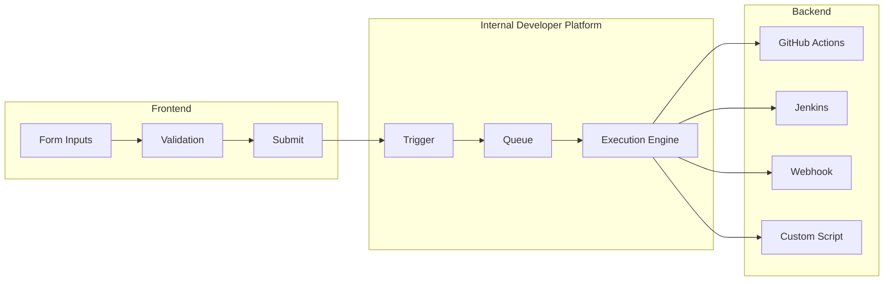

> [!IMPORTANT]
> This document describes a feature that's not yet developed. The content is subject to change and may not reflect the final implementation.

Self-Service Actions allow developers to trigger workflows directly from the Internal Developer Platform catalog. Create services, provision infrastructure, request access, or run any automation—all with a consistent, form-based interface.

## Overview

Self-Service Actions consist of three parts:

1. **Frontend Experience** - Form inputs, validation, and display
2. **Backend Workflow** - The automation triggered by the action
3. **Execution Tracking** - Status, logs, and results



---

## Action Definition

### Complete Example

```json
{
  "identifier": "create_microservice",
  "title": "Create Microservice",
  "description": "Scaffold a new microservice with standard configuration",
  "icon": "rocket",
  "trigger": {
    "type": "self-service",
    "operation": "CREATE",
    "target_template": "microservice"
  },
  "user_inputs": {
    "properties": {
      "service_name": {
        "type": "string",
        "title": "Service Name",
        "description": "Name of the new microservice",
        "pattern": "^[a-z][a-z0-9-]*$",
        "minLength": 3,
        "maxLength": 50
      },
      "language": {
        "type": "string",
        "title": "Programming Language",
        "enum": ["java", "python", "nodejs", "go"],
        "default": "java"
      },
      "team": {
        "type": "string",
        "title": "Owning Team",
        "blueprint": "team",
        "format": "entity"
      },
      "include_database": {
        "type": "boolean",
        "title": "Include Database",
        "description": "Add PostgreSQL database configuration",
        "default": false
      },
      "tier": {
        "type": "string",
        "title": "Service Tier",
        "enum": ["critical", "high", "medium", "low"],
        "enumLabels": {
          "critical": "Critical - 99.99% SLA",
          "high": "High - 99.9% SLA",
          "medium": "Medium - 99% SLA",
          "low": "Low - Best effort"
        },
        "default": "medium"
      }
    },
    "required": ["service_name", "language", "team"]
  },
  "invocation_method": {
    "type": "GITHUB",
    "org": "my-org",
    "repo": "platform-automation",
    "workflow": "create-microservice.yml",
    "inputs": {
      "service_name": "{{ .inputs.service_name }}",
      "language": "{{ .inputs.language }}",
      "team_id": "{{ .inputs.team }}",
      "include_db": "{{ .inputs.include_database }}",
      "tier": "{{ .inputs.tier }}",
      "triggered_by": "{{ .trigger.user.email }}"
    }
  }
}
```

---

## Frontend Configuration

### Input Types

#### String Input

```json
{
  "service_name": {
    "type": "string",
    "title": "Service Name",
    "description": "Must be lowercase, alphanumeric with hyphens",
    "pattern": "^[a-z][a-z0-9-]*$",
    "minLength": 3,
    "maxLength": 50,
    "placeholder": "my-service"
  }
}
```

#### Number Input

```json
{
  "replicas": {
    "type": "number",
    "title": "Number of Replicas",
    "minimum": 1,
    "maximum": 10,
    "default": 2
  }
}
```

#### Boolean Input

```json
{
  "enable_monitoring": {
    "type": "boolean",
    "title": "Enable Monitoring",
    "description": "Set up Prometheus metrics and Grafana dashboard",
    "default": true
  }
}
```

#### Enumeration (Dropdown)

```json
{
  "environment": {
    "type": "string",
    "title": "Environment",
    "enum": ["dev", "staging", "prod"],
    "enumLabels": {
      "dev": "Development",
      "staging": "Staging",
      "prod": "Production"
    },
    "default": "dev"
  }
}
```

#### Entity Reference

```json
{
  "target_service": {
    "type": "string",
    "title": "Target Service",
    "format": "entity",
    "blueprint": "microservice",
    "description": "Select a service from the catalog"
  }
}
```

#### Array Input

```json
{
  "environments": {
    "type": "array",
    "title": "Target Environments",
    "items": {
      "type": "string",
      "enum": ["dev", "staging", "prod"]
    },
    "minItems": 1,
    "uniqueItems": true
  }
}
```

### Conditional Fields

Show/hide fields based on other inputs:

```json
{
  "user_inputs": {
    "properties": {
      "database_type": {
        "type": "string",
        "title": "Database Type",
        "enum": ["none", "postgresql", "mysql", "mongodb"]
      },
      "database_size": {
        "type": "string",
        "title": "Database Size",
        "enum": ["small", "medium", "large"],
        "visible_if": {
          "database_type": { "not": "none" }
        }
      }
    }
  }
}
```

---

## Backend Invocation Methods

### GitHub Actions

```json
{
  "invocation_method": {
    "type": "GITHUB",
    "org": "my-organization",
    "repo": "automation-repo",
    "workflow": "workflow-file.yml",
    "branch": "main",
    "inputs": {
      "param1": "{{ .inputs.field1 }}",
      "param2": "{{ .inputs.field2 }}"
    }
  }
}
```

### Webhook

```json
{
  "invocation_method": {
    "type": "WEBHOOK",
    "url": "https://automation.example.com/trigger",
    "method": "POST",
    "headers": {
      "Authorization": "Bearer {{ .secrets.AUTOMATION_TOKEN }}",
      "Content-Type": "application/json"
    },
    "body": {
      "action": "create_service",
      "params": {
        "name": "{{ .inputs.service_name }}",
        "user": "{{ .trigger.user.email }}"
      }
    }
  }
}
```

### Jenkins

```json
{
  "invocation_method": {
    "type": "JENKINS",
    "url": "https://jenkins.example.com",
    "job": "platform/create-service",
    "parameters": {
      "SERVICE_NAME": "{{ .inputs.service_name }}",
      "ENVIRONMENT": "{{ .inputs.environment }}"
    }
  }
}
```

### Azure DevOps

```json
{
  "invocation_method": {
    "type": "AZURE_DEVOPS",
    "organization": "my-org",
    "project": "platform",
    "pipeline_id": "42",
    "branch": "main",
    "parameters": {
      "serviceName": "{{ .inputs.service_name }}"
    }
  }
}
```

---

## Template Expressions

Use template expressions to inject dynamic values:

### Input Values

```bash
{{ .inputs.service_name }}      // User input
{{ .inputs.team }}              // Entity reference ID
```

### Trigger Context

```bash
{{ .trigger.user.email }}       // User who triggered
{{ .trigger.user.id }}          // User ID
{{ .trigger.timestamp }}        // When triggered
{{ .trigger.run_id }}           // Execution run ID
```

### Entity Context (for entity-scoped actions)

```bash
{{ .entity.identifier }}        // Entity ID
{{ .entity.title }}             // Entity title
{{ .entity.properties.owner }}  // Entity property
{{ .entity.relations.team }}    // Entity relation
```

### Secrets

```bash
{{ .secrets.API_TOKEN }}        // Configured secret
{{ .secrets.GITHUB_TOKEN }}     // GitHub token
```

### Functions

```bash
{{ .inputs.name | lower }}      // Lowercase
{{ .inputs.name | upper }}      // Uppercase
{{ .inputs.name | slug }}       // URL-safe slug
{{ now | date "2006-01-02" }}   // Current date
```

---

## Action Triggers

### Self-Service (Manual)

Displayed in catalog UI:

```json
{
  "trigger": {
    "type": "self-service",
    "operation": "CREATE",
    "target_template": "microservice"
  }
}
```

### Entity-Scoped

Action available on entity detail page:

```json
{
  "trigger": {
    "type": "self-service",
    "operation": "DAY-2",
    "target_template": "microservice"
  }
}
```

### Operations

| Operation | Description |
| ----------- | ------------- |
| `CREATE` | Create new entity |
| `DELETE` | Delete entity |
| `DAY-2` | Day-2 operation on existing entity |

---

## Execution Tracking

### Execution Status

```http
GET /api/v1/actions/{action_id}/runs/{run_id}
```

Response:

```json
{
  "run_id": "d290f1ee-6c54-4b01-90e6-d701748f0851",
  "action_id": "create_microservice",
  "status": "IN_PROGRESS",
  "triggered_by": {
    "user_id": "user-123",
    "email": "dev@example.com"
  },
  "triggered_at": "2024-01-15T10:30:00Z",
  "inputs": {
    "service_name": "payment-service",
    "language": "java",
    "team": "payments-team"
  },
  "backend_status": {
    "type": "GITHUB",
    "workflow_run_id": 12345678,
    "status": "in_progress",
    "url": "https://github.com/org/repo/actions/runs/12345678"
  },
  "logs": [
    { "timestamp": "2024-01-15T10:30:01Z", "message": "Action triggered" },
    { "timestamp": "2024-01-15T10:30:02Z", "message": "GitHub workflow started" }
  ]
}
```

### Execution Statuses

| Status | Description |
| -------- | ------------- |
| `PENDING` | Waiting to start |
| `IN_PROGRESS` | Currently executing |
| `SUCCESS` | Completed successfully |
| `FAILURE` | Execution failed |
| `CANCELLED` | Cancelled by user |

---

## Day-2 Actions Examples

### Scale Service

```json
{
  "identifier": "scale_service",
  "title": "Scale Service",
  "trigger": {
    "type": "self-service",
    "operation": "DAY-2",
    "target_template": "microservice"
  },
  "user_inputs": {
    "properties": {
      "replicas": {
        "type": "number",
        "title": "Number of Replicas",
        "minimum": 1,
        "maximum": 20,
        "default": "{{ .entity.properties.current_replicas }}"
      }
    }
  },
  "invocation_method": {
    "type": "WEBHOOK",
    "url": "https://k8s-api.example.com/scale",
    "body": {
      "service": "{{ .entity.identifier }}",
      "replicas": "{{ .inputs.replicas }}"
    }
  }
}
```

### Request Database Access

```json
{
  "identifier": "request_db_access",
  "title": "Request Database Access",
  "trigger": {
    "type": "self-service",
    "operation": "DAY-2",
    "target_template": "database"
  },
  "user_inputs": {
    "properties": {
      "access_level": {
        "type": "string",
        "title": "Access Level",
        "enum": ["read", "write", "admin"]
      },
      "justification": {
        "type": "string",
        "title": "Justification",
        "format": "textarea"
      }
    }
  },
  "approval": {
    "required": true,
    "approvers": ["{{ .entity.properties.dba_team }}"]
  }
}
```

---

## Best Practices

### 1. Clear Naming

Use action-oriented names:

- ✅ "Create Microservice"
- ✅ "Deploy to Production"
- ❌ "Microservice Action"
- ❌ "Deployment"

### 2. Helpful Descriptions

Provide context in descriptions:

```json
{
  "description": "Creates a new microservice with CI/CD pipeline, monitoring, and Kubernetes manifests. Takes about 5 minutes.",
  "user_inputs": {
    "properties": {
      "name": {
        "description": "Must be lowercase, use hyphens for spaces. Example: payment-service"
      }
    }
  }
}
```

### 3. Sensible Defaults

Pre-fill common values:

```json
{
  "environment": {
    "default": "dev"
  },
  "replicas": {
    "default": 2
  }
}
```

### 4. Validation

Add input validation to prevent errors:

```json
{
  "service_name": {
    "pattern": "^[a-z][a-z0-9-]*$",
    "minLength": 3,
    "maxLength": 50
  }
}
```

---

## Next Steps

- **[Data Integration](data-integration.md)** - Auto-update entities after actions
