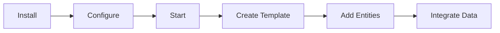

Welcome to the Internal Developer Platform. This section will guide you through installing, configuring, and using the Internal Developer Platform for the first time.

## Overview

The Internal Developer Platform is a modern backend for Internal Developer Platforms. Before diving in, here's what you'll learn:

<div class="grid cards" markdown>

- 📥 **[Installation](installation.md)**

    ---

    Set up the Internal Developer Platform using Docker, Docker Compose, or build from source.

- ⚡ **[Quick Start](quickstart.md)**

    ---

    Create your first Entity Template and Entity in minutes.

- ⚙️ **[Configuration](configuration.md)**

    ---

    Configure database connections, security, and app profiles.

</div>

## Prerequisites

Before you begin, ensure you have the following installed:

| Requirement | Minimum Version | Description |
| ------------- | --------------- | ------------- |
| **Docker** | 20.10+ | Container runtime |
| **Docker Compose** | 2.0+ | Multi-container orchestration |
| **Java** (optional) | 21+ | For building from source |
| **Maven** (optional) | 3.9+ | For building from source |

## Quick Overview



### 1. Install

The fastest way to get started is using Docker Compose and Maven

Start the PostgreSQL service using Docker Compose:

```bash
git clone https://github.com/decathlon/internal-developer-platform.git
cd internal-developer-platform
docker-compose up -d
```

Build and run the Internal Developer Platform app:

```bash
mvn clean package -DskipTests
mvn spring-boot:run -Dspring-boot.run.profiles=local
```

### 2. Verify Installation

Check that the API is running:

```bash
curl http://localhost:8084/actuator/health
```

You should see:

```json
{"status": "UP"}
```

### 3. Create Your First Entity Template

```bash
curl -X POST http://localhost:8084/api/v1/entity-templates \
  -H "Content-Type: application/json" \
  -d '{
    "identifier": "service",
    "description": "A microservice in the platform",
    "properties_definitions": [
      {
        "name": "name",
        "description": "Service name",
        "type": "STRING",
        "required": true
      },
      {
        "name": "team",
        "description": "Owning team",
        "type": "STRING",
        "required": true
      }
    ]
  }'
```

---

## Next Steps

- **[Installation Guide](installation.md)** - Detailed installation instructions
- **[Quick Start Tutorial](quickstart.md)** - Step-by-step first project
- **[Core Concepts](../concepts/index.md)** - Understand the data model
