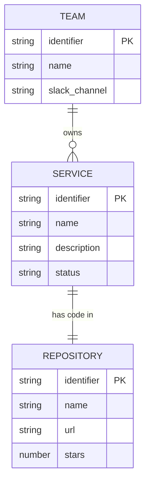

This tutorial walks you through creating your first Entity Template and Entity in the Internal Developer Platform. By the end, you'll understand the basic workflow of modeling your software catalog.

## Prerequisites

Ensure the Internal Developer Platform is running. See [Installation](installation.md) for setup instructions.

```bash
# Verify the Internal Developer Platform is running
curl http://localhost:8084/actuator/health
```

---

## Step 1: Design Your Data Model

Before creating Entity Templates, think about what you want to track. For this tutorial, we'll model a simple software catalog with:

- **Services** - Microservices in your platform
- **Teams** - Engineering teams
- **Repositories** - GitHub repositories



---

## Step 2: Create Entity Templates

### Create the Team Template

```bash
curl -X POST http://localhost:8084/api/v1/entity-templates \
  -H "Content-Type: application/json" \
  -d '{
    "identifier": "team",
    "description": "An engineering team in the organization",
    "properties_definitions": [
      {
        "name": "name",
        "description": "Team name",
        "type": "STRING",
        "required": true,
        "rules": {
          "min_length": 2,
          "max_length": 100
        }
      },
      {
        "name": "slack_channel",
        "description": "Team Slack channel",
        "type": "STRING",
        "required": false
      },
      {
        "name": "email",
        "description": "Team contact email",
        "type": "STRING",
        "required": false,
        "rules": {
          "format": "EMAIL"
        }
      }
    ]
  }'
```

### Create the Repository Template

```bash
curl -X POST http://localhost:8084/api/v1/entity-templates \
  -H "Content-Type: application/json" \
  -d '{
    "identifier": "github_repository",
    "description": "A GitHub repository containing source code",
    "properties_definitions": [
      {
        "name": "name",
        "description": "Repository name",
        "type": "STRING",
        "required": true
      },
      {
        "name": "url",
        "description": "Repository URL",
        "type": "STRING",
        "required": true,
        "rules": {
          "format": "URL"
        }
      },
      {
        "name": "stars",
        "description": "Number of GitHub stars",
        "type": "NUMBER",
        "required": false,
        "rules": {
          "min_value": 0
        }
      },
      {
        "name": "is_public",
        "description": "Whether the repository is public",
        "type": "BOOLEAN",
        "required": false
      }
    ]
  }'
```

### Create the Service Template

```bash
curl -X POST http://localhost:8084/api/v1/entity-templates \
  -H "Content-Type: application/json" \
  -d '{
    "identifier": "service",
    "description": "A microservice in the platform",
    "properties_definitions": [
      {
        "name": "name",
        "description": "Service name",
        "type": "STRING",
        "required": true
      },
      {
        "name": "description",
        "description": "Service description",
        "type": "STRING",
        "required": false
      },
      {
        "name": "status",
        "description": "Service lifecycle status",
        "type": "STRING",
        "required": false,
        "rules": {
          "enum_values": ["development", "staging", "production", "deprecated"]
        }
      }
    ],
    "relations_definitions": [
      {
        "name": "owned_by",
        "target_template_identifier": "team",
        "required": true,
        "to_many": false
      },
      {
        "name": "repository",
        "target_template_identifier": "github_repository",
        "required": false,
        "to_many": false
      }
    ]
  }'
```

---

## Step 3: Verify Your Templates

List all created templates:

```bash
curl http://localhost:8084/api/v1/entity-templates | jq
```

Get a specific template:

```bash
curl http://localhost:8084/api/v1/entity-templates/identifier/service | jq
```

---

## Step 4: Understanding the Structure

You've just created three Entity Templates. Let's break down what each part means:

### Entity Template Structure

```json
{
  "identifier": "service",        // Unique ID for referencing
  "description": "...",           // Human-readable description
  "properties_definitions": [...], // Data fields
  "relations_definitions": [...]   // Links to other templates
}
```

### Property Definition

```json
{
  "name": "status",               // Property name
  "description": "...",           // What it represents
  "type": "STRING",               // Data type: STRING, NUMBER, BOOLEAN
  "required": false,              // Is it mandatory?
  "rules": {                      // Validation rules
    "enum_values": ["dev", "prod"]
  }
}
```

### Relation Definition

```json
{
  "name": "owned_by",                    // Relation name
  "target_template_identifier": "team",    // Target template
  "required": true,                      // Is it mandatory?
  "to_many": false                       // One-to-one or one-to-many?
}
```

---

## What's Next?

Now that you have Entity Templates, you can:

1. **[Understand Concepts](../concepts/index.md)** - Deep dive into Entity Templates, Properties, and Relations
2. **[Configure Data Integration](../features/data-integration.md)** - Set up Webhooks and Kafka to populate entities automatically
3. **[Create Scorecards](../features/scorecards.md)** - Track engineering metrics and health
4. **[Explore the API](../api/index.md)** - Full API reference with Swagger UI

---

## Clean Up

To delete a template (and all its entities):

```bash
curl -X DELETE http://localhost:8084/api/v1/entity-templates/identifier/service
```

> [!WARNING] "Cascading Deletes"
> Deleting a template may affect relations in other templates. Plan your deletions carefully.
