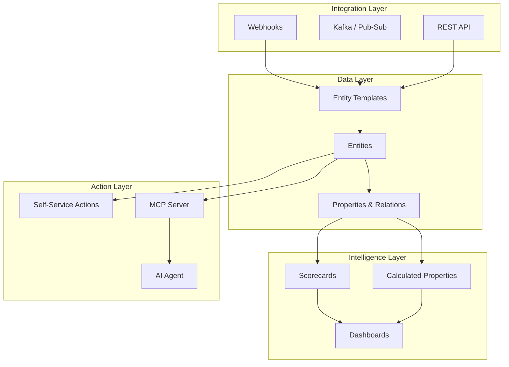

## A modern, open source Internal Developer Platform backend

Build your software catalog, integrate data from any source, create scorecards to track engineering excellence, and enable self-service actions for your engineering teams.

- 🚀 **Getting Started**

    ---

    Install IDP-Core and create your first entity template in minutes.

    [➡️ Quick Start](getting-started/quickstart.md)

- 📖 **Core Concepts**

    ---

    Understand Entity Templates, Properties, Relations, and Calculated Properties.

    [➡️ Learn Concepts](concepts/index.md)

- ⚙️ **Features**

    ---

    Discover data integration, scorecards, dashboards, and self-service actions.

    [➡️ Explore Features](features/index.md)

- 🔌 **API Reference**

    ---

    Interactive OpenAPI documentation with all available endpoints.

    [➡️ API Docs](api/index.md)

- 🐳 **Deployment**

    ---

    Deploy with Docker, Kubernetes, and configure observability.

    [➡️ Deploy](deployment/index.md)

- 💻 **Contributing**

    ---

    Join the community and contribute to IDP-Core development.

    [➡️ Contribute](contributing/index.md)

---

## Why IDP-Core?

IDP-Core serves as the foundation of your Internal Developer Platform, addressing key challenges faced by modern engineering organizations:

### ⚡ Enhance Engineering Velocity

Transition from custom, in-house coding for each use case to a **generic approach** for integrating data and calculating scorecards. Significantly increase the speed of adding or changing engineering metrics.

### 👁️ Holistic Information System View

Offer a **comprehensive view** of your information system across multiple axes and dimensions—technical, financial, and human.

### 🤖 AI-Ready Context Base

Create a **well-structured and reliable context base** that helps AI agents better understand your ecosystem and technical landscape, leading to more accurate and valuable propositions.

### 👤 Engineer Self-Service

Improve engineers' daily productivity by providing **self-service capabilities** across the tools they use. Integrate automated workflows and create coherent journeys for common actions.

---

## Key Features

### Flexible Data Model

Define your own **Entity Templates** that mirror your organization's specific needs. No predefined schemas—create data models at runtime that adapt to rapid shifts.

### Multi-Source Data Ingestion

Connect to any data source through **Webhooks**, **Kafka/Pub-Sub**, or direct API calls. Map incoming data to your entities using JQ expressions.

### Scorecards & Metrics

Track engineering excellence with **Scorecards**—define levels, conditions, and weights to assess your tech landscape's health.

### Self-Service Actions

Enable developers to execute complex, multi-tool operations through **simple, single-click actions** with guardrails and golden paths.

### AI Integration (MCP)

Expose your platform's data and actions through the **Model Context Protocol (MCP)**, enabling AI agents to understand and act on your technical ecosystem.

---

## Architecture at a Glance

We built the Internal Developer Platform with modern architectural principles:

- **Domain-Driven Design (DDD)** - Clear separation between domain logic and infrastructure
- **Hexagonal Architecture** - Ports and adapters pattern for flexibility
- **Spring Boot 3.x** - Production-ready framework with excellent ecosystem
- **PostgreSQL** - Reliable data persistence
- **OpenTelemetry** - First-class observability with metrics, traces, and logs

---

## Open Source

We open source the Internal Developer Platform to be free of opinionated choices. We believe in providing the community with a modern Internal Developer Platform backend that adapts to any organization's needs.

[💻 View on GitHub](https://github.com/decathlon/internal-developer-platform){ .md-button .md-button--primary }
[📖 Read the Docs](getting-started/index.md){ .md-button }
